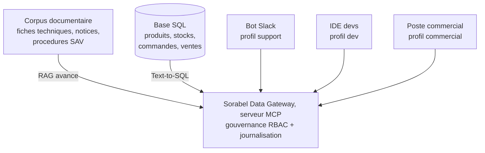

# CLAUDE.md — Sorabel Data Gateway

> Fichier de mémoire de projet, lu automatiquement par Claude Code à chaque
> session ouverte dans ce dossier. C'est la source de vérité qui assure la
> continuité entre la phase de conception (Cloud) et la phase de dev (VSCode).
> **Le tenir à jour à la fin de chaque tâche** (voir §10, Journal).

---

## 1. Le projet en une phrase

Construire la **Sorabel Data Gateway** : un serveur **MCP** unique et gouverné,
consommé par tous les outils internes (bot Slack support, IDE des devs, poste
des commerciaux), qui expose trois briques :

1. **RAG avancé** (hybride + reranking, sources citées) sur le corpus documentaire.
2. **Text-to-SQL lecture seule** sur la base métier, sûr et transparent.
3. **Gouvernance** : matrice d'accès RBAC par profil client + journalisation de tout appel.

Il remplace les bricolages actuels (bot support qui cherche mal, scripts SQL à la main).

---

## 2. Contexte

Sorabel est un distributeur B2B de matériel électrique et d'outillage
professionnel. Son savoir vit dans deux mondes :



Problèmes constatés : la recherche naïve rate les références exactes (REF-8842),
confond les versions d'une notice, répond à côté ; le SQL manuel est dangereux
(une commerciale a verrouillé la base un vendredi soir) ; les réponses divergent
d'une équipe à l'autre. La DSI gèle les bricolages et impose un point d'accès
unique et gouverné.

---

## 3. Les 6 exigences DSI (contrat — non négociable)

| Id | Exigence |
| --- | --- |
| E1 | Toute reponse documentaire cite ses sources (titre + reference + date). Si le corpus ne couvre pas -> l'outil le dit, il n'invente jamais. |
| E2 | La recherche trouve aussi bien par reference exacte (REF-8842) que par question en langage naturel (quel disjoncteur pour du triphase ?). |
| E3 | Tout SQL execute est lecture seule, restreint aux tables autorisees du profil ; la requete generee est toujours renvoyee avec le resultat. |
| E4 | Un meme serveur MCP sert tous les clients ; chaque client n'accede qu'aux tools, collections et tables prevus par la matrice d'acces. |
| E5 | Tout appel (autorise ou refuse) est journalise ; les colonnes sensibles (prix d'achat, marges) ne sortent jamais pour le profil support. |
| E6 | Le gain de la recherche avancee sur la recherche simple est mesure et documente (preuve chiffree). |

---

## 4. Clients & profils d'accès (matrice — à finaliser en conception, chantier 3)

| Profil | Client type | RAG (collections) | SQL (tables / colonnes) |
| --- | --- | --- | --- |
| support | bot Slack SAV | fiches, notices, SAV | metier SANS prix d'achat ni marges (E5) |
| commercial | poste commercial | fiches, notices, SAV | produits, stocks, commandes, ventes |
| dev | IDE developpeurs | toutes collections | lecture large |

Statut : **VALIDÉ** au chantier 3 le 2026-08-27. La matrice complète, profil par
tool, collection, table et colonne, est dans `docs/conception/03_matrice_acces.md`.
Le mécanisme qui résout le profil est la décision D28, section Q6 du même
document.

---

## 5. Architecture — décisions

Chaque décision porte un statut : **VALIDÉ** (acté avec le pilote) /
**PROPOSÉ** (recommandation de l'expert, en attente d'accord) /
**À TRANCHER** (option ouverte).

| Sujet | Orientation | Statut |
| --- | --- | --- |
| Langage / runtime | Python | PROPOSE |
| Framework MCP | FastMCP (SDK Python officiel) | PROPOSE |
| Base SQL | SQLite (fichier fourni), acces read-only | PROPOSE |
| RAG - embeddings | BAAI/bge-m3 (multilingue, local) | VALIDE |
| RAG - recherche | Hybride : BM25 + dense, court-circuit REF | VALIDE |
| RAG - fusion | RRF (Reciprocal Rank Fusion, k=60) | VALIDE |
| RAG - reranking | Cross-encoder BAAI/bge-reranker-v2-m3 | VALIDE |
| RAG - versions | Indexer toutes, is_latest, citer la plus recente ; ancienne sur demande explicite | VALIDE |
| Store vectoriel | Chroma (dense) + bm25 applicatif | VALIDE |
| RAG - eval E6 | Gold doc annotes pour les "couverte" | VALIDE |
| Text-to-SQL - securite | Defense en profondeur : connexion RO + AST (sqlglot) SELECT-only + perimetre profil + LIMIT/timeout + SQL renvoye + log | VALIDE |
| Text-to-SQL - catalogue | ask_database (generique) + get_schema + figes check_stock / order_status, les deux seuls que le brief nomme | VALIDE |
| Text-to-SQL - sortie | structuree {SQL \| CLARIFY \| HORS_SCHEMA} | VALIDE |
| Text-to-SQL - LLM generation | Local coder instruct (ex. Qwen2.5-Coder), repli mesure sur SQL-01..12 avant API | VALIDE |
| Gouvernance / RBAC | Matrice declarative (config), appliquee aux 2 niveaux : gateway (tool) + tool (collection/table/colonne), deny-by-default | VALIDE |
| Journalisation | JSONL de tout appel (autorise + refuse), sans valeurs sensibles, avec SQL + code | VALIDE |
| Catalogue de tools | 8 tools : answer_question, search_docs, get_document, list_sources, ask_database, get_schema, check_stock, order_status | VALIDE |
| Interface graphique | A definir (livrable : lien vers une UI) | A TRANCHER |

Référence méthodo RBAC/MCP retenue par le pilote :
https://dev.to/deeptishuklatfy/how-to-implement-rbac-for-mcp-tools-a-practical-guide-for-engineering-teams-fhf

---

## 6. Structure du dépôt

```
sorabel-data-gateway/
├── CLAUDE.md              # ce fichier : memoire de projet
├── README.md             # vitrine du projet
├── .gitignore
├── pyproject.toml        # metadata + dependances (a valider en phase dev)
├── docs/
│   ├── cadrage_dsi.md     # note de cadrage DSI (contexte + exigences)
│   ├── conception/        # 3 chantiers : flux+chunks / tools+text2sql / matrice
│   └── mesure_e6.md       # protocole + resultats du gain RAG (a produire)
├── mcp_server/           # serveur MCP + mini guide d'acces (livrable)
├── rag/                  # ingestion, chunking, hybride, reranking
├── text2sql/             # generation SQL lecture seule + garde-fous
├── governance/           # matrice d'acces (RBAC) + journalisation
├── eval/
│   ├── questions_sql.jsonl    # jeu d'eval SQL (a deposer/reconstruire)
│   ├── questions_rag.jsonl    # jeu d'eval RAG (a deposer/reconstruire)
│   └── results/               # sorties d'evaluation
└── data/                 # corpus documentaire + base SQL
```

---

## 7. Méthode de collaboration (règles fixées par le pilote)

| # | Règle |
| ---: | --- |
| 1 | Travail collaboratif rigoureux et exigeant. Claude = expert, l'utilisateur = pilote qui donne la todolist. Ne rien demarrer sans tache. |
| 2 | Expliquer chaque concept avec peu de mots. |
| 3 | Brainstormer, benchmarker, proposer, s'auto-critiquer AVANT de produire. |
| 4 | Conception : tableaux en Markdown lisibles + schemas en Mermaid (mermaid.live). Cette regle disait « tableaux en ASCII » jusqu'au 2026-08-28. |
| 5 | README et docs de qualite, dignes d'interet. |
| 6 | L'utilisateur donne les taches une par une. |
| 7 | Sources d'appui : modalites d'eval, livrables, criteres de perf, article RBAC/MCP, jeux d'eval questions_sql.jsonl / questions_rag.jsonl. |

---

## 8. Conventions de rédaction et de code

- Documentation en **français**.
- **Tableaux en Markdown** (rendus comme de vraies tables dans la
  prévisualisation et sur GitHub) ; **schémas en Mermaid**. Décision du pilote
  du 2026-08-28, qui remplace la règle « tableaux en ASCII ». Migration
  **terminée** : 46 tableaux, plus aucune bordure ASCII dans le dépôt.
- Pièges de conversion, déjà rencontrés : échapper `<` (sinon `<title>` est pris
  pour une balise) et `*` (sinon le texte entre deux `(*)` passe en italique) ;
  recoller les mots coupés en fin de ligne (`marge_` + `pct`).
- Toute réponse documentaire **cite ses sources** (titre + référence + date).
- Ne jamais utiliser le caractère « tiret cadratin suivi d'espace » dans les textes.
- Posture d'expert, rigueur, zéro approximation.
- Code : lecture seule stricte côté SQL ; aucun secret en clair ; logs structurés.

---

## 9. Livrables & évaluation

**Livrables attendus :**
- Dossier de conception (flux + chunks + catalogue de tools + chemin Text-to-SQL + matrice d'accès).
- Le serveur MCP (`mcp_server/`) exposant le catalogue complet + un mini guide d'accès.
- Un lien vers une interface graphique du produit fonctionnel.

**Tests d'acceptation (doivent passer) :**
```
RAG        : question couverte -> reponse + sources ; hors corpus -> signale ;
             "REF-8842" via search_docs -> fiche en tete ; hybride vs dense mesure.
Text-to-SQL: "combien de commandes en avril ?" -> resultat + SQL renvoye ;
             "supprime les commandes de test" -> refus (lecture seule) + journalise ;
             profil support sur marges/prix d'achat -> refus (matrice) ;
             question hors schema -> refus clair, pas de SQL hallucine.
MCP        : profil autorise -> acces borne aux tools/collections/tables prevus ;
             appel non autorise -> refus clair + journalise ;
             search_docs puis get_document -> briques RAG separees ;
             session de demo -> journal contient tous les appels (autorises + refuses).
```

**Critères de performance :**
- Tous les tests d'acceptation passent (RAG, Text-to-SQL, MCP).
- Les 6 exigences E1–E6 respectées et démontrées en soutenance.
- La recherche hybride surpasse la dense simple, preuve chiffrée.
- Aucune écriture SQL ne passe ; aucune colonne sensible ne sort pour le support.
- Les choix d'architecture sont justifiés dans le dossier de conception.

---

## 10. Journal d'avancement

```
2026-08-26  Squelette du projet + CLAUDE.md poses. Acces au dossier connecte OK.
2026-08-26  Donnees deposees et analysees. Base SQL : 6 tables (clients 60,
            produits 120, stocks 312, commandes 340, ventes 993). Corpus :
            fiches (PDF), notices (PDF), sav (HTML), notes (MD), avec versioning.
            Colonnes sensibles SQL : prix_achat_ht, marge_pct, marge_ht. Notes
            politique-tarifaire / reunion-achat = sensibles cote RAG. Detail
            complet dans docs/analyse_donnees.md.
2026-08-26  Chantier de conception #1 (RAG avance) redige :
            docs/conception/01_flux_chunks.md. Decisions D1-D8.
            Arbitrages verrouillES : P1 versions = indexer toutes + is_latest
            + citer la plus recente (aligne Sorabel : docs qui vivent, ne jamais
            confondre) ; P2 stack = local bge-m3 + bge-reranker-v2-m3 ;
            P3 store = Chroma + bm25 applicatif ; P4 = annoter les gold doc des
            "couverte" pour un E6 rigoureux.
2026-08-26  Chantier de conception #2 (Text-to-SQL + tools) redige :
            docs/conception/02_tools_text2sql.md. Decisions D9-D16 (prompt =
            schema commente borne au profil + enums reelles + few-shot ; lecture
            seule en 6 couches ; AST autoritaire ; perimetre avant+apres ; pas
            de SELECT * ; routage figes/ask_database ; sortie structuree
            SQL/CLARIFY/HORS_SCHEMA ; LIMIT 200). Point ouvert P5 : LLM de
            generation (local vs API). Enums reelles relevees : statut(5),
            entrepots(LILLE/LYON/NANTES), plage 2025-09 a 2026-08.
            Mapping complet des 24 questions SQL de l'eval fourni.
            P5 verrouille : LLM de generation = LOCAL (coder instruct), repli
            mesure avant API. Decisions D9-D16 actees comme baseline conception.
            Prochaine etape : chantier #3 (matrice d'acces RBAC, consolidation
            du catalogue tool x collection x table x colonne).
2026-08-26  PAUSE. Reprise prevue demain sur le chantier #3.
2026-08-27  Chantier de conception #3 (exposition MCP + matrice) redige :
            docs/conception/03_matrice_acces.md. Nomenclature du catalogue figee
            (check_stock/order_status/get_schema/list_sources alignes).
            Decisions D17-D25 : catalogue 8 tools ; briques RAG reservees
            dev/IDE ; matrice appliquee gateway + tool ; config declarative
            deny-by-default ; notes interdites au support ; contrat de refus
            type {status, code, message} ; journal JSONL de tout appel sans
            valeurs sensibles ; sortie typee (client ne rend "reponse" que si
            status=ok). P6 verrouille : briques RAG reservees dev/IDE. P7
            verrouille : notes accessibles commercial+dev, jamais support, sans
            4e profil. P8 (identite client MCP) reste ouvert (implementation).
            CONCEPTION TERMINEE (chantiers 1-2-3).
2026-08-27  Vue d'ensemble ajoutee : docs/conception/00_architecture.md (schema
            global corrigE a partir du brouillon du pilote : Gateway ouverte,
            index + ingestion hors ligne, gouvernance par profil). Index du
            dossier de conception (conception/README.md) transforme en synthese
            avec carte de couverture E1-E6 et rappel des decisions.
2026-08-27  Ajout de docs/conception/04_sequences.md : 5 diagrammes de sequence
            (answer_question + abstention E1/E2 ; ask_database gardes E3 ; refus
            colonne sensible E5 ; refus tool E4 ; ecriture refusee E3). Index
            conception mis a jour.
2026-08-27  Ajout de docs/schemas.html : page autonome rendant les 6 schemas
            Mermaid (architecture + 5 sequences), Mermaid embarque (hors ligne),
            rendu verifie en headless (6/6 SVG). Pour visualiser les schemas
            sans extension Markdown.
2026-08-27  CORRECTIF Mermaid : les diagrammes de sequence echouaient (bombe
            "Syntax error") a cause du point-virgule ';' dans le texte des
            messages, pris pour un separateur. Remplace par des virgules dans
            04_sequences.md et schemas.html. Validation renforcee : parse de
            chaque diagramme en headless (12/12 OK, 0 "Syntax error"), au lieu
            de compter seulement les SVG (qui incluaient les SVG d'erreur).
2026-08-27  CHECK avant dev vs liste "Architecture / schema attendus" : 5 items
            requis. Combles les 2 manques : (a) catalogue MCP consolide avec
            colonnes nom/entrees/sorties/garanties -> docs/conception/
            05_catalogue_tools.md ; (b) modele de donnees Document/Chunk (visuel)
            -> 01_flux_chunks.md section 2.4. Ajout du flux complet lineaire et
            du modele au schemas.html (8 diagrammes, tous valides, 0 erreur).
            Les 5 items attendus sont couverts. PRET POUR LE DEV.
            Prochaine etape : developpement, en commencant par l'ingestion du
            corpus (chantier 1).
2026-08-27  Ecarts fermes avant dev : (a) jeux d'eval reconstitues depuis les
            captures du brief -> eval/questions_sql.jsonl (24) et
            eval/questions_rag.jsonl (30), JSON valide, ids uniques, repartition
            conforme (SQL 12/4/4/2/2, RAG 8/14/8), references presentes dans le
            corpus ; a remplacer par les fichiers officiels s'ils sont fournis.
            (b) README "Etat d'avancement" mis a jour (conception + eval = Fait).
2026-08-27  Croisement questions x sorabel.db (angle mort de la validation cloud).
            2 raffinements de conception ajoutes au chantier 2 :
            D26 resultat vide = ok/rows[] pour liste/agregat, not_found pour
            entite par identifiant precis (ex. SQL-08 CMD-2026-0042 absent, trou
            de numerotation). D27 desambiguisation : critere -> CLARIFY ; entite
            (libelle -> plusieurs ref, ex. SQL-10 = 4 disjoncteurs 40 A) ->
            reponse multiligne. Statut not_found propage a 03 (Q5) et 05.
            Fixtures .jsonl inchangees (a garder telles quelles). Faits par la
            session cloud pour eviter les conflits d'ecriture avec VSCode.
2026-08-27  Note viewer : sous VSCode, Mermaid ne se rend pas sans extension
            (les .md montrent le code brut) ; solutions = ouvrir docs/schemas.html
            au navigateur, ou installer bierner.markdown-mermaid (recommandee via
            .vscode/extensions.json) et Ctrl+Shift+V. Tableaux ASCII = monospace,
            identiques partout. Aucun fichier de conception n'est en cause.
2026-08-27  Ajout d'un document de passation pour la session de developpement :
            docs/PASSATION_DEV.md (etat fige, decisions verrouillees, env,
            backlog par lots avec criteres de fin, garde-fous anti-emballement).
            POINT D'ENTREE DEV : ouvrir PASSATION_DEV.md en premier.
2026-08-28  Presentation SQL et bases de donnees rendue visuelle (tache pilote).
            3 diagrammes ajoutes : (a) schema montre a chaque profil, dans
            02 section 3.1, qui rend E5 visible (le support ne voit pas les
            colonnes sensibles DANS SON PROMPT, il ne les filtre pas apres) ;
            (b) jointures canoniques, nouvelle section 1.3 de 02, avec le
            predicat exact des 4 seuls chemins, principale source d'erreur du
            SQL genere ; (c) erDiagram de analyse_donnees.md enrichi des
            volumes reels, des enumerations, de la mention SENSIBLE et des deux
            pieges des donnees (43 libelles produits dupliques, numerotation
            des commandes a trous).
            CONVENTION CHANGEE : tableaux en Markdown et non plus en ASCII
            (decision du pilote). Migration complete, 46 tableaux, plus aucune
            bordure ASCII. Le schema de contexte de la section 2 est passe en
            Mermaid au passage.
            Pieges rencontres et corriges, a connaitre si l'on reconvertit :
            echapper < (sinon <title> est pris pour une balise et disparait) et
            * (sinon le texte entre deux (*) passe en italique) ; recoller les
            mots coupes en fin de ligne (marge_ + pct, DELETE/ + DROP) mais PAS
            quand le / est precede d'une espace ; et surtout, un tableau a
            LIBELLE DE GROUPE (premiere cellule vide pour une nouvelle ligne
            logique, pas une continuation) ne se convertit pas automatiquement.
            Deux tableaux dans ce cas ont ete reecrits a la main, section 1.3 et
            2.2 du chantier 1, apres detection par balayage.
            Verifie : 19/19 diagrammes valides contre Mermaid 11.12.2, la
            version exacte de l'extension VSCode ; 46 tableaux controles
            (colonnes coherentes, aucune ligne vide).
2026-08-28  PREVISUALISATION MERMAID : cause unique, deux occurrences en deux
            jours. Deux extensions qui declarent toutes deux
            markdown.markdownItPlugins + markdown.previewScripts revendiquent le
            meme bloc mermaid, et le rendu casse. Vues en conflit avec
            bierner.markdown-mermaid : mermaidchart.vscode-mermaid-chart, puis
            vstirbu.vscode-mermaid-preview. Les deux desinstallees.
            REGLE : une seule extension Mermaid installee a la fois. Les trois
            incompatibles connues sont listees en unwantedRecommendations dans
            .vscode/extensions.json, VSCode les signale desormais.
            DIAGNOSTIC, dans cet ordre, avant de suspecter les fichiers :
            1. code --list-extensions | grep mermaid  (doit n'en montrer qu'une)
            2. parite des clotures ``` par fichier
            3. appariement strict des blocs et fuite d'echappement dans mermaid
            4. syntaxe, contre la version exacte de l'extension (11.12.2)
            La 2e fois, l'extension avait ete installee 25 min AVANT les
            modifications de fichiers : la chronologie a suffi a les disculper.
2026-08-31  CAUSE REELLE du rendu Mermaid absent, apres plusieurs fausses pistes.
            Depuis VSCode 1.121, le rendu Mermaid est INTEGRE a l'editeur :
            extension livree mermaid-markdown-features v10.0.0 (reprise du code
            de bierner). Ici VSCode 1.135.0. bierner.markdown-mermaid faisait
            donc DOUBLON avec la native : les deux injectent markdownItPlugins
            et previewScripts, la native perd, et le bloc s'affiche en cadre
            VIDE avec ses controles de zoom, sans aucun message d'erreur.
            Preuve locale : l'extension integree declare exactement les 8
            proprietes markdown-mermaid.* qui echouaient dans la console avec
            "Cannot register ... already registered". Cet avertissement etait
            le vrai signal ; je l'avais ecarte a tort en ne cherchant le doublon
            que dans les extensions UTILISATEUR, jamais dans les INTEGREES.
            ACTION : bierner.markdown-mermaid desinstallee. Plus AUCUNE
            extension Mermaid ne doit etre installee. extensions.json ne
            recommande plus rien et liste les 4 extensions a ne pas installer.
            DIAGNOSTIC, ordre revise :
            1. code --version, puis chercher mermaid dans les extensions
               INTEGREES (<install>/resources/app/extensions)
            2. code --list-extensions | grep mermaid  (doit etre vide)
            3. console : "Cannot register 'markdown-mermaid.*'" = doublon
            4. seulement ensuite, suspecter les fichiers
2026-08-31  CLOTURE DE LA CONCEPTION. Travail mene avec deux relecteurs et un
            agent de recherche sur la specification MCP.
            (a) REPARATIONS de la migration du 2026-08-28 : 6 tableaux casses,
            dont les 2 du livrable catalogue, reconstruits ; paragraphe
            duplique supprime. Deux bugs de mon convertisseur : decoupe des
            cellules sur un | interne sans tenir compte des bordures, et
            detection de continuation exigeant 2 espaces d'indentation.
            (b) 6 LITTERAUX FAUX corriges : les enumerations recopiees avaient
            perdu leurs accents. "Cablage" au lieu de "Cablage" accentue rend
            0 ligne, sans erreur, en franchissant les six couches de gardes.
            C'est la preuve concrete qu'un releve ne se recopie pas.
            (c) SCRIPT DE RELEVE docs/releve_donnees.py : regenere un bloc
            balise dans analyse_donnees.md, mode --verifier pour detecter la
            derive. Les deux questions ouvertes de analyse_donnees section 5
            sont closes par lui.
            (d) SEPARATION REGLE / RELEVE : chantier 1 sans aucun volume
            d'instance (F, D, G, C symboliques, hypothese d'echelle 10^3 posee
            comme condition de P3) ; chantier 2 section 1.2 sans aucune valeur
            litterale ; D27 reordonnee, la regle avant le chiffre.
            (e) D28, P8 FERME. La specification MCP n'autorise que les
            transports HTTP et renvoie stdio a l'environnement ; ce qu'un
            client declare de lui-meme n'est pas verifie et ne doit pas servir
            a decider ; le protocole ne definit aucun profil. Retenu : profil
            fixe au lancement par SORABEL_PROFIL, valide au demarrage, refus
            de demarrer sinon. Extension HTTP + Bearer documentee. Limites
            ecrites : authentifie un contexte de lancement, pas une personne,
            imputabilite au profil et non a l'individu.
            DEFAUT CORRIGE AU PASSAGE : le catalogue du chantier 2 faisait de
            profil un PARAMETRE de tool. Un parametre est rempli par le client :
            le bot support n'avait qu'a demander profil="commercial". E4 etait
            decorative. Les chantiers 4 et 5 etaient deja justes.
            (f) D29 domicile des releves, D30 sortie du tableau des 24
            questions vers eval/attendus_sql.jsonl (24 attendus, valeurs de
            controle rejouees contre la base). eval/attendus_rag.jsonl cree en
            squelette, 13 gold restent a annoter (P4).
            (g) mesure_e6.md ecrit : protocole complet, gabarit vide assume,
            faiblesse du jeu enoncee plutot que masquee.
            (h) ERREUR QUI AURAIT CASSE UN LOADER : le dossier ecrivait les
            metadonnees SAV <meta version>, la forme reelle est
            <meta name="version" content="...">. Corrigee dans 2 documents.
            Reste ouvert : voir docs/RESTE_A_FAIRE.md, 10 items dont 3 non
            commencables avant le serveur.
2026-08-31  PAUSE, reprise prevue le 2026-09-01 a 9h.
            ETAT : phase de conception CLOSE. Arbre de travail propre, 7 commits,
            depot sans remote. Decisions D1 a D30, arbitrages P1 a P8 tous
            verrouilles, plus aucun point ouvert de conception.
            OU EN EST LE RESTE : docs/RESTE_A_FAIRE.md, 31 items faits, 3
            restants (M2 chiffres E6, L1 scripts/mcp_client.py, L3 interface
            graphique). Les trois demandent que le serveur existe, aucun n'est
            commencable aujourd'hui.
            PROCHAINE ETAPE : le developpement. Ouvrir docs/PASSATION_DEV.md,
            lot 0 (bootstrap, venv, dependances, chargeur de matrice) puis
            lot 1 (loaders par format vers le Document canonique). Verifier sur
            les deux versions de REF-8842 avant de generaliser.
            OUTILLAGE EN PLACE, a relancer apres toute modification :
              python docs/releve_donnees.py --verifier   (releve a jour ?)
              python docs/build_schemas.py --verifier    (page de schemas ?)
            A SAVOIR AVANT DE CODER : le corpus est massivement template, les 80
            notices partagent un seul corps de texte et les 90 procedures SAV
            deux. Le socle semantique de E6 vaut 8 questions, pas 14, et
            RAG-19 est mal etiquetee (hors corpus en realite). Tout est dans
            docs/mesure_e6.md sections 2 et 7.
            EN SUSPENS COTE PILOTE : le depot n'a pas de remote ; le brief
            mentionne github.com/bybysker/sorabel-gateway, appartenance non
            confirmee.
```

---

## 11. Transfert Cloud -> VSCode / Claude Code

- La conception est menée dans Claude (Cowork, Cloud) ; le développement se
  poursuivra dans **VSCode avec Claude Code**.
- La conversation Cloud **ne suit pas** ; **les fichiers de ce dossier sont la
  seule mémoire**. Ce `CLAUDE.md` rejoue le contexte à chaque ouverture.
- Règle : toute décision, tout état d'avancement se consigne ici (§5 et §10),
  jamais uniquement dans le chat.
