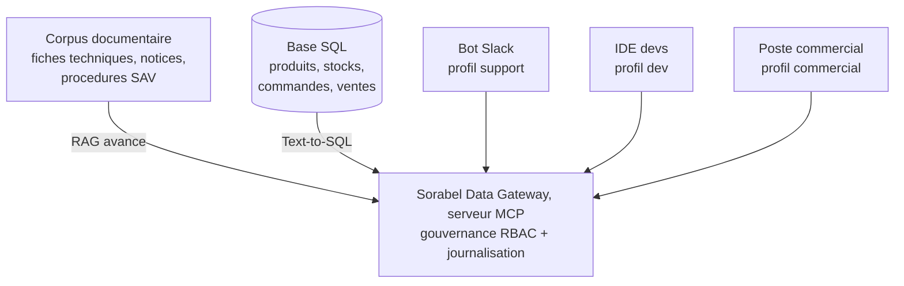

# Mémoire de projet : Sorabel Data Gateway

> Fichier de mémoire de projet, relu à l'ouverture de chaque session de
> travail dans ce dossier. C'est la source de vérité qui assure la
> continuité entre la phase de conception (Cloud) et la phase de dev (VSCode).
> **Le tenir à jour à la fin de chaque tâche** (voir §10, Journal).

---

## 1. Le projet en une phrase

Construire la **Sorabel Data Gateway** : un serveur **MCP** unique et gouverné,
consommé par tous les outils internes (bot Slack support, IDE des devs, poste
des commerciaux), qui expose trois briques :

1. **RAG avancé** (hybride + reranking, sources citées) sur le corpus documentaire.
2. **Text-to-SQL lecture seule** sur la base métier, sûr et transparent.
3. **Gouvernance** : matrice d'accès RBAC par profil client + journalisation de tout appel.

Il remplace les bricolages actuels (bot support qui cherche mal, scripts SQL à la main).

---

## 2. Contexte

Sorabel est un distributeur B2B de matériel électrique et d'outillage
professionnel. Son savoir vit dans deux mondes :



Problèmes constatés : la recherche naïve rate les références exactes (REF-8842),
confond les versions d'une notice, répond à côté ; le SQL manuel est dangereux
(une commerciale a verrouillé la base un vendredi soir) ; les réponses divergent
d'une équipe à l'autre. La DSI gèle les bricolages et impose un point d'accès
unique et gouverné.

---

## 3. Les 6 exigences DSI (contrat : non négociable)

| Id | Exigence |
| --- | --- |
| E1 | Toute reponse documentaire cite ses sources (titre + reference + date). Si le corpus ne couvre pas -> l'outil le dit, il n'invente jamais. |
| E2 | La recherche trouve aussi bien par reference exacte (REF-8842) que par question en langage naturel (quel disjoncteur pour du triphase ?). |
| E3 | Tout SQL execute est lecture seule, restreint aux tables autorisees du profil ; la requete generee est toujours renvoyee avec le resultat. |
| E4 | Un meme serveur MCP sert tous les clients ; chaque client n'accede qu'aux tools, collections et tables prevus par la matrice d'acces. |
| E5 | Tout appel (autorise ou refuse) est journalise ; les colonnes sensibles (prix d'achat, marges) ne sortent jamais pour le profil support. |
| E6 | Le gain de la recherche avancee sur la recherche simple est mesure et documente (preuve chiffree). |

---

## 4. Clients & profils d'accès (matrice imposée par le cadrage DSI)

| Profil | Client type | Tools | Collections | Tables |
| --- | --- | --- | --- | --- |
| support | bot Slack SAV | 7 sur 8, PAS get_schema | fiches_techniques, notices, procedures_sav | clients, produits, stocks, commandes. PAS ventes |
| commercial | poste commercial | les 8 | les 4, notes_internes comprise | les 5 |

Il n'y a que DEUX profils. Le profil `dev` de nos chantiers 1 a 5 n'existe pas au
contrat, et les briques RAG sont accessibles au support : D18 et P6 sont
RENVERSES. Voir chantier 3, section Q7.

Statut : **IMPOSÉ**, et non plus décidé par nous. La matrice fait foi dans
`docs/cadrage_dsi.md`, restauré depuis le dépôt amont, et la suite d'acceptance
la contrôle (`tests/conftest.py`, `TOOLS_BY_PROFILE`). Sa transcription pour le
code est `governance/matrice.yaml`, dont `verifier_matrice.py` vérifie qu'elle
n'en diverge pas. Le mécanisme qui résout le profil reste D28 : variable
`SORABEL_PROFILE` au lancement.

---

## 5. Architecture : décisions

Chaque décision porte un statut : **VALIDÉ** (acté avec le pilote) /
**PROPOSÉ** (recommandation de l'expert, en attente d'accord) /
**À TRANCHER** (option ouverte).

| Sujet | Orientation | Statut |
| --- | --- | --- |
| Langage / runtime | Python | PROPOSE |
| Framework MCP | FastMCP (SDK Python officiel) | PROPOSE |
| Base SQL | SQLite (fichier fourni), acces read-only au niveau du pilote | VALIDE |
| RAG - embeddings | intfloat/multilingual-e5-small par defaut, nom lu dans EMBEDDING_MODEL. 384 dim, 910 chunks en 60 s sur processeur. bge-m3 a une variable pres (D47) | VALIDE |
| RAG - recherche | Hybride : BM25 + dense, court-circuit REF | VALIDE |
| RAG - fusion | RRF (Reciprocal Rank Fusion, k=60) | VALIDE |
| RAG - reranking | Cross-encoder BAAI/bge-reranker-v2-m3 | VALIDE |
| RAG - versions | Indexer toutes, is_latest, citer la plus recente ; ancienne sur demande explicite | VALIDE |
| Store vectoriel | Chroma EMBARQUE (PersistentClient), pas de service ni Docker + bm25 applicatif separe. Motif : filtrage par metadonnee AVANT la recherche, eprouve le 2026-09-02 (D45) | VALIDE |
| RAG - eval E6 | Gold doc annotes pour les "couverte" | VALIDE |
| Text-to-SQL - securite | Defense en profondeur : connexion RO + AST (sqlglot) SELECT-only + perimetre profil + LIMIT/timeout + SQL renvoye + log | VALIDE |
| Text-to-SQL - catalogue | ask_database (generique) + get_schema + figes check_stock / order_status, les deux seuls que le brief nomme | VALIDE |
| Text-to-SQL - sortie | structuree {SQL \| CLARIFY \| HORS_SCHEMA} | VALIDE |
| Text-to-SQL - LLM generation | Local coder instruct (ex. Qwen2.5-Coder), repli mesure sur SQL-01..12 avant API | VALIDE |
| Gouvernance / RBAC | Matrice declarative, appliquee aux 2 niveaux : gateway (tool) + tool (collection/table/colonne), deny-by-default. SOURCE UNIQUE : governance/matrice.yaml, controlee par verifier_matrice.py | VALIDE |
| Journalisation | JSONL de tout appel (autorise + refuse), sans valeurs sensibles, avec SQL + code | VALIDE |
| Catalogue de tools | 8 tools : answer_question, search_docs, get_document, list_sources, ask_database, get_schema, check_stock, order_status | VALIDE |
| Interface graphique | Deployee sur Azure, cible du livrable "lien vers une UI" | VALIDE |
| Chargement du modele | PARESSEUX, au premier encodage. 22,5 s a froid contre 30 s de budget par appel dans la suite d'acceptance (D46) | VALIDE |
| Cible de deploiement | Azure. Strategie INCREMENTALE : lots 0 a 4 en local, deploiement au lot 5 (D37) | VALIDE |
| Persistance des artefacts | Chemin unique SORABEL_DATA_DIR. Le stockage de conteneur est ephemere par defaut (D35) | VALIDE |
| Client Slack | APPLICATION a part entiere, reponse differee, identite Slack au journal seulement (D34) | VALIDE |
| Interface : ce qu'elle prouve | 5 ecrans, l'ecran 3 compare DEUX profils sur le meme appel. E4/E5 rendus visibles (D38) | PROPOSE |
| Demo deux profils malgre D28 | DEUX processus, meme image + meme matrice, journal partage. C'est la topologie normale de MCP stdio (D39) | PROPOSE |
| Ce que l'interface n'est PAS | Pas de selecteur de profil, pas d'authentification, pas de refus "joli" (D40) | PROPOSE |
| Refus de colonne, explicite | Couche 0 bis : pre-filtre lexical declare dans la matrice. AUCUNE valeur de securite, sert l'imputabilite (D41) | PROPOSE |
| Classification des colonnes | EXHAUSTIVE : sensibles + restreintes + publiques = le schema. Une colonne non classee fait echouer le controle (D42) | PROPOSE |
| Perimetre SQL | Porte sur TOUTE occurrence d'une colonne, pas les projections : WHERE, ORDER BY, GROUP BY, HAVING, sous-requetes (D43) | PROPOSE |
| Ancrage des invariants | Ecrits EN DUR dans verifier_matrice.py, hors du YAML qu'ils controlent (D44) | PROPOSE |

Référence méthodo RBAC/MCP retenue par le pilote :
https://dev.to/deeptishuklatfy/how-to-implement-rbac-for-mcp-tools-a-practical-guide-for-engineering-teams-fhf

---

## 6. Structure du dépôt

```
sorabel-data-gateway/
├── MEMOIRE_PROJET.md      # ce fichier : memoire de projet
├── README.md             # vitrine du projet
├── .gitignore
├── pyproject.toml        # metadata + dependances (a valider en phase dev)
├── docs/
│   ├── cadrage_dsi.md     # note de cadrage DSI (contexte + exigences)
│   ├── analyse_donnees.md # le jeu de donnees ; bloc de releve GENERE
│   ├── REVUE_CONCEPTION.md # revue du 2026-09-02, classee par lot bloque
│   ├── conception/        # 8 chantiers, 00 a 08, index, plus pile_technique.md
│   │                      # (carte informative du retenu / de l'ecarte)
│   ├── mesure_e6.md       # protocole de mesure du gain RAG, chiffres au lot 3
│   ├── PASSATION_DEV.md   # POINT D'ENTREE DEV : lots, criteres, garde-fous
│   ├── RESTE_A_FAIRE.md   # ce qui reste, l'historique est dans git
│   ├── releve_donnees.py  # GENERE le bloc de releve de analyse_donnees.md
│   ├── build_schemas.py   # GENERE schemas.html depuis les blocs mermaid des .md
│   ├── schemas.html       # schemas rendus. NE PAS editer, regenerer.
│   │                      # Porte la bibliotheque Mermaid, stockee une seule fois
│   └── archive/           # documents qu'on ne maintient plus, avertis en tete
├── scripts/              # mcp_client.py : demo support vs commercial (a creer)
├── mcp_server/           # serveur MCP + GUIDE_ACCES.md (mini guide, livrable)
├── rag/                  # ingestion, chunking, hybride, reranking
├── text2sql/             # generation SQL lecture seule + garde-fous
├── governance/
│   ├── matrice.yaml           # SOURCE DE VERITE des droits (D21), + lexique de refus
│   ├── verifier_matrice.py    # controle les invariants, GENERE la vue
│   ├── matrice_lisible.md      # vue generee. NE PAS editer, regenerer.
│   └── logs/                  # journal JSONL de tout appel (ecrit au lot 5)
├── eval/
│   ├── questions_sql.jsonl    # fixture SQL, 24 questions. NE PAS modifier.
│   ├── questions_rag.jsonl    # fixture RAG, 30 questions. NE PAS modifier.
│   ├── attendus_sql.jsonl     # attendus par question, oracle des tests (D30)
│   ├── attendus_rag.jsonl     # gold des "couverte" (P4), 13 annotes
│   ├── cas_mcp.jsonl          # 22 cas de gouvernance : profil x tool x attendu
│   └── results/               # sorties d'evaluation, datees
└── data/                 # corpus + base SQL, NON versionnes (.gitignore)
```

---

## 7. Méthode de collaboration (règles fixées par le pilote)

| # | Règle |
| ---: | --- |
| 1 | Travail collaboratif rigoureux et exigeant. Un expert technique qui propose, un pilote qui donne la todolist. Ne rien demarrer sans tache. |
| 2 | Expliquer chaque concept avec peu de mots. |
| 3 | Brainstormer, benchmarker, proposer, s'auto-critiquer AVANT de produire. |
| 4 | Conception : tableaux en Markdown lisibles + schemas en Mermaid (mermaid.live). Cette regle disait « tableaux en ASCII » jusqu'au 2026-08-28. |
| 5 | README et docs de qualite, dignes d'interet. |
| 6 | L'utilisateur donne les taches une par une. |
| 7 | Sources d'appui : modalites d'eval, livrables, criteres de perf, article RBAC/MCP, jeux d'eval questions_sql.jsonl / questions_rag.jsonl. |

---

## 8. Conventions de rédaction et de code

- Documentation en **français**.
- **Tableaux en Markdown** (rendus comme de vraies tables dans la
  prévisualisation et sur GitHub) ; **schémas en Mermaid**. Décision du pilote
  du 2026-08-28, qui remplace la règle « tableaux en ASCII ». Migration
  **terminée** : 46 tableaux, plus aucune bordure ASCII dans le dépôt.
- Pièges de conversion, déjà rencontrés : échapper `<` (sinon `<title>` est pris
  pour une balise) et `*` (sinon le texte entre deux `(*)` passe en italique) ;
  recoller les mots coupés en fin de ligne (`marge_` + `pct`).
- Toute réponse documentaire **cite ses sources** (titre + référence + date).
- Ne jamais utiliser le caractère « tiret cadratin suivi d'espace » dans les textes.
- Posture d'expert, rigueur, zéro approximation.
- Code : lecture seule stricte côté SQL ; aucun secret en clair ; logs structurés.

---

## 9. Livrables & évaluation

**Livrables attendus :**
- Dossier de conception (flux + chunks + catalogue de tools + chemin Text-to-SQL + matrice d'accès).
- Le serveur MCP (`mcp_server/`) exposant le catalogue complet + un mini guide d'accès.
- Un lien vers une interface graphique du produit fonctionnel.

**Tests d'acceptation (doivent passer) :**
```
RAG        : question couverte -> reponse + sources ; hors corpus -> signale ;
             "REF-8842" via search_docs -> fiche en tete ; hybride vs dense mesure.
Text-to-SQL: "combien de commandes en avril ?" -> resultat + SQL renvoye ;
             "supprime les commandes de test" -> refus (lecture seule) + journalise ;
             profil support sur marges/prix d'achat -> refus (matrice) ;
             question hors schema -> refus clair, pas de SQL hallucine.
MCP        : profil autorise -> acces borne aux tools/collections/tables prevus ;
             appel non autorise -> refus clair + journalise ;
             search_docs puis get_document -> briques RAG separees ;
             session de demo -> journal contient tous les appels (autorises + refuses).
```

**Critères de performance :**
- Tous les tests d'acceptation passent (RAG, Text-to-SQL, MCP).
- Les 6 exigences E1–E6 respectées et démontrées en soutenance.
- La recherche hybride surpasse la dense simple, preuve chiffrée.
- Aucune écriture SQL ne passe ; aucune colonne sensible ne sort pour le support.
- Les choix d'architecture sont justifiés dans le dossier de conception.

---

## 10. Journal d'avancement

```
2026-08-26  Squelette du projet + MEMOIRE_PROJET.md poses. Acces au dossier connecte OK.
2026-08-26  Donnees deposees et analysees. Base SQL : 6 tables (clients 60,
            produits 120, stocks 312, commandes 340, ventes 993). Corpus :
            fiches (PDF), notices (PDF), sav (HTML), notes (MD), avec versioning.
            Colonnes sensibles SQL : prix_achat_ht, marge_pct, marge_ht. Notes
            politique-tarifaire / reunion-achat = sensibles cote RAG. Detail
            complet dans docs/analyse_donnees.md.
2026-08-26  Chantier de conception #1 (RAG avance) redige :
            docs/conception/01_flux_chunks.md. Decisions D1-D8.
            Arbitrages verrouillES : P1 versions = indexer toutes + is_latest
            + citer la plus recente (aligne Sorabel : docs qui vivent, ne jamais
            confondre) ; P2 stack = local bge-m3 + bge-reranker-v2-m3 ;
            P3 store = Chroma + bm25 applicatif ; P4 = annoter les gold doc des
            "couverte" pour un E6 rigoureux.
2026-08-26  Chantier de conception #2 (Text-to-SQL + tools) redige :
            docs/conception/02_tools_text2sql.md. Decisions D9-D16 (prompt =
            schema commente borne au profil + enums reelles + few-shot ; lecture
            seule en 6 couches ; AST autoritaire ; perimetre avant+apres ; pas
            de SELECT * ; routage figes/ask_database ; sortie structuree
            SQL/CLARIFY/HORS_SCHEMA ; LIMIT 200). Point ouvert P5 : LLM de
            generation (local vs API). Enums reelles relevees : statut(5),
            entrepots(LILLE/LYON/NANTES), plage 2025-09 a 2026-08.
            Mapping complet des 24 questions SQL de l'eval fourni.
            P5 verrouille : LLM de generation = LOCAL (coder instruct), repli
            mesure avant API. Decisions D9-D16 actees comme baseline conception.
            Prochaine etape : chantier #3 (matrice d'acces RBAC, consolidation
            du catalogue tool x collection x table x colonne).
2026-08-26  PAUSE. Reprise prevue demain sur le chantier #3.
2026-08-27  Chantier de conception #3 (exposition MCP + matrice) redige :
            docs/conception/03_matrice_acces.md. Nomenclature du catalogue figee
            (check_stock/order_status/get_schema/list_sources alignes).
            Decisions D17-D25 : catalogue 8 tools ; briques RAG reservees
            dev/IDE ; matrice appliquee gateway + tool ; config declarative
            deny-by-default ; notes interdites au support ; contrat de refus
            type {status, code, message} ; journal JSONL de tout appel sans
            valeurs sensibles ; sortie typee (client ne rend "reponse" que si
            status=ok). P6 verrouille : briques RAG reservees dev/IDE. P7
            verrouille : notes accessibles commercial+dev, jamais support, sans
            4e profil. P8 (identite client MCP) reste ouvert (implementation).
            CONCEPTION TERMINEE (chantiers 1-2-3).
2026-08-27  Vue d'ensemble ajoutee : docs/conception/00_architecture.md (schema
            global corrigE a partir du brouillon du pilote : Gateway ouverte,
            index + ingestion hors ligne, gouvernance par profil). Index du
            dossier de conception (conception/README.md) transforme en synthese
            avec carte de couverture E1-E6 et rappel des decisions.
2026-08-27  Ajout de docs/conception/04_sequences.md : 5 diagrammes de sequence
            (answer_question + abstention E1/E2 ; ask_database gardes E3 ; refus
            colonne sensible E5 ; refus tool E4 ; ecriture refusee E3). Index
            conception mis a jour.
2026-08-27  Ajout de docs/schemas.html : page autonome rendant les 6 schemas
            Mermaid (architecture + 5 sequences), Mermaid embarque (hors ligne),
            rendu verifie en headless (6/6 SVG). Pour visualiser les schemas
            sans extension Markdown.
2026-08-27  CORRECTIF Mermaid : les diagrammes de sequence echouaient (bombe
            "Syntax error") a cause du point-virgule ';' dans le texte des
            messages, pris pour un separateur. Remplace par des virgules dans
            04_sequences.md et schemas.html. Validation renforcee : parse de
            chaque diagramme en headless (12/12 OK, 0 "Syntax error"), au lieu
            de compter seulement les SVG (qui incluaient les SVG d'erreur).
2026-08-27  CHECK avant dev vs liste "Architecture / schema attendus" : 5 items
            requis. Combles les 2 manques : (a) catalogue MCP consolide avec
            colonnes nom/entrees/sorties/garanties -> docs/conception/
            05_catalogue_tools.md ; (b) modele de donnees Document/Chunk (visuel)
            -> 01_flux_chunks.md section 2.4. Ajout du flux complet lineaire et
            du modele au schemas.html (8 diagrammes, tous valides, 0 erreur).
            Les 5 items attendus sont couverts. PRET POUR LE DEV.
            Prochaine etape : developpement, en commencant par l'ingestion du
            corpus (chantier 1).
2026-08-27  Ecarts fermes avant dev : (a) jeux d'eval reconstitues depuis les
            captures du brief -> eval/questions_sql.jsonl (24) et
            eval/questions_rag.jsonl (30), JSON valide, ids uniques, repartition
            conforme (SQL 12/4/4/2/2, RAG 8/14/8), references presentes dans le
            corpus ; a remplacer par les fichiers officiels s'ils sont fournis.
            (b) README "Etat d'avancement" mis a jour (conception + eval = Fait).
2026-08-27  Croisement questions x sorabel.db (angle mort de la validation cloud).
            2 raffinements de conception ajoutes au chantier 2 :
            D26 resultat vide = ok/rows[] pour liste/agregat, not_found pour
            entite par identifiant precis (ex. SQL-08 CMD-2026-0042 absent, trou
            de numerotation). D27 desambiguisation : critere -> CLARIFY ; entite
            (libelle -> plusieurs ref, ex. SQL-10 = 4 disjoncteurs 40 A) ->
            reponse multiligne. Statut not_found propage a 03 (Q5) et 05.
            Fixtures .jsonl inchangees (a garder telles quelles). Faits par la
            session cloud pour eviter les conflits d'ecriture avec VSCode.
2026-08-27  Note viewer : sous VSCode, Mermaid ne se rend pas sans extension
            (les .md montrent le code brut) ; solutions = ouvrir docs/schemas.html
            au navigateur, ou installer bierner.markdown-mermaid (recommandee via
            .vscode/extensions.json) et Ctrl+Shift+V. Tableaux ASCII = monospace,
            identiques partout. Aucun fichier de conception n'est en cause.
2026-08-27  Ajout d'un document de passation pour la session de developpement :
            docs/PASSATION_DEV.md (etat fige, decisions verrouillees, env,
            backlog par lots avec criteres de fin, garde-fous anti-emballement).
            POINT D'ENTREE DEV : ouvrir PASSATION_DEV.md en premier.
2026-08-28  Presentation SQL et bases de donnees rendue visuelle (tache pilote).
            3 diagrammes ajoutes : (a) schema montre a chaque profil, dans
            02 section 3.1, qui rend E5 visible (le support ne voit pas les
            colonnes sensibles DANS SON PROMPT, il ne les filtre pas apres) ;
            (b) jointures canoniques, nouvelle section 1.3 de 02, avec le
            predicat exact des 4 seuls chemins, principale source d'erreur du
            SQL genere ; (c) erDiagram de analyse_donnees.md enrichi des
            volumes reels, des enumerations, de la mention SENSIBLE et des deux
            pieges des donnees (43 libelles produits dupliques, numerotation
            des commandes a trous).
            CONVENTION CHANGEE : tableaux en Markdown et non plus en ASCII
            (decision du pilote). Migration complete, 46 tableaux, plus aucune
            bordure ASCII. Le schema de contexte de la section 2 est passe en
            Mermaid au passage.
            Pieges rencontres et corriges, a connaitre si l'on reconvertit :
            echapper < (sinon <title> est pris pour une balise et disparait) et
            * (sinon le texte entre deux (*) passe en italique) ; recoller les
            mots coupes en fin de ligne (marge_ + pct, DELETE/ + DROP) mais PAS
            quand le / est precede d'une espace ; et surtout, un tableau a
            LIBELLE DE GROUPE (premiere cellule vide pour une nouvelle ligne
            logique, pas une continuation) ne se convertit pas automatiquement.
            Deux tableaux dans ce cas ont ete reecrits a la main, section 1.3 et
            2.2 du chantier 1, apres detection par balayage.
            Verifie : 19/19 diagrammes valides contre Mermaid 11.12.2, la
            version exacte de l'extension VSCode ; 46 tableaux controles
            (colonnes coherentes, aucune ligne vide).
2026-08-28  PREVISUALISATION MERMAID : cause unique, deux occurrences en deux
            jours. Deux extensions qui declarent toutes deux
            markdown.markdownItPlugins + markdown.previewScripts revendiquent le
            meme bloc mermaid, et le rendu casse. Vues en conflit avec
            bierner.markdown-mermaid : mermaidchart.vscode-mermaid-chart, puis
            vstirbu.vscode-mermaid-preview. Les deux desinstallees.
            REGLE : une seule extension Mermaid installee a la fois. Les trois
            incompatibles connues sont listees en unwantedRecommendations dans
            .vscode/extensions.json, VSCode les signale desormais.
            DIAGNOSTIC, dans cet ordre, avant de suspecter les fichiers :
            1. code --list-extensions | grep mermaid  (doit n'en montrer qu'une)
            2. parite des clotures ``` par fichier
            3. appariement strict des blocs et fuite d'echappement dans mermaid
            4. syntaxe, contre la version exacte de l'extension (11.12.2)
            La 2e fois, l'extension avait ete installee 25 min AVANT les
            modifications de fichiers : la chronologie a suffi a les disculper.
2026-08-31  CAUSE REELLE du rendu Mermaid absent, apres plusieurs fausses pistes.
            Depuis VSCode 1.121, le rendu Mermaid est INTEGRE a l'editeur :
            extension livree mermaid-markdown-features v10.0.0 (reprise du code
            de bierner). Ici VSCode 1.135.0. bierner.markdown-mermaid faisait
            donc DOUBLON avec la native : les deux injectent markdownItPlugins
            et previewScripts, la native perd, et le bloc s'affiche en cadre
            VIDE avec ses controles de zoom, sans aucun message d'erreur.
            Preuve locale : l'extension integree declare exactement les 8
            proprietes markdown-mermaid.* qui echouaient dans la console avec
            "Cannot register ... already registered". Cet avertissement etait
            le vrai signal ; je l'avais ecarte a tort en ne cherchant le doublon
            que dans les extensions UTILISATEUR, jamais dans les INTEGREES.
            ACTION : bierner.markdown-mermaid desinstallee. Plus AUCUNE
            extension Mermaid ne doit etre installee. extensions.json ne
            recommande plus rien et liste les 4 extensions a ne pas installer.
            DIAGNOSTIC, ordre revise :
            1. code --version, puis chercher mermaid dans les extensions
               INTEGREES (<install>/resources/app/extensions)
            2. code --list-extensions | grep mermaid  (doit etre vide)
            3. console : "Cannot register 'markdown-mermaid.*'" = doublon
            4. seulement ensuite, suspecter les fichiers
2026-08-31  CLOTURE DE LA CONCEPTION. Travail mene avec deux relecteurs et un
            agent de recherche sur la specification MCP.
            (a) REPARATIONS de la migration du 2026-08-28 : 6 tableaux casses,
            dont les 2 du livrable catalogue, reconstruits ; paragraphe
            duplique supprime. Deux bugs de mon convertisseur : decoupe des
            cellules sur un | interne sans tenir compte des bordures, et
            detection de continuation exigeant 2 espaces d'indentation.
            (b) 6 LITTERAUX FAUX corriges : les enumerations recopiees avaient
            perdu leurs accents. "Cablage" au lieu de "Cablage" accentue rend
            0 ligne, sans erreur, en franchissant les six couches de gardes.
            C'est la preuve concrete qu'un releve ne se recopie pas.
            (c) SCRIPT DE RELEVE docs/releve_donnees.py : regenere un bloc
            balise dans analyse_donnees.md, mode --verifier pour detecter la
            derive. Les deux questions ouvertes de analyse_donnees section 5
            sont closes par lui.
            (d) SEPARATION REGLE / RELEVE : chantier 1 sans aucun volume
            d'instance (F, D, G, C symboliques, hypothese d'echelle 10^3 posee
            comme condition de P3) ; chantier 2 section 1.2 sans aucune valeur
            litterale ; D27 reordonnee, la regle avant le chiffre.
            (e) D28, P8 FERME. La specification MCP n'autorise que les
            transports HTTP et renvoie stdio a l'environnement ; ce qu'un
            client declare de lui-meme n'est pas verifie et ne doit pas servir
            a decider ; le protocole ne definit aucun profil. Retenu : profil
            fixe au lancement par SORABEL_PROFIL, valide au demarrage, refus
            de demarrer sinon. Extension HTTP + Bearer documentee. Limites
            ecrites : authentifie un contexte de lancement, pas une personne,
            imputabilite au profil et non a l'individu.
            DEFAUT CORRIGE AU PASSAGE : le catalogue du chantier 2 faisait de
            profil un PARAMETRE de tool. Un parametre est rempli par le client :
            le bot support n'avait qu'a demander profil="commercial". E4 etait
            decorative. Les chantiers 4 et 5 etaient deja justes.
            (f) D29 domicile des releves, D30 sortie du tableau des 24
            questions vers eval/attendus_sql.jsonl (24 attendus, valeurs de
            controle rejouees contre la base). eval/attendus_rag.jsonl cree en
            squelette, 13 gold restent a annoter (P4).
            (g) mesure_e6.md ecrit : protocole complet, gabarit vide assume,
            faiblesse du jeu enoncee plutot que masquee.
            (h) ERREUR QUI AURAIT CASSE UN LOADER : le dossier ecrivait les
            metadonnees SAV <meta version>, la forme reelle est
            <meta name="version" content="...">. Corrigee dans 2 documents.
            Reste ouvert : voir docs/RESTE_A_FAIRE.md, 10 items dont 3 non
            commencables avant le serveur.
2026-08-31  PAUSE, reprise prevue le 2026-09-01 a 9h.
            ETAT : phase de conception CLOSE. Arbre de travail propre, 7 commits,
            depot sans remote. Decisions D1 a D30, arbitrages P1 a P8 tous
            verrouilles, plus aucun point ouvert de conception.
            OU EN EST LE RESTE : docs/RESTE_A_FAIRE.md, 31 items faits, 3
            restants (M2 chiffres E6, L1 scripts/mcp_client.py, L3 interface
            graphique). Les trois demandent que le serveur existe, aucun n'est
            commencable aujourd'hui.
            PROCHAINE ETAPE : le developpement. Ouvrir docs/PASSATION_DEV.md,
            lot 0 (bootstrap, venv, dependances, chargeur de matrice) puis
            lot 1 (loaders par format vers le Document canonique). Verifier sur
            les deux versions de REF-8842 avant de generaliser.
            OUTILLAGE EN PLACE, a relancer apres toute modification :
              python docs/releve_donnees.py --verifier   (releve a jour ?)
              python docs/build_schemas.py --verifier    (page de schemas ?)
            A SAVOIR AVANT DE CODER : le corpus est massivement template, les 80
            notices partagent un seul corps de texte et les 90 procedures SAV
            deux. Le socle semantique de E6 vaut 8 questions, pas 14, et
            RAG-19 est mal etiquetee (hors corpus en realite). Tout est dans
            docs/mesure_e6.md sections 2 et 7.
            EN SUSPENS COTE PILOTE : le depot n'a pas de remote ; le brief
            mentionne github.com/bybysker/sorabel-gateway, appartenance non
            confirmee.
2026-09-01  Chantier 6 : choix des bases de donnees. Le sujet n'avait jamais
            ete traite pour lui-meme, il etait disperse en arbitrages.
            CONSTAT DE DEPART : il n'y a pas une base mais TROIS besoins de
            natures opposees (metier en lecture seule, index reconstructible,
            journal en ajout), plus une configuration qui ne doit surtout pas
            devenir une base (la matrice, D21).
            D31 metier : relationnel impose par les jointures et par E3 (SQL
            analysable par AST). SQLite confirme, ligne passee de PROPOSE a
            VALIDE. PostgreSQL ecarte MALGRE un vrai atout, ses roles natifs
            qui permettraient un GRANT par colonne : il encoderait la matrice
            une seconde fois, contre D21. Nuance a retenir : dupliquer un
            INVARIANT (aucune ecriture) est sain, dupliquer une CONFIGURATION
            qui change (les droits par profil) cree la derive.
            D32 index : Chroma + BM25 applicatif confirme, mais le MOTIF DE P3
            ETAIT FAUX. Il invoquait la simplicite ; le critere decisif est le
            filtrage par metadonnee AVANT la recherche, sans lequel E2 et E4 ne
            tiennent pas. FAISS n'est pas ecarte pour sa complexite mais parce
            qu'il ne filtre pas. Qdrant ecarte car son hybride natif brouille la
            baseline E6. sqlite-vec nomme et non retenu, par prudence assumee.
            D33 journal : fichier JSONL en ajout, pas de base. Une ligne
            complete par appel resiste a un arret brutal et se lit sans outil.
2026-09-01  MENAGE. Critere retenu : retirer ce qui est devenu FAUX ou
            REDONDANT, pas ce qui est vieux.
            (a) docs/soutenance_schemas.md -> docs/archive/. Il decrivait le
            dossier du 2026-08-28 : 19 fiches pour 18 schemas, et il citait
            820 chunks / 400 fichiers / 350 groupes, precisement les valeurs
            retirees de la conception. Archive et non supprime, sa structure
            en trois rubriques valant d'etre reprise. Avertissement en tete,
            et docs/archive/README.md pose la regle : un document arrive ici
            quand le maintenir couterait plus que le refaire, il n'en ressort
            pas, on le reecrit.
            (b) docs/vendor/mermaid.min.js supprime. La bibliotheque etait
            stockee DEUX fois, 3,2 Mo dans vendor et les memes octets dans
            schemas.html. build_schemas.py la relit desormais dans la page
            avant de la reecrire, avec un message d'erreur qui dit comment
            recuperer si la page manque. Cycle verifie stable : deux
            generations successives donnent une page identique.
            NOTE : le blob reste dans l'historique git, seule une reecriture
            l'oterait. Ce n'est pas juge necessaire.
            (c) RESTE_A_FAIRE.md reduit de 23 Ko a 1,8 Ko : les 31 lignes
            closes sont dans l'historique git, ou chaque commit porte son
            raisonnement. Une liste de travail n'est pas un compte rendu.
            (d) PASSATION_DEV.md corrige : P8 n'est plus "ouvert" (D28), le
            lot 2 est scinde en 2a dense de base et 2b avance comme le brief
            l'ordonne, le lot 3 signale que le socle E6 vaut 8 questions et
            non 14, le lot 5 nomme scripts/mcp_client.py, et le lot 6 ne
            reclame plus le mini guide, qui est ecrit.
            (e) DEFAUT TROUVE AU PASSAGE : le chantier 6 n'etait reference
            nulle part, l'index du dossier ne le listait pas. Corrige.
2026-09-01  Chantier 7 : cible de deploiement Azure. Le pilote deploie sur Azure
            parce que le brief exige un lien vers une interface. NUANCE A TENIR
            EN SOUTENANCE : le brief impose un DEPLOIEMENT, pas Azure.
            Tout ce qui suit est adosse a la documentation officielle, verifiee
            le 2026-09-01, sources listees en fin de chantier 7.
            CE QUI NE BOUGE PAS, contre mon attente initiale : P2 tient, bge-m3
            et bge-reranker-v2-m3 sont au catalogue Azure AI Foundry en GA, donc
            AUCUN modele a remplacer. P5 tient dans son principe. D31 et D32
            tiennent, le type de stockage ne change pas.
            D28 TIENT, et Entra ID s'est revele le maillon FAIBLE, a l'inverse
            de ce que j'anticipais : la spec MCP exige les indicateurs de
            ressource RFC 8707, Entra ID lie l'audience par son propre modele de
            portees et aucune source officielle ne revendique la conformite ; le
            support des metadonnees de ressource protegee est en PREVERSION ; et
            Entra ID ne gere pas l'enregistrement dynamique de client. Faisable,
            mais comme chantier distinct, pas comme acquis.
            D34 SLACK. Trou revele par le pilote : Slack n'apparaissait que comme
            une ETIQUETTE, 9 mentions toutes decoratives. C'est une APPLICATION a
            heberger, avec trois contraintes ignorees : le budget de 3 secondes
            de Slack impose une reponse DIFFEREE en deux messages, un point
            d'entree public, et la verification de signature. En echange, Slack
            apporte ce que D28 declarait manquer : une identite d'utilisateur.
            Elle va au JOURNAL, marquee attestee par le bot et non verifiee, et
            n'entre jamais dans une decision d'autorisation.
            D35 PERSISTANCE, seule decision reellement nouvelle. Le stockage de
            conteneur est ephemere par defaut : un index ecrit ailleurs que sous
            un volume monte disparait au redemarrage SANS erreur. Tout artefact
            passe par SORABEL_DATA_DIR. Vertu secondaire : explicite en local.
            D36 DIMENSIONNEMENT. Ligne de partage nette : les deux modeles
            critiques pour E6, embeddings et reranker, tiennent sur PROCESSEUR a
            cette echelle, donc la mesure du gain ne depend d'aucun accelerateur.
            Seule la generation SQL exige un GPU ou une API. Le GPU serverless
            existe sur Container Apps et Microsoft documente Ollama dessus.
            Ordre d'essai conforme au repli deja prevu par P5.
            D37 STRATEGIE INCREMENTALE. Lots 0 a 4 en local, deploiement au lot 5,
            interface et Slack au lot 6. Defaut assume : le risque de
            deploiement est reporte a la fin. Parade inscrite au backlog :
            eprouver la chaine de deploiement a vide des maintenant.
            AZURE AI SEARCH ECARTE pour le meme motif que Qdrant : son hybride
            natif rend la baseline dense moins nette a isoler, or E6 en depend.
            AUCUN COUT CHIFFRE. Le palier gratuit Container Apps est confirme,
            mais les tarifs des modeles n'ont pas pu etre lus sur les pages
            officielles, dynamiques. A etablir a la calculatrice (item A4).
2026-09-01  KEYCLOAK instruit, non retenu. Question du pilote apres le constat
            que Entra ID ne satisfait pas litteralement la spec MCP.
            FAIT DECISIF, source Keycloak elle-meme : "Keycloak cannot currently
            recognize the resource parameter", le support des indicateurs de
            ressource RFC 8707 est PLANIFIE, pas livre, et le contournement
            propose est la portee, EXACTEMENT le meme palliatif qu'Entra ID.
            Les deux en sont donc au meme point sur le seul critere qui
            motiverait de changer. Keycloak est mieux place sur l'enregistrement
            de client et a une page dediee a MCP, mais il ajoute un service ET
            une base de donnees pour trois profils.
            FRONTIERE POSEE, section 5.1 ter du chantier 7 : un fournisseur
            d'identite dit QUI, la matrice dit QUOI. Keycloak sait faire de
            l'autorisation applicative avec son moteur de politiques : il ne faut
            PAS s'en servir, ce serait encoder la matrice une seconde fois,
            contre D21, et governance/matrice.yaml cesserait d'etre la source de
            verite unique. Le fichier YAML ne bouge donc pas, quel que soit le
            mecanisme d'identite retenu.
            Seul gain reel d'un IdP sur SORABEL_PROFIL : l'expiration et la
            revocation, pas la conformite.
            IMPRECISION CORRIGEE au passage : les metadonnees de ressource
            protegee sont servies par le SERVEUR MCP, pas par le fournisseur
            d'identite. La preversion signalee cote Azure concerne la fonction
            integree d'App Service qui les produit a votre place ; si nous les
            servons nous-memes, cette reserve ne nous lie pas.
2026-09-01  MATRICE D'ACCES : la source de verite existe enfin. Elle etait citee
            par D21 depuis le chantier 3, et le fichier n'existait pas ; la
            matrice vivait recopiee en clair a TROIS endroits (03 section 3.2,
            catalogue 05, GUIDE_ACCES section 3). Meme mode de defaillance que
            les enumerations de la base, qui avaient diverge avec six litteraux
            faux. Une divergence de droits, elle, ne se voit pas : elle
            s'exploite.
            CREES : governance/matrice.yaml (catalogue ferme, collections,
            colonnes sensibles, 3 profils, invariants ecrits pour etre lus) et
            governance/verifier_matrice.py, qui joue 19 controles puis GENERE
            governance/matrice_lisible.md. Le script porte un lecteur YAML de
            repli, pyyaml n'etant pas encore installe (lot 0 le fera).
            CONTROLES EPROUVES EN LES FAISANT ECHOUER, un par un : retirer une
            colonne sensible au support, donner search_docs au support, citer une
            colonne inexistante. Les trois echouent avec le nom du fautif.
            Matrice restauree apres chaque essai.
            DERIVE DEJA PRESENTE, trouvee au passage : l'exemple YAML de 03
            section 3.5 donnait tables: "*" au profil dev la ou la matrice
            enumere les cinq tables, et imbriquait les droits sous une cle sql:
            que le fichier n'a pas. Section reecrite : elle pointe le fichier
            reel au lieu d'en montrer une copie.
            Les trois tableaux subsistent, desormais ETIQUETES COMME DES VUES,
            avec la regle de preseance ecrite au-dessus.
            AJOUTE : docs/conception/pile_technique.md, carte transverse du
            retenu et de l'ecarte avec son motif (PostgreSQL, FAISS, Qdrant,
            sqlite-vec, Azure AI Search, Entra ID, Keycloak), plus les trois
            motifs recurrents de rejet. Informatif, ne decide rien.
            VERIFIE : 19 controles matrice, releve a jour, schemas.html a jour.
2026-09-02  REVUE DE CONCEPTION, puis passe de correction. Huit relecteurs, un
            angle chacun, lecture seule. Resultat : docs/REVUE_CONCEPTION.md,
            classe par le LOT que chaque constat bloque et non en liste plate.
            LE FAIT LE PLUS LOURD : le titre est le seul signal qui distingue
            170 des 400 fichiers du corpus. Mesure : sans leur titre, les 80
            notices ont UN corps de texte distinct, les 90 procedures SAV aussi.
            Aucune ligne du dossier ne disait que le titre est recopie dans
            chaque chunk. Sans cette regle, le moteur cite une notice au hasard
            parmi 80, avec titre, ref, version et date parfaitement formes : E1
            formellement satisfaite, citation fausse, rien ne le signale. Et le
            socle E6 tombe de 8 questions a 2. Regle posee au chantier 1.
            Le dossier annoncait DEUX corps de texte pour les SAV. Il y en a UN.
            Le releve comptait le litteral Version 1.0 contre Version 2.0. Un
            chiffre qui MINIMISE une faiblesse du jeu est ce qui se paie le plus
            cher en soutenance. Neutraliseur corrige.
            TROIS DEFAUTS REPRODUITS DIRECTEMENT, tous dans du code du depot :
            (a) la couche 1 ne bloque pas TOUTE ecriture. Sur une connexion
            mode=ro + query_only, PRAGMA query_only=0 est ACCEPTE, puis ATTACH
            d'un fichier tiers, CREATE, INSERT : 120 lignes de prix_achat_ht
            exfiltrees. La base metier reste protegee. Ce qui protege vraiment,
            c'est la couche 2, qui type ATTACH et PRAGMA comme non-SELECT. Deux
            couches sur le papier, UNE qui tient. Phrase corrigee, section 2.1
            bis ecrite avec les messages exacts de SQLite.
            (b) le lecteur YAML de repli de verifier_matrice.py ecrasait 4
            invariants sur 5 : la pile etait depilee par la fille de l'item de
            liste, qui remplacait alors la liste par un dict. La vue generee ET
            COMMITEE affichait une section d'invariants VIDE, sous la phrase le
            script echoue si l'une tombe. Corrige, indent+1 au lieu de indent+2.
            (c) le motif PDF de releve_donnees.py perdait 47 titres de fiche sur
            150, en s'arretant sur une parenthese echappee. Corrige, et le
            chantier 1 INTERDIT desormais la regex maison sur un flux PDF, avec
            quatre assertions de fin de lot 1.
            DEFAUT DE GOUVERNANCE QUE J'AVAIS CREE LA VEILLE : les colonnes
            etaient une LISTE NOIRE dans un fichier proclamant deny-by-default,
            et le controle E5 verifiait colonnes_sensibles contre
            colonnes_interdites, deux listes du MEME fichier. En retirer une
            colonne des deux laissait 19 controles sur 19 au vert. Corrige par
            D42, classification exhaustive des 31 colonnes, et D44, ancres
            ecrites en dur dans le script. 28 controles, EPROUVES en les faisant
            echouer un par un : 10 mutations, 10 echecs nommant le fautif, dont
            l'ajout d'un 4e profil et le renommage d'un tool, qui passaient tous
            les deux avant.
            clients.email a du etre classee, la classification etant exhaustive.
            Mise en colonnes_restreintes, interdite au support. AU-DELA du
            litteral d'E5, decision A CONFIRMER PAR LE PILOTE.
            E5 AVAIT UN TROU DE CONCEPTION : le perimetre etait decrit sur les
            colonnes touchees, notion tournee vers la SORTIE. ORDER BY marge_pct
            divulgue le classement sans afficher la colonne, et une dichotomie
            sur un predicat rend la valeur exacte : marge de REF-8842 = 47,3,
            reconstituee sur la base reelle. D43 : toute occurrence, WHERE,
            JOIN ON, GROUP BY, HAVING, ORDER BY, agregats, sous-requetes.
            CONTRADICTION TEST / MECANISME : SQL-17 a 20 attendent
            FORBIDDEN_COLUMN alors que la couche 0 cache la colonne, donc le
            modele repond HORS_SCHEMA. La mauvaise reponse aurait ete de montrer
            les colonnes pour pouvoir les refuser. Resolue par D41, couche 0 bis,
            pre-filtre lexical declare dans la matrice, qui rend le refus
            explicite et imputable SANS valeur de securite. Les fixtures ne
            bougent pas : les 4 questions contiennent toutes marge ou prix
            d'achat.
            MOTIF FAUX, DEUXIEME OCCURRENCE apres celui de P3. Azure AI Search
            etait ecarte au pretexte que son hybride natif empeche d'isoler une
            baseline dense. La documentation officielle presente l'index PUREMENT
            VECTORIEL comme un cas de premiere classe. Conclusion inchangee,
            motif reecrit : c'est la neutralite de la mesure, pas une
            impossibilite. Je l'avais propage la veille en le recopiant.
            SPEC MCP : les citations pointaient 2025-06-18, l'URL canonique sert
            2026-07-28. Les trois points qui portent D28 sont inchanges. Le DCR
            passe de SHOULD a MAY et est deprecie au profit de CIMD, que le
            chantier 7 creditait deja a Keycloak sans le nommer.
            GPU A100 : absent de West Europe et de France Central, present
            seulement a Sweden Central. Tableau corrige.
            DEUX MANQUES COMBLES, qui n'etaient pas des erreurs mais des vides :
            eval/cas_mcp.jsonl, 22 cas de gouvernance profil x tool x attendu,
            avec les attentes de JOURNAL. Les 4 tests d'acceptation MCP n'avaient
            aucun oracle, alors que ce sont ceux joues en direct devant
            l'evaluateur. Et docs/conception/08_interface.md : ce que l'interface
            doit PROUVER, 5 ecrans, l'ecran 3 comparant deux profils sur le meme
            appel. D39 tranche la contradiction trouvee par la revue : D28 fige
            le profil au lancement, donc DEUX PROCESSUS, meme image et meme
            matrice, journal partage. C'est la topologie normale de MCP stdio,
            pas un contournement.
            PASSATION : la parade au report du risque de deploiement passe de
            recommandee a critere de fin du lot 0. Et chaque lot porte desormais
            l'ecriture de son harnais : aucun lot n'en etait charge, les oracles
            existaient sans programme pour les consommer.
            OUTILLAGE : validation Mermaid rebranchee sur mermaid-cli, 20/20.
            PIEGE RETROUVE : ne PAS chercher error-icon dans un SVG, mermaid
            l'injecte dans le CSS de TOUS ses SVG, valides compris. Sur un
            diagramme casse, mermaid-cli sort en code non nul et n'ecrit AUCUN
            fichier. C'est le seul signal fiable, et le detecteur a ete calibre
            sur un cas casse avant d'etre cru.
            VERIFIE : 28 controles matrice, releve a jour, schemas a jour,
            20 diagrammes valides, tableaux Markdown coherents.
2026-09-02  DEPOT AMONT RAPATRIE, et la conception recalee dessus.
            bybysker/sorabel-gateway est le DEPOT D'EXERCICE fourni : lecture
            seule pour nous (push false). Fork Bealph/sorabel-gateway cree,
            deux remotes, origin = le fork, amont = le depot fourni. Fusion des
            deux historiques sur une branche, trois conflits resolus, rien
            d'ecrase. NON POUSSE : le fork est PUBLIC, la decision revient au
            pilote.
            CE QUE L'AMONT APPORTE, et qui nous manquait : la SUITE
            D'ACCEPTANCE BOITE NOIRE, tests/acceptance/ + conftest.py. C'est le
            vrai contrat. Plus scripts/seed.py, scripts/mcp_client.py (deja
            ecrit, c'etait notre item L1), docs/schema.sql, Makefile,
            docker-compose.yml, uv.lock, et l'arborescence imposee :
            ingest/ retrieval/ sql/ mcp_server/ logs/.
            docs/cadrage_dsi.md RESTAURE depuis le commit de scaffold. L'amont
            l'avait supprime, mais conftest.py le cite comme imposant la matrice.
            Notre copie locale n'en etait qu'une PARAPHRASE de 2352 octets, sans
            la matrice ni le contrat d'integration. La vraie en fait 4814 et
            porte les deux. C'est la cause racine de tout ce qui suit.
            NOTRE MATRICE ETAIT FAUSSE sur deux droits :
            (a) D18 et P6 RENVERSES. Nous reservions les briques RAG au profil
            dev ; le contrat les donne au SUPPORT, et test_rag.py appelle
            search_docs EN PROFIL SUPPORT. Notre serveur aurait refuse et le
            test serait tombe. Le contrat a raison, pour une raison que nous
            n'avions pas vue : le brief nomme le bot support comme celui qui
            cherche mal dans les PDF, donc lui rendre une recherche correcte
            c'est precisement lui donner search_docs. E1 ne se protege pas en
            retirant des tools, elle se protege dans le contrat de sortie
            d'answer_question.
            (b) get_schema N'EST PAS accessible au support. Nous le donnions.
            (c) la table ventes est retiree AU SUPPORT EN ENTIER, pas seulement
            sa colonne marge_ht. Nous affirmions que la restriction ne portait
            jamais sur les tables. C'etait faux.
            (d) le profil dev N'EXISTE PAS. Deux profils, pas trois.
            P7 SURVIT, et c'est le seul de nos arbitrages de gouvernance que le
            cadrage confirme mot pour mot : notes internes fermees au support.
            AUTRES ECARTS DE CONTRAT, tous consignes au chantier 3 section Q7 :
            SORABEL_PROFILE et non SORABEL_PROFIL ; enveloppe {status, payload,
            message} ; statuts ok / refused / clarification / hors_corpus /
            error ; journal par GATEWAY_JOURNAL vers logs/journal.jsonl, cles
            timestamp/profile/tool/arguments/status/message ; lignes SQL
            POSITIONNELLES avec un champ columns ; search_docs(query) et
            check_stock(reference) ; sources en titre/reference/date ; livrable
            E6 = eval/rapport_gain.md, dont le test verifie le contenu.
            Nos neuf codes de refus ne sont PAS au contrat : ils deviennent
            internes, ils voyagent dans payload, jamais a la place du status.
            MATRICE v3 : deux profils, noms de collections du cadrage
            (fiches_techniques, notices, procedures_sav, notes_internes) avec
            leur doc_type ET leur dossier d'origine. verifier_matrice.py recopie
            la matrice du contrat dans ses ANCRES en dur : c'est la seule
            recopie assumee du depot, et elle existe pour que la transcription
            ne puisse pas deriver de la source sans que le controle tombe.
            26 controles, EPROUVES par 10 mutations qui echouent toutes, dont
            donner get_schema au support, donner ventes au support, et remettre
            un profil dev.
            BONNE NOUVELLE, deux fois : nos fixtures reconstituees depuis les
            captures sont IDENTIQUES aux officielles, 30/30 et 24/24, memes ids
            et memes questions ; et le corpus local est identique au corpus
            distant, 400 fichiers, au fichier et a l'octet.
            LECON, la meme que pour les enumerations et le motif de P3 : CE QUI
            EST REFORMULE DERIVE. Le fond de la conception a tenu, ce sont les
            noms qui ont bouge, et un droit d'acces sur deux.
2026-09-02  LOT 0. Environnement monte, suite d'acceptance ROUGE comme attendu,
            point de depart chiffre etabli : 12 tests, 12 echecs, tous pour la
            meme raison, "module mcp_server.server introuvable".
            OBSTACLE, sans rapport avec le projet : Smart App Control est actif
            sur ce poste (VerifiedAndReputablePolicyState=1). Il bloque le Python
            que uv telecharge, qui n'est pas signe par un editeur reconnu. Erreur
            0xC0E90002, sans message, code 127 depuis bash. Le contrat impose
            Python >=3.11,<3.12 et le poste n'avait que 3.12.
            RESOLU par un installeur SIGNE, winget Python.Python.3.11 en portee
            utilisateur, sans elevation. Le reglage de securite n'a pas ete
            touche : le desactiver est IRREVERSIBLE sans reinstaller Windows.
            .python-version epingle sur ce Python, et il est gitignore.
            DONNEES : le seed officiel produit une base IDENTIQUE a celle que
            nous avions, verifie par empreinte SHA-256 sur toutes les lignes des
            cinq tables. Les valeurs de controle tiennent : 27 commandes en
            avril, marge de REF-8842 a 47,3, 43 libelles dupliques, CMD-2026-0042
            absente. Tous nos oracles restent valides.
            B2 DE LA REVUE EST FERME, et prouve au lieu d'etre suppose : pyyaml
            est present dans l'environnement, 6.0.3, tire par chromadb, et
            verifier_matrice.py --verifier produit LA MEME VUE qu'avec son
            lecteur de repli. Le garde-fou ne cassera pas.
            LINT : ruff check passait 9 erreurs sur nos trois scripts, ce qui
            aurait fait echouer la CI au premier push. Corrige. Piege rencontre
            au passage : un remplacement par expression reguliere sur du code a
            renomme une variable de boucle sans renommer son usage, F821. Une
            substitution aveugle dans du code se relit toujours.
            RESTE DU LOT 0, non faisable ici : le demon Docker est arrete, donc
            Chroma sur 8002 n'a pas ete demarre ; et la chaine de deploiement
            Azure n'a pas ete eprouvee a vide, alors que c'est un critere de fin
            de lot que la revue a rendu obligatoire.
2026-09-02  DOCKER INDISPONIBLE, et ce n'est pas bloquant. Docker Desktop
            refuse de demarrer : "Virtualization support not detected". Cause
            reelle, mesuree : VT-x est DESACTIVE DANS LE FIRMWARE du poste
            (VirtualizationFirmwareEnabled = False), alors que le processeur
            i7-10610U sait le faire et que SLAT est present. Cela se reactive au
            redemarrage dans le BIOS, et peut etre verrouille par une DSI. Ni
            Windows ni Docker n'y peuvent rien.
            D45 : Chroma passe en EMBARQUE, chromadb.PersistentClient, sans
            service ni conteneur, sur un chemin sous SORABEL_DATA_DIR. Le contrat
            dit que l'implementation interne est libre, et la suite d'acceptance
            ne touche jamais Chroma : elle parle au serveur MCP en stdio.
            EPROUVE, non suppose, sur chromadb 0.5.23 avec des vecteurs choisis
            pour que le chunk INTERDIT soit le plus proche de la requete :
            sans filtre, la note interne remonte 2e ; avec le filtre de profil,
            elle disparait ET la profondeur est remplie de candidats autorises ;
            le filtre combine doc_type + is_latest fonctionne ; la persistance
            survit a la fermeture du client. C'est exactement la propriete qui a
            fait retenir Chroma et ecarter FAISS.
            GAIN INATTENDU : une unite de moins a deployer. Le dimensionnement du
            chantier 7 comptait un service Chroma, il n'y en a plus.
            COUT ASSUME : un index en processus ne se partage pas entre
            instances. Avec D39, les deux processus serveurs liront le meme
            repertoire en lecture seule apres l'ingestion, qui est hors ligne et
            faite une fois. Si l'ingestion devenait continue, il faudrait revenir
            au service.
2026-09-02  CHANTIER 1, RAG AVANCE. Termine, les trois points du brief.
            INGESTION : python -m ingest, 400 documents, 910 chunks, 350 groupes
            de versions, 14 controles, index reconstructible en 59 s.
            LA REGLE QUI PORTE TOUT, et elle est mesuree : chaque chunk est
            prefixe de titre | reference | version. Sans ce report, les 80
            notices ont 4 textes distincts au lieu de 320, et les 90 procedures
            SAV 4 au lieu de 360. Le moteur citerait une notice au hasard parmi
            80, avec des metadonnees parfaitement formees : E1 formellement
            satisfaite, citation fausse, rien ne le signale.
            RECHERCHE : baseline dense a 25/30, systeme complet a 28/30, E1
            tenue dans LES DEUX cas, aucune reponse hors corpus.
            ABLATION E6, eval/rapport_gain.md GENERE par
            python -m retrieval.rapport :
              reference_exacte R@1  A 0.875  B 0.875  C 1.000  D 1.000
              couverte R@1          A 0.778  B 0.889  C 1.000  D 1.000
            Le rapport dit aussi ce que la mesure NE prouve pas : sur 8 a 9
            questions notables, une bascule vaut 12 points, les intervalles de
            Wilson se recouvrent et McNemar donne p = 0,5.
            J'AVAIS MAL EVALUE LE RERANKER : j'ai dit qu'il n'avait presque plus
            de marge. Vrai du CLASSEMENT, ou l'hybride plafonnait deja. FAUX de
            l'ABSTENTION : marge de separation 0,0015 en dense contre 1,41 avec
            le reranker. D'ou DEUX seuils, un par echelle de score.
            DEFAUT DE REPRODUCTIBILITE trouve et corrige : la meme requete
            rendait des voisins differents d'un processus a l'autre, alors que le
            vecteur de requete etait identique au bit pres, verifie par
            empreinte. Cause : la recherche approchee HNSW sur un corpus ou les
            quasi ex aequo sont la regle. hnsw:search_ef porte a 512, plus un
            departage deterministe. Mes deux premieres mesures se contredisaient
            sans que je sache laquelle croire.
            D45 Chroma EMBARQUE, D46 chargement paresseux, D47 modele
            d'embedding. Docker inutilisable ici : VT-x est coupe au firmware.
            DEMO : uv run streamlit run scripts/demo_rag.py, trois onglets, dont
            la comparaison des deux profils sur la meme question. PAS de
            selecteur de profil, c'est une propriete du serveur (D40).

2026-09-02  CHANTIER 2, TEXT-TO-SQL. Construit, mesure, D48 actee.
            COUCHE 0 : schema introspecte et borne au profil, enumerations
            relevees dans la base avec leurs accents. Support 4 tables et 21
            colonnes, commercial 5 et 31.
            GARDES : 27 cas eprouves, toutes les attaques refusees avec le bon
            code, dont tri, agregat, dichotomie et sous-requete sur une colonne
            retiree, ATTACH, PRAGMA, sqlite_master, etoile en sous-requete.
            D48 : Qwen2.5-Coder-0.5B-Instruct local, 17/24. Securite 8/8,
            metier 8/12, ambiguite 0/2. Echelon suivant si la qualite doit
            monter : AZURE AI FOUNDRY, dans le locataire Sorabel, decision du
            pilote. Pas un cloud tiers : chez Foundry les questions restent
            chez le client, et D36 l'avait deja documente.
            LA LIMITE EST MATERIELLE. Le processeur tombe a 801 MHz sur 2304
            sous charge. Le 7B y produit 0,38 jeton/s contre 3 a 8 attendus, et
            le meme appel a pris 30 s puis 208 s selon l'echauffement. L'echelle
            de P5 a ete montee jusqu'en haut : elle sature sur le materiel, pas
            sur le modele.
            TROIS DEFAUTS DANS MON PROPRE CODE, trouves en eprouvant :
            (a) SELECT COUNT(*) etait REFUSE, mon controle de l'etoile attrapant
                celle de COUNT(*), qui est la requete du test d'acceptance.
            (b) le garde refusait ORDER BY sur un alias de resultat, donc les
                requetes de REFERENCE de notre propre oracle. Il faisait passer
                pour des erreurs de modele une erreur de garde.
            (c) le defaut du code pointait le 1,5B quand D48 retient le 0,5B.
            UN COMPTE RENDU FAUX, corrige : j'ai presente une mesure comme celle
            du 7B alors qu'elle etait celle du 1,5B. Mon patch de main() n'avait
            rien remplace, j'ai ecrit sans verifier, et le print de confirmation
            venait de mon script de patch donc il s'affichait de toute facon.
            LECON A GARDER : ne jamais ecrire un fichier par remplacement sans
            assertion, et ne jamais croire un message de confirmation qui
            s'affiche independamment du resultat.
            D26 ADAPTEE : le contrat DSI enumere cinq statuts et not_found n'en
            fait pas partie. La distinction passe dans le message et un champ
            trouve.
            TROU QUE LES GARDES NE COMBLENT PAS, SQL-22 : 'qui est le PDG de
            Sorabel ?' rend un SELECT valide sur une table autorisee. Aucune
            couche ne verifie le SENS. E3 'pas de SQL hallucine' depend donc de
            la qualite du modele. Chantier 2, section 6.4.

2026-09-02  PAUSE, reprise prevue le 2026-09-03 a 9h.
            ETAT : arbre propre, tout pousse sur origin (le fork Bealph).
            Chantiers 1 et 2 du brief termines. Suite d'acceptance encore a
            12 echecs, ce qui est ATTENDU : elle parle au serveur MCP, qui est
            le chantier 3.
            PROCHAINE ETAPE, FIXEE PAR LE PILOTE : une interface de
            demonstration du chantier Text-to-SQL, avant le serveur MCP.
            Demande : complete et facile a comprendre, mais affichant le MAXIMUM
            d'elements techniques. Le chantier 2 est le plus riche en mecanique
            visible et le moins visuel des trois : la pile de gardes, le prompt
            reellement envoye, le SQL genere, les ressources extraites de l'AST,
            le code de refus et la couche fautive, les temps par etape.
            DEUX POINTS VALIDES PAR LE PILOTE le 2026-09-02 :
            (a) la page pourra rejouer une question en DESACTIVANT le pre-filtre
                lexical, pour voir la couche 3 attraper la meme attaque sur
                l'AST. Cela montre la defense en profondeur au lieu de la
                raconter, car le pre-filtre agit en 0 s et court-circuite tout.
                CONTRAINTE ASSOCIEE, non negociable : ce contournement est une
                capacite de la DEMONSTRATION, jamais une option du serveur. Un
                interrupteur qui desactive une garde, expose cote serveur ou
                passe dans un appel de tool, serait le defaut que nous avons
                corrige sur 'profil' : n'importe quel appelant s'en servirait.
                Il sera donc un parametre de l'appel DIRECT que la page fait a
                ServiceSql, absent de toute signature de tool et de toute
                variable d'environnement du serveur. La page peut le faire
                parce qu'elle n'est PAS un client MCP.
            (b) le premier appel au modele coute 677 s sur ce poste : la page
                prechauffe au lancement et l'AFFICHE, sans quoi elle paraitra
                cassee. A traiter d'entree.
            ENSUITE, chantier 3 : le serveur MCP. Exposer les 8 tools,
            appliquer la matrice aux DEUX niveaux, journaliser tout appel, et
            faire passer la suite d'acceptance du rouge au vert. C'est le
            premier moment ou notre metre devient celui de l'evaluateur.
            A SAVOIR AVANT DE CODER LE SERVEUR :
              - lancement impose : python -m mcp_server.server, transport stdio
              - profil par SORABEL_PROFILE, journal par GATEWAY_JOURNAL
              - enveloppe {status, payload, message}, cinq statuts seulement
              - 30 s de budget par appel, et un processus serveur NEUF par
                session de test : le prechauffage du modele est implemente mais
                INSUFFISANT sur ce poste, mesure a 677 s au premier appel
              - eval/cas_mcp.jsonl porte 22 cas de gouvernance avec les
                attentes de JOURNAL
            OUTILLAGE, a relancer apres toute modification :
              uv run python governance/verifier_matrice.py --verifier
              uv run python mcp_server/verifier_guide.py --verifier
              uv run python docs/releve_donnees.py --verifier
              uv run python docs/build_schemas.py --verifier
              uv run python tests/eprouver_gardes.py
              uv run python -m ingest --controles-seuls
              uv run ruff check .
```

---

## 11. Continuité entre sessions

- La conception a été menée dans un environnement séparé de celui du
  développement, qui se poursuit dans VSCode.
- La conversation Cloud **ne suit pas** ; **les fichiers de ce dossier sont la
  seule mémoire**. Ce fichier rejoue le contexte à chaque ouverture.
- Règle : toute décision, tout état d'avancement se consigne ici (§5 et §10),
  jamais uniquement dans le chat.
