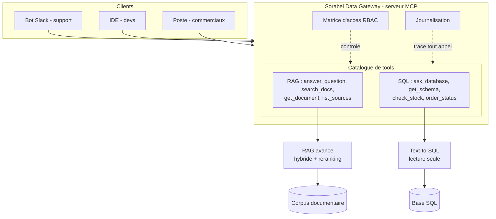

# Sorabel Data Gateway

> Un point d'accès **unique et gouverné** au savoir de Sorabel : recherche
> documentaire (RAG avancé) et données métier (Text-to-SQL lecture seule),
> exposées à tous les outils internes via un serveur **MCP**.

Sorabel est un distributeur B2B de matériel électrique et d'outillage. Son savoir
est éclaté entre un corpus documentaire (fiches techniques, notices, procédures
SAV) et une base SQL (produits, stocks, commandes, ventes). Résultat : chaque
équipe s'était bricolé son outil, la recherche ratait les références exactes, et
le SQL tapé à la main a déjà verrouillé la base en production. La Gateway remet
de l'ordre : **une porte, des règles, une trace.**

---

## Ce que fait la Gateway

| Brique          | Ce qu'elle résout                                              | Exigences |
|-----------------|----------------------------------------------------------------|-----------|
| RAG avancé      | Trouve par référence exacte *et* en langage naturel, cite ses sources, refuse d'inventer | E1, E2, E6 |
| Text-to-SQL     | Répond aux questions métier en SQL lecture seule, renvoie la requête pour transparence   | E3        |
| Gouvernance     | Chaque client borné par une matrice d'accès ; tout appel journalisé | E4, E5    |

---

## Architecture (vue d'ensemble)



---

## Structure du dépôt

Arborescence imposée par le dépôt d'exercice, plus ce qu'apporte la conception.

```
data/
  corpus/             # ~400 documents : fiches/ notices/ (PDF), sav/ (HTML), notes/ (Markdown)
  sorabel.db          # base SQL (hors git : générée par make seed, schéma dans docs/schema.sql)
docs/
  cadrage_dsi.md      # exigences E1–E6, matrice d'accès, contrat d'intégration
  schema.sql          # schéma commenté de la base (colonnes sensibles signalées)
eval/
  questions_rag.jsonl # questions documentaires : couvertes, hors corpus, par référence exacte
  questions_sql.jsonl # questions métier en langage naturel, dont cas limites
ingest/               # chaîne d'ingestion du corpus (à concevoir et construire)
retrieval/            # recherche documentaire (à concevoir et construire)
sql/                  # accès SQL en langage naturel (à concevoir et construire)
mcp_server/           # serveur MCP de la gateway (à concevoir et construire)
scripts/
  seed.py             # génère et peuple data/sorabel.db
  mcp_client.py       # client MCP de test (profils support / commercial)
tests/acceptance/     # suite d'acceptance boîte noire, adossée aux exigences E1–E6
```

S'y ajoutent, apportes par la phase de conception :

```
docs/conception/           8 chantiers, index, carte de la pile technique
docs/REVUE_CONCEPTION.md   revue du 2026-09-02, classee par lot bloque
docs/PASSATION_DEV.md      point d'entree du developpement
governance/                matrice.yaml, source de verite des droits, et son verificateur
eval/attendus_*.jsonl      oracles metier, et cas_mcp.jsonl pour la gouvernance
```

## Stack

- Python 3.11 (géré avec `uv`)
- Chroma pour l'index vectoriel (`docker compose`, port 8002)
- SQLite pour la base (`data/sorabel.db`, générée par le seed, à ouvrir en lecture seule)
- SDK MCP (`mcp`) pour le serveur et le client stdio
- `pypdf` / `beautifulsoup4` pour l'extraction du corpus, `rank-bm25` pour la piste lexicale
- `sentence-transformers` disponible via l'extra `vector` :

```bash
uv sync                       # cœur + outils de dev
uv sync --extra vector        # + sentence-transformers
```

## Démarrage

```bash
make install      # uv sync
make seed         # génère data/sorabel.db (déterministe, aligné sur le corpus)
make up           # docker compose : Chroma sur localhost:8002
make test         # suite d'acceptance (rouge tant que la gateway n'est pas construite)
make serve        # serveur MCP stdio (profil via SORABEL_PROFILE)
make client       # client de test (PROFILE=support|commercial)
```

Exemples côté client :

```bash
uv run python scripts/mcp_client.py --profile support --tool search_docs --args '{"query": "REF-8842"}'
uv run python scripts/mcp_client.py --profile commercial --tool ask_database --args '{"question": "combien de commandes en avril ?"}'
```

## Démonstration visuelle

```bash
uv sync --extra vector --extra demo
uv run streamlit run scripts/demo_rag.py     # http://localhost:8501
```

Trois onglets : la même question jouée en recherche dense puis en hybride
complète, la même question jouée sur les deux profils côte à côte, et le rapport
de mesure E6 généré. Il n'y a volontairement pas de sélecteur de profil : le
profil est une propriété du serveur, fixée à son lancement, pas une préférence
d'affichage.

## État d'avancement

| Phase                             | Statut       |
|-----------------------------------|--------------|
| Squelette + mémoire de projet     | Fait         |
| Analyse des données               | Fait, relevé généré |
| Conception (7 chantiers + schémas)| Fait, D1 à D37 |
| Jeux d'évaluation + attendus      | Fait         |
| Protocole de mesure E6            | Fait, chiffres au lot 3 |
| Implémentation RAG                | À venir      |
| Implémentation Text-to-SQL        | À venir      |
| Gouvernance + serveur MCP         | À venir      |
| Interface graphique               | À venir      |
| Mesure E6 + soutenance            | À venir      |

---

