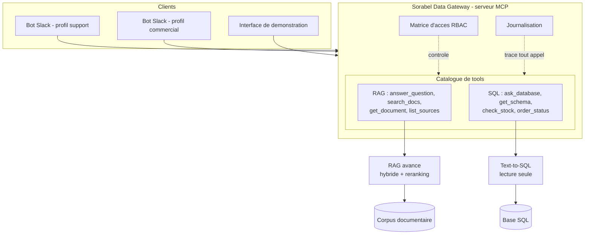

# Sorabel Data Gateway

> Un point d'accès **unique et gouverné** au savoir de Sorabel : recherche
> documentaire (RAG avancé) et données métier (Text-to-SQL lecture seule),
> exposées à tous les outils internes via un serveur **MCP**.

Sorabel est un distributeur B2B de matériel électrique et d'outillage. Son savoir
est éclaté entre un corpus documentaire (fiches techniques, notices, procédures
SAV) et une base SQL (produits, stocks, commandes, ventes). Résultat : chaque
équipe s'était bricolé son outil, la recherche ratait les références exactes, et
le SQL tapé à la main a déjà verrouillé la base en production. La Gateway remet
de l'ordre : **une porte, des règles, une trace.**

## L'interface, en ligne

**https://sorabel-gateway.mangoplant-5634ed08.francecentral.azurecontainerapps.io**

Six écrans. Le plus parlant n'est pas la recherche mais **« Serveur MCP »** :
le même appel y est joué sur les deux profils, et les deux issues s'écrivent à
la suite dans le même journal. Le produit de Sorabel n'est pas la recherche, ce
sont les **droits sur la recherche**.

Comptez une trentaine de secondes au premier affichage d'un écran : les modèles
d'embedding, de reranking et de génération SQL se chargent à la demande.

Déployé sur Azure Container Apps, image construite côté Azure par
`az acr build`. Tout est dans `deploy/azure.sh`, y compris un mode
`--controles` en lecture seule et un mode `--a-vide` qui éprouve la chaîne sans
rien construire.

**L'application tourne en continu, donc elle est facturée en continu.** Coût
mesuré : environ **155 USD par mois**, calculé par `deploy/cout.py` depuis
l'API tarifaire d'Azure et la consommation réelle du conteneur. Pour l'éteindre
sans rien détruire, le jour où le lien n'est plus nécessaire :

**Trois** services tournent : l'interface, et deux bots Slack, un par profil.
Une commande par service, chacune sur **une seule ligne** car PowerShell
n'accepte pas la continuation par antislash :

```text
az containerapp update --name sorabel-gateway --resource-group adialloRG --min-replicas 0
az containerapp update --name sorabel-slack --resource-group adialloRG --min-replicas 0
az containerapp update --name sorabel-slack-commercial --resource-group adialloRG --min-replicas 0
```

Les rallumer se fait avec `--min-replicas 1`, au prix de quelques minutes de
réveil, le temps de retirer 6 Go d'image et de charger les modèles. Pour tout
retirer, `bash deploy/azure.sh --detruire`, qui ne touche pas au groupe de
ressources puisqu'il est partagé.

---

## Ce que fait la Gateway

| Brique          | Ce qu'elle résout                                              | Exigences |
|-----------------|----------------------------------------------------------------|-----------|
| RAG avancé      | Trouve par référence exacte *et* en langage naturel, cite ses sources, refuse d'inventer | E1, E2, E6 |
| Text-to-SQL     | Répond aux questions métier en SQL lecture seule, renvoie la requête pour transparence   | E3        |
| Gouvernance     | Chaque client borné par une matrice d'accès ; tout appel journalisé | E4, E5    |

---

## Architecture (vue d'ensemble)



---

## Structure du dépôt

Arborescence imposée par le dépôt d'exercice, plus ce qu'apporte la conception.

```
data/
  corpus/             # ~400 documents : fiches/ notices/ (PDF), sav/ (HTML), notes/ (Markdown)
  sorabel.db          # base SQL (hors git : générée par make seed, schéma dans docs/schema.sql)
docs/
  cadrage_dsi.md      # exigences E1–E6, matrice d'accès, contrat d'intégration
  schema.sql          # schéma commenté de la base (colonnes sensibles signalées)
eval/
  questions_rag.jsonl # questions documentaires : couvertes, hors corpus, par référence exacte
  questions_sql.jsonl # questions métier en langage naturel, dont cas limites
ingest/               # chaîne d'ingestion du corpus : 400 documents, 910 chunks
retrieval/            # recherche documentaire : hybride, fusion RRF, reranking
sql/                  # accès SQL en langage naturel : sept couches de gardes
mcp_server/           # serveur MCP de la gateway, plus son guide d'accès généré
scripts/
  seed.py             # génère et peuple data/sorabel.db
  mcp_client.py       # client MCP de test (profils support / commercial)
tests/acceptance/     # suite d'acceptance boîte noire, adossée aux exigences E1–E6
```

S'y ajoutent, apportes par la phase de conception :

```
docs/conception/           8 chantiers, index, carte de la pile technique
docs/REVUE_CONCEPTION.md   revue du 2026-09-02, classee par lot bloque
docs/PASSATION_DEV.md      point d'entree du developpement
governance/                matrice.yaml, source de verite des droits, et son verificateur
eval/attendus_*.jsonl      oracles metier, et cas_mcp.jsonl pour la gouvernance
```

## Stack

- Python 3.11 (géré avec `uv`)
- Chroma pour l'index vectoriel, **embarque** (`PersistentClient`), sans service
  ni conteneur : le filtrage par metadonnee avant la recherche est ce qui l'a fait
  retenir, et la virtualisation est coupee au firmware de ce poste (D45)
- SQLite pour la base (`data/sorabel.db`, générée par le seed, à ouvrir en lecture seule)
- SDK MCP (`mcp`) pour le serveur et le client stdio
- `pypdf` / `beautifulsoup4` pour l'extraction du corpus, `rank-bm25` pour la piste lexicale
- `sentence-transformers` disponible via l'extra `vector` :

```bash
uv sync                       # cœur + outils de dev
uv sync --extra vector        # + sentence-transformers
```

## Démarrage

`make up` a disparu de cette liste : Chroma est embarqué depuis D45, il n'y a
plus de service à lancer.

```bash
make install      # uv sync
make seed         # génère data/sorabel.db (déterministe, aligné sur le corpus)
make test         # suite d'acceptance : 12/12 en environ 210 s
make serve        # serveur MCP stdio (profil via SORABEL_PROFILE)
make client       # client de test (PROFILE=support|commercial)
```

Exemples côté client :

```bash
uv run python scripts/mcp_client.py --profile support --tool search_docs --args '{"query": "REF-8842"}'
uv run python scripts/mcp_client.py --profile commercial --tool ask_database --args '{"question": "combien de commandes en avril ?"}'
```

## Démonstration visuelle

```bash
uv sync --extra vector --extra demo
uv run streamlit run scripts/demo_rag.py     # http://localhost:8501
```

Trois onglets : la même question jouée en recherche dense puis en hybride
complète, la même question jouée sur les deux profils côte à côte, et le rapport
de mesure E6 généré. Il n'y a volontairement pas de sélecteur de profil : le
profil est une propriété du serveur, fixée à son lancement, pas une préférence
d'affichage.

```bash
uv run streamlit run scripts/demo_sql.py     # http://localhost:8502
```

La démonstration du Text-to-SQL, elle, montre **où chaque question s'arrête** :
la pile de gardes étage par étage avec celui qui a tranché, le schéma réellement
envoyé au modèle, sa sortie brute, les ressources extraites de l'arbre
syntaxique, le SQL avant et après injection du `LIMIT`, et l'enveloppe qu'un
client MCP recevrait, lui, à côté de tout ce qu'il ne reçoit pas.

```bash
uv run python scripts/demo_deux_profils.py
```

La session de démonstration : la **même** séquence d'appels jouée sur les deux
profils, par le vrai protocole MCP, avec un processus serveur par profil. Les
deux lisent la même matrice et écrivent dans le **même** journal, ce qui rend la
comparaison vérifiable : les deux décisions opposées se lisent à la suite.

## État d'avancement

| Phase | Statut |
| --- | --- |
| Squelette + memoire de projet | Fait |
| Analyse des donnees | Fait, releve genere |
| Conception, 8 chantiers et schemas | Fait, D1 a D50 |
| Jeux d'evaluation + attendus | Fait, plus l'oracle de gouvernance |
| Implementation RAG | Fait, 400 documents, 910 chunks |
| Implementation Text-to-SQL | Fait, 27 gardes eprouvees |
| Gouvernance + serveur MCP | Fait, suite d'acceptance 12/12 |
| Interface graphique | Fait, deployee sur Azure, six ecrans |
| Mesure E6 | Fait, `eval/rapport_gain.md` genere |
| Bots Slack, un par profil | Fait, deux services deployes |
| Manuel pedagogique | Fait, `docs/Manuel_Sorabel_Data_Gateway.docx` |
| Soutenance | A venir |

---

---

## Le manuel

`docs/Manuel_Sorabel_Data_Gateway.docx`, 148 titres et 36 tableaux, reconstruit
le projet pas à pas : chaque décision, son motif, et les **44 pièges** payés en
cours de route, comptés dans le document produit et non dans la source. Il est **généré** depuis `docs/manuel_pedagogique.md` par
`docs/vers_docx.py`, qui n'emploie que la bibliothèque standard, et qui refuse
d'écrire si plus de 2 % des lignes de source se perdaient en route.
