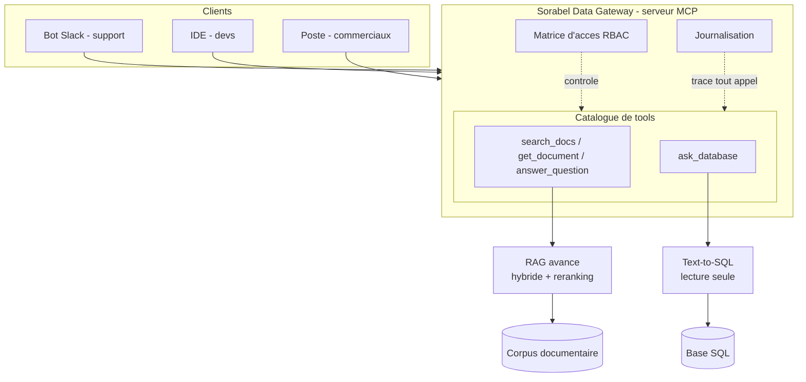

# Sorabel Data Gateway

> Un point d'accès **unique et gouverné** au savoir de Sorabel : recherche
> documentaire (RAG avancé) et données métier (Text-to-SQL lecture seule),
> exposées à tous les outils internes via un serveur **MCP**.

Sorabel est un distributeur B2B de matériel électrique et d'outillage. Son savoir
est éclaté entre un corpus documentaire (fiches techniques, notices, procédures
SAV) et une base SQL (produits, stocks, commandes, ventes). Résultat : chaque
équipe s'était bricolé son outil, la recherche ratait les références exactes, et
le SQL tapé à la main a déjà verrouillé la base en production. La Gateway remet
de l'ordre : **une porte, des règles, une trace.**

---

## Ce que fait la Gateway

| Brique          | Ce qu'elle résout                                              | Exigences |
|-----------------|----------------------------------------------------------------|-----------|
| RAG avancé      | Trouve par référence exacte *et* en langage naturel, cite ses sources, refuse d'inventer | E1, E2, E6 |
| Text-to-SQL     | Répond aux questions métier en SQL lecture seule, renvoie la requête pour transparence   | E3        |
| Gouvernance     | Chaque client borné par une matrice d'accès ; tout appel journalisé | E4, E5    |

---

## Architecture (vue d'ensemble)



---

## Structure du dépôt

```
sorabel-data-gateway/
├── CLAUDE.md          Memoire de projet (contexte, exigences, decisions)
├── README.md          Ce fichier
├── docs/              Cadrage DSI + dossier de conception + mesure E6
├── mcp_server/        Serveur MCP + mini guide d'acces (livrable)
├── rag/               Ingestion, chunking, recherche hybride, reranking
├── text2sql/          Generation SQL lecture seule + garde-fous
├── governance/        Matrice d'acces (RBAC) + journalisation
├── eval/              Jeux d'evaluation SQL et RAG + resultats
└── data/              Corpus documentaire + base SQL
```

---

## État d'avancement

| Phase                             | Statut       |
|-----------------------------------|--------------|
| Squelette + mémoire de projet     | Fait         |
| Analyse des données               | Fait         |
| Conception (3 chantiers + schémas)| Fait         |
| Jeux d'évaluation (SQL + RAG)     | Fait         |
| Implémentation RAG                | À venir      |
| Implémentation Text-to-SQL        | À venir      |
| Gouvernance + serveur MCP         | À venir      |
| Interface graphique               | À venir      |
| Mesure E6 + soutenance            | À venir      |

---

## Démarrage rapide

À compléter en phase de développement (installation, lancement du serveur MCP,
exécution des tests d'acceptation, reproduction de la mesure E6).

---

*Projet de formation — Dev IA agentic. Conception menée avec un assistant IA
selon une méthode pilote / expert (voir `CLAUDE.md`, §7).*
