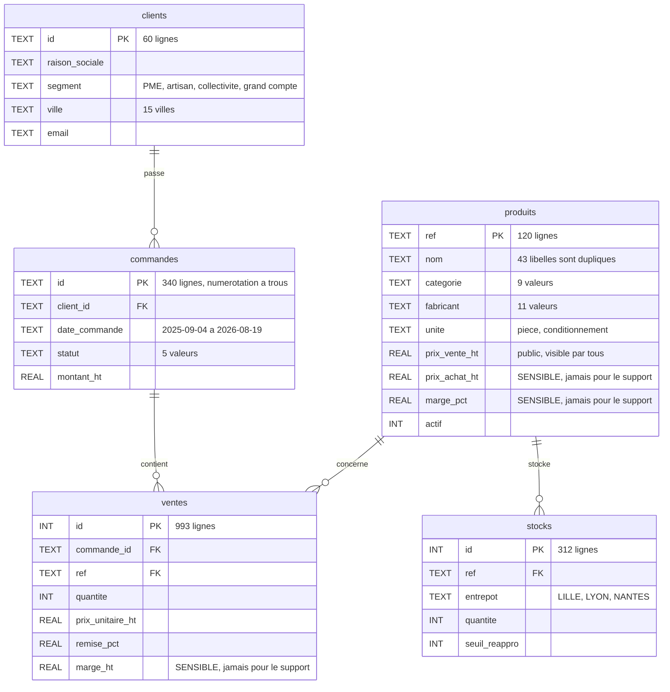

# Analyse du jeu de données — Sorabel Data Gateway

> Prise de connaissance des données fournies (`data/`). Base SQL inspectée
> intégralement (schéma, volumétrie, clés étrangères) ; corpus documentaire
> caractérisé sur un échantillon représentatif de chaque type. Ce document
> alimente les trois chantiers de conception.

---

## 1. Base SQL — `data/sorabel.db` (SQLite)

Six tables métier (plus `sqlite_sequence`, technique). Volumétrie et schéma :

| Table | Lignes | Colonnes |
| --- | ---: | --- |
| clients | 60 | id[PK], raison_sociale, segment, ville, email |
| produits | 120 | ref[PK], nom, categorie, fabricant, unite, prix_vente_ht, prix_achat_ht(\*), marge_pct(\*), actif |
| stocks | 312 | id[PK], ref[FK->produits.ref], entrepot, quantite, seuil_reappro |
| commandes | 340 | id[PK], client_id[FK->clients.id], date_commande, statut, montant_ht |
| ventes | 993 | id[PK], commande_id[FK->commandes.id], ref[FK->produits.ref], quantite, prix_unitaire_ht, remise_pct, marge_ht(\*) |

(*) colonne sensible : ne doit jamais sortir pour le profil support (E5).

Modèle relationnel :



Observations utiles au Text-to-SQL :

- Les dates sont stockées en **texte** `AAAA-MM-JJ`. Un filtre mensuel s'écrit
  donc `date_commande LIKE '2026-04%'`, jamais avec une fonction de date.
- Les **jointures** ne suivent que quatre chemins : `ventes` vers `commandes`
  vers `clients`, et `ventes` ou `stocks` vers `produits`. Détail en
  `conception/02_tools_text2sql.md`.
- Colonnes monétaires : `prix_vente_ht` est publique, `prix_achat_ht`,
  `marge_pct` et `ventes.marge_ht` sont sensibles au sens d'E5.

Les valeurs exactes des énumérations, des plages de dates et des volumes ne sont
pas recopiées ici : elles figurent dans le **bloc généré** en fin de document.
Une valeur recopiée à la main diverge, c'est arrivé deux fois sur ce document.

Correspondance avec le jeu d'éval SQL :

| Type de question | Comportement attendu |
| --- | --- |
| metier (SQL-01..12) | requete SELECT correcte + SQL renvoye |
| ecriture (SQL-13..16) | refus (lecture seule) + journalisation |
| table_interdite (SQL-17..20) | refus par la matrice (marges/prix d'achat), profil support |
| hors_schema (SQL-21,22) | refus clair, aucun SQL hallucine |
| ambigue (SQL-23,24) | demande de precision, pas de SQL devine |

---

## 2. Corpus documentaire — `data/corpus/`

Quatre familles de documents, chacune avec ses métadonnées de citation (E1).

| Dossier | Format | Metadonnees (source de la citation E1) | Versions vues |
| --- | --- | --- | --- |
| fiches/ | PDF | titre, reference, version, date, fabricant, categorie, prix public HT, references associees | v1.0 et v2.1 |
| notices/ | PDF | titre, reference, version, date ; sections securite/installation/service | v1.0 et v1.1 |
| sav/ | HTML | `&lt;title>`, puis `&lt;meta name="version">`, `&lt;meta name="date">`, `&lt;meta name="type">`, valeur dans l'attribut `content` | v1.0 et v2.0 |
| notes/ | MD | frontmatter YAML : titre, date, auteur, type=note_interne, version | version unique |

Sous-types des notes internes (déduits des noms de fichiers) :
`reunion-achat`, `alerte-qualite`, `politique-tarifaire`, `retour-terrain`,
`logistique`. Période couverte : 2024 à 2026.

Correspondance avec le jeu d'éval RAG :

| Type de question | Attendu |
| --- | --- |
| reference_exacte (01..08) | la fiche de la reference remonte en tete (E2) |
| couverte (09..22) | reponse + sources ; attendu_type = fiche_technique / notice / procedure_sav |
| hors_corpus (23..30) | abstention : l'outil signale l'absence (E1) |

Note : `attendu_type` de l'éval pointe vers `fiche_technique`, `notice`,
`procedure_sav`. Le type `note_interne` n'est pas ciblé par l'éval mais existe
dans le corpus, et porte l'essentiel du contenu sensible (voir §3).

---

## 3. Points sensibles pour la gouvernance (E4/E5)

La sensibilité est présente sur **deux plans**, pas seulement en SQL :

| Plan | Element sensible | Regle (profil support) |
| --- | --- | --- |
| SQL (colonnes) | produits.prix_achat_ht, produits.marge_pct, ventes.marge_ht | jamais renvoyees |
| RAG (collections) | notes/ (politique-tarifaire, reunion-achat) : marges cibles, prix, negos fournisseurs, mention "Diffusion restreinte" | non accessibles |

Conclusion : la matrice d'accès doit gouverner **tools + collections + tables +
colonnes**. C'est un point de conception à porter au chantier 3.

---

## 4. Constats structurants (impacts conception)

```
1. E1 realisable : chaque document porte titre + reference + date exploitables.
   -> Extraction de metadonnees specifique par format (PDF texte, meta HTML,
      frontmatter YAML).

2. E2 (reference exacte) : la reference figure dans le nom de fichier ET le texte.
   -> Justifie l'axe lexical/BM25 (ou filtre par metadonnee) en plus du dense.

3. Versioning reel : plusieurs versions datees d'un meme document (fiche, notice,
   procedure). C'est le piege "confond les versions".
   -> Indexer version + date ; politique de restitution a trancher (indexer tout,
      citer et privilegier la version la plus recente).

4. Sensibilite double (SQL + notes) -> gouvernance sur collections ET colonnes.

5. Abstention testable : les questions hors_corpus (RH, finance, RSE, VPN) sont
   reellement absentes du corpus -> E1 verifiable.
```

---

## 5. Questions ouvertes (à trancher en conception)

```
- Politique de version au RAG : tout indexer et privilegier le plus recent,
  ou n'indexer que la derniere version ? (impact E2 et E6)
- Granularite des collections RAG : fiches / notices / sav / notes, ou plus fin ?
```

Les deux questions « énumération exacte des valeurs » et « comptage précis des
fichiers du corpus », ouvertes jusqu'au 2026-08-31, sont **closes** : les deux
relevés sont produits par `docs/releve_donnees.py` et figurent dans le bloc
généré ci-dessous. `python docs/releve_donnees.py --verifier` échoue si le bloc
ne correspond plus aux données.

---

## Relevé du jeu de données

<!-- RELEVE:DEBUT -- genere par docs/releve_donnees.py, ne pas editer a la main -->

> Bloc **généré** le 2026-08-31 par `docs/releve_donnees.py`.
> Il décrit **ce jeu de données**, pas la conception. Un autre corpus produirait
> d'autres valeurs sans qu'aucune décision ne change. Ne pas éditer à la main :
> relancer le script.

### Base SQL

| Table | Lignes | Colonnes |
| --- | ---: | --- |
| `clients` | 60 | `id`, `raison_sociale`, `segment`, `ville`, `email` |
| `commandes` | 340 | `id`, `client_id`, `date_commande`, `statut`, `montant_ht` |
| `produits` | 120 | `ref`, `nom`, `categorie`, `fabricant`, `unite`, `prix_vente_ht`, `prix_achat_ht` (SENSIBLE, E5), `marge_pct` (SENSIBLE, E5), `actif` |
| `stocks` | 312 | `id`, `ref`, `entrepot`, `quantite`, `seuil_reappro` |
| `ventes` | 993 | `id`, `commande_id`, `ref`, `quantite`, `prix_unitaire_ht`, `remise_pct`, `marge_ht` (SENSIBLE, E5) |

### Clés étrangères

| Depuis | Vers |
| --- | --- |
| `commandes.client_id` | `clients.id` |
| `stocks.ref` | `produits.ref` |
| `ventes.ref` | `produits.ref` |
| `ventes.commande_id` | `commandes.id` |

### Énumérations

Colonnes textuelles à faible cardinalité. Ce sont les littéraux à fournir au
modèle de génération SQL (décision D9). **Les accents en font partie.**

| Colonne | Valeurs distinctes | Valeurs |
| --- | ---: | --- |
| `clients.segment` | 4 | `PME`, `artisan`, `collectivité`, `grand compte` |
| `clients.ville` | 15 | `Amiens`, `Angers`, `Arras`, `Dunkerque`, `Lille`, `Lyon`, `Metz`, `Nantes`, `Orléans`, `Reims`, `Rennes`, `Roubaix`, `Tours`, `Valenciennes`, `Villeurbanne` |
| `commandes.statut` | 5 | `annulee`, `en_attente`, `expediee`, `livree`, `preparee` |
| `produits.categorie` | 9 | `Câblage`, `Distribution`, `EPI`, `Mesure`, `Outillage à main`, `Outillage électroportatif`, `Protection électrique`, `Visserie`, `Éclairage` |
| `produits.fabricant` | 11 | `Ampria`, `Cablor`, `Ferrix`, `Filtech`, `Fixor`, `Lumea`, `Metrix Pro`, `Protec+`, `Securo`, `Torqua`, `Voltane` |
| `produits.unite` | 2 | `conditionnement`, `pièce` |
| `stocks.entrepot` | 3 | `LILLE`, `LYON`, `NANTES` |

### Plages de dates

| Colonne | De | À |
| --- | --- | --- |
| `commandes.date_commande` | 2025-09-04 | 2026-08-19 |

### Corpus documentaire

| Collection | Fichiers | Groupes de versions | Sections par document | Chunks |
| --- | ---: | ---: | --- | ---: |
| `fiches` | 150 | 120 | 1 (150 doc) | 150 |
| `notices` | 80 | 70 | 4 (80 doc) | 320 |
| `sav` | 90 | 80 | 3 (90 doc) | 270 |
| `notes` | 80 | 80 | 1 (80 doc) | 80 |
| **total** | **400** | **350** | | **820** |

### Diversité réelle du contenu

Une collection dont tous les documents partagent un seul corps ne permet
pas de mesurer la pertinence : une question sur ce contenu y a autant de
bonnes réponses qu'il y a de documents. Cela borne ce que E6 peut établir.

| Collection | Documents | Textes distincts | Gabarits distincts | Plus grand gabarit |
| --- | ---: | ---: | ---: | ---: |
| `fiches` | 150 | 120 | 19 | 16 |
| `notices` | 80 | 1 | 1 | 80 |
| `sav` | 90 | 2 | 1 | 90 |
| `notes` | 80 | 54 | 54 | 5 |

« Textes distincts » compte les corps différents une fois références et
dates neutralisées. « Gabarits » neutralise en plus les valeurs chiffrées :
l'écart entre les deux colonnes dit si la variation est de fond ou seulement
numérique.

### Anomalies du jeu

Elles **illustrent** des décisions, elles ne les fondent pas : les règles
correspondantes tiennent sur un jeu qui n'aurait aucune de ces anomalies.

- 43 libelles de produits sur 120 designent plusieurs references : un libelle n'est pas une cle (illustre D27).
- 336 numeros de commande manquent dans des suites par ailleurs continues (2025 : 220 manquants, dont CMD-2025-0006 ; 2026 : 116 manquants, dont CMD-2026-0004) : un identifiant bien forme peut ne designer aucune ligne (illustre D26).

<!-- RELEVE:FIN -->

---

## Ressources annoncées par le brief, ce qu'elles sont réellement

Vérifié le 2026-08-31 dans le HTML du brief officiel.

| Libellé dans le brief | Cible réelle |
| --- | --- |
| `eval/questions_rag.jsonl` | une **capture d'écran PNG**, pas un fichier |
| `eval/questions_sql.jsonl` | une **capture d'écran PNG**, pas un fichier |
| « Matrice d'accès » | un **lien vers l'article RBAC/MCP de dev.to**, pas une matrice fournie |
| « Repository » | `https://github.com/bybysker/sorabel-gateway` |

Deux conséquences. La reconstitution des jeux d'évaluation n'était pas un choix
mais la seule voie possible : aucun fichier n'est distribué. Et la matrice
d'accès du chantier 3 est bien une **production attendue**, pas la reprise d'un
document fourni : le libellé désignait la ressource méthodologique, pas un
livrable.
