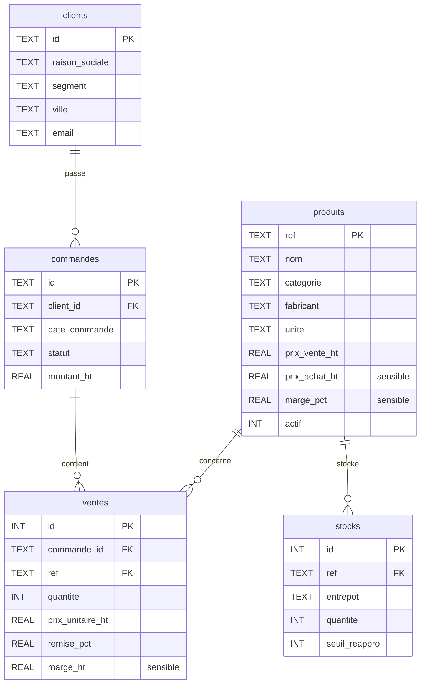

# Analyse du jeu de données — Sorabel Data Gateway

> Prise de connaissance des données fournies (`data/`). Base SQL inspectée
> intégralement (schéma, volumétrie, clés étrangères) ; corpus documentaire
> caractérisé sur un échantillon représentatif de chaque type. Ce document
> alimente les trois chantiers de conception.

---

## 1. Base SQL — `data/sorabel.db` (SQLite)

Six tables métier (plus `sqlite_sequence`, technique). Volumétrie et schéma :

```
+-----------+--------+----------------------------------------------------------------+
| Table     | Lignes | Colonnes                                                       |
+-----------+--------+----------------------------------------------------------------+
| clients   |     60 | id[PK], raison_sociale, segment, ville, email                  |
| produits  |    120 | ref[PK], nom, categorie, fabricant, unite, prix_vente_ht,      |
|           |        | prix_achat_ht(*), marge_pct(*), actif                          |
| stocks    |    312 | id[PK], ref[FK->produits.ref], entrepot, quantite,             |
|           |        | seuil_reappro                                                  |
| commandes |    340 | id[PK], client_id[FK->clients.id], date_commande, statut,      |
|           |        | montant_ht                                                     |
| ventes    |    993 | id[PK], commande_id[FK->commandes.id], ref[FK->produits.ref],  |
|           |        | quantite, prix_unitaire_ht, remise_pct, marge_ht(*)            |
+-----------+--------+----------------------------------------------------------------+
(*) colonne sensible : ne doit jamais sortir pour le profil support (E5).
```

Modèle relationnel :



Observations utiles au Text-to-SQL :

```
- Dates au format texte 'YYYY-MM-DD' (ex. commandes 2026-03, 2026-04) :
  un filtre mensuel se fait par date_commande LIKE '2026-04%'.
- Entrepots observes : LILLE, LYON (colonne stocks.entrepot).
- statut de commande : valeurs type 'livree', 'annulee' (a enumerer exhaustivement).
- Jointures naturelles : ventes -> commandes -> clients, et ventes/stocks -> produits.
- Colonnes monetaires : prix_vente_ht (public, OK support) vs prix_achat_ht +
  marge_pct + marge_ht (sensibles, interdits support).
```

Correspondance avec le jeu d'éval SQL :

```
+------------------------+-----------------------------------------------------------+
| Type de question       | Comportement attendu                                      |
+------------------------+-----------------------------------------------------------+
| metier (SQL-01..12)    | requete SELECT correcte + SQL renvoye                     |
| ecriture (SQL-13..16)  | refus (lecture seule) + journalisation                    |
| table_interdite        | refus par la matrice (marges/prix d'achat), profil support|
|  (SQL-17..20)          |                                                           |
| hors_schema (SQL-21,22)| refus clair, aucun SQL hallucine                          |
| ambigue (SQL-23,24)    | demande de precision, pas de SQL devine                   |
+------------------------+-----------------------------------------------------------+
```

---

## 2. Corpus documentaire — `data/corpus/`

Quatre familles de documents, chacune avec ses métadonnées de citation (E1).

```
+-----------+--------+-------------------------------------------+------------------+
| Dossier   | Format | Metadonnees (source de la citation E1)     | Versions vues    |
+-----------+--------+-------------------------------------------+------------------+
| fiches/   | PDF    | titre, reference, version, date,          | v1.0 et v2.1     |
|           |        | fabricant, categorie, prix public HT,     |                  |
|           |        | references associees                      |                  |
| notices/  | PDF    | titre, reference, version, date ;         | v1.0 et v1.1     |
|           |        | sections securite/installation/service    |                  |
| sav/      | HTML   | <title>, <meta version>, <meta date>,     | v1.0 et v2.0     |
|           |        | <meta type=procedure_sav>                 |                  |
| notes/    | MD     | frontmatter YAML : titre, date, auteur,   | version unique   |
|           |        | type=note_interne, version                |                  |
+-----------+--------+-------------------------------------------+------------------+
```

Sous-types des notes internes (déduits des noms de fichiers) :
`reunion-achat`, `alerte-qualite`, `politique-tarifaire`, `retour-terrain`,
`logistique`. Période couverte : 2024 à 2026.

Correspondance avec le jeu d'éval RAG :

```
+----------------------------+-------------------------------------------------------+
| Type de question           | Attendu                                               |
+----------------------------+-------------------------------------------------------+
| reference_exacte (01..08)  | la fiche de la reference remonte en tete (E2)         |
| couverte (09..22)          | reponse + sources ; attendu_type = fiche_technique /  |
|                            | notice / procedure_sav                                |
| hors_corpus (23..30)       | abstention : l'outil signale l'absence (E1)           |
+----------------------------+-------------------------------------------------------+
```

Note : `attendu_type` de l'éval pointe vers `fiche_technique`, `notice`,
`procedure_sav`. Le type `note_interne` n'est pas ciblé par l'éval mais existe
dans le corpus, et porte l'essentiel du contenu sensible (voir §3).

---

## 3. Points sensibles pour la gouvernance (E4/E5)

La sensibilité est présente sur **deux plans**, pas seulement en SQL :

```
+--------------------+------------------------------------------+---------------------+
| Plan               | Element sensible                          | Regle (profil       |
|                    |                                          | support)            |
+--------------------+------------------------------------------+---------------------+
| SQL (colonnes)     | produits.prix_achat_ht, produits.marge_  | jamais renvoyees    |
|                    | pct, ventes.marge_ht                      |                     |
| RAG (collections)  | notes/ (politique-tarifaire, reunion-    | non accessibles     |
|                    | achat) : marges cibles, prix, negos      |                     |
|                    | fournisseurs, mention "Diffusion         |                     |
|                    | restreinte"                              |                     |
+--------------------+------------------------------------------+---------------------+
```

Conclusion : la matrice d'accès doit gouverner **tools + collections + tables +
colonnes**. C'est un point de conception à porter au chantier 3.

---

## 4. Constats structurants (impacts conception)

```
1. E1 realisable : chaque document porte titre + reference + date exploitables.
   -> Extraction de metadonnees specifique par format (PDF texte, meta HTML,
      frontmatter YAML).

2. E2 (reference exacte) : la reference figure dans le nom de fichier ET le texte.
   -> Justifie l'axe lexical/BM25 (ou filtre par metadonnee) en plus du dense.

3. Versioning reel : plusieurs versions datees d'un meme document (fiche, notice,
   procedure). C'est le piege "confond les versions".
   -> Indexer version + date ; politique de restitution a trancher (indexer tout,
      citer et privilegier la version la plus recente).

4. Sensibilite double (SQL + notes) -> gouvernance sur collections ET colonnes.

5. Abstention testable : les questions hors_corpus (RH, finance, RSE, VPN) sont
   reellement absentes du corpus -> E1 verifiable.
```

---

## 5. Questions ouvertes (à trancher en conception)

```
- Politique de version au RAG : tout indexer et privilegier le plus recent,
  ou n'indexer que la derniere version ? (impact E2 et E6)
- Granularite des collections RAG : fiches / notices / sav / notes, ou plus fin ?
- Enumeration exacte des valeurs de statut et des entrepots (pour bornage SQL).
- Comptage precis des fichiers du corpus par type (a produire par script au
  moment de l'ingestion, chantier 1).
```
