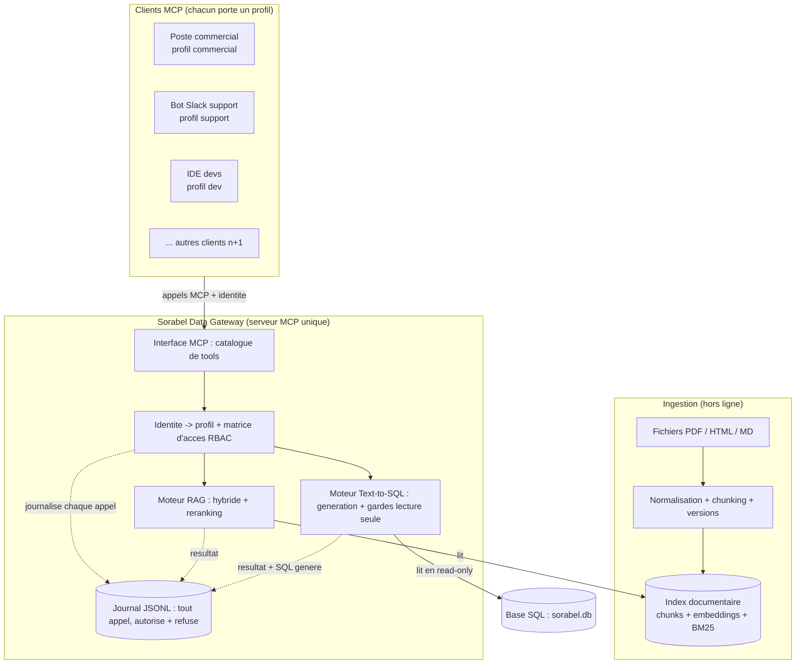

# Vue d'ensemble de l'architecture : Sorabel Data Gateway

> Schéma d'architecture globale, en tête du dossier de conception. Il ouvre la
> Gateway pour montrer ses composants et relie chaque bloc aux exigences DSI.
> Détails dans les chantiers 1 (RAG), 2 (Text-to-SQL) et 3 (matrice d'accès).

## Schéma

## Légende et correspondance avec les exigences

| Bloc | Role | Exigence |
| --- | --- | --- |
| Interface MCP | expose le catalogue de tools (un serveur pour tous les clients) | E4 |
| Identite + matrice RBAC | resout le profil, borne l'acces aux tools / collections / tables / colonnes | E4, E5 |
| Moteur RAG | recherche hybride + reranking, reponse ancree + sources citees | E1, E2, E6 |
| Moteur Text-to-SQL | generation SQL + gardes lecture seule, SQL renvoye avec le resultat | E3, E5 |
| Journal JSONL | trace tout appel (autorise + refuse), sans valeurs sensibles | E5 |
| Index documentaire | chunks + embeddings + BM25 (lu par le RAG) | E2 |
| Base SQL (read-only) | donnees metier, accedee en lecture seule | E3 |
| Ingestion (hors ligne) | normalise et indexe le corpus en amont | E1, E2 |

## Points de lecture

En ligne vs hors ligne : l'ingestion (normalisation, chunking, gestion des
versions, indexation) se fait hors ligne et produit l'index ; à la requête, le
moteur RAG lit cet index, jamais les fichiers bruts. Côté données, la Gateway
interroge la base en lecture seule.

Application de la matrice sur deux niveaux : l'autorisation au niveau tool est
vérifiée à l'entrée (la gateway refuse l'appel d'un tool interdit), et le
périmètre ressource (collections, tables, colonnes) est appliqué dans chaque
moteur, car lui seul sait quelles ressources la requête touche réellement.

Chemin de réponse : les flèches montrent le sens des requêtes ; la réponse
(passages plus sources pour le RAG, lignes plus SQL généré pour le SQL) revient
au client via l'interface MCP, sous une sortie typée par `status` (une
abstention ou un refus n'est jamais rendu comme une réponse).

Gouvernance par profil, pas par nombre de clients : `n+1` exprime la
multiplicité, mais l'accès est déterminé par le profil que porte chaque client
(support, commercial, dev), pas par le nombre d'agents.
