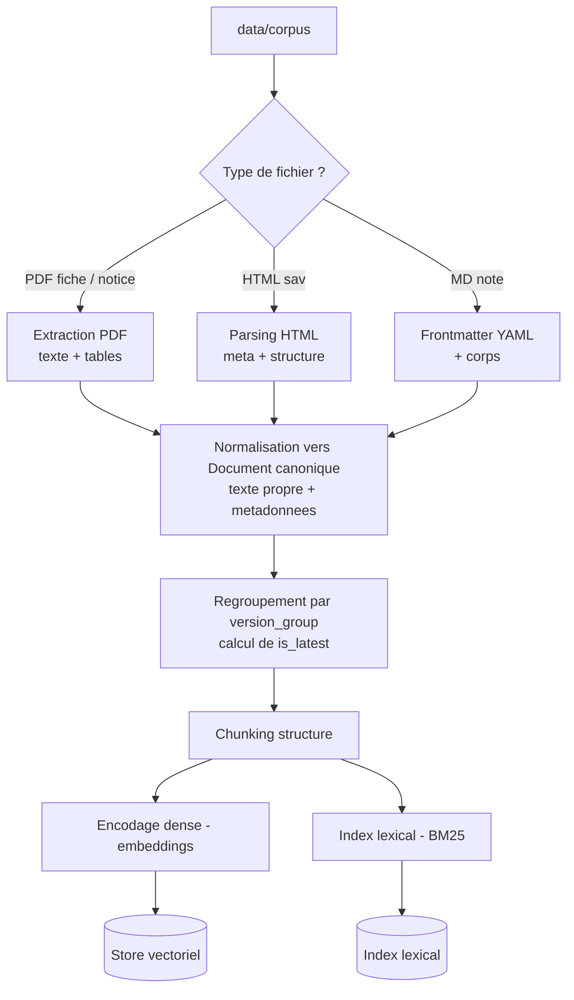
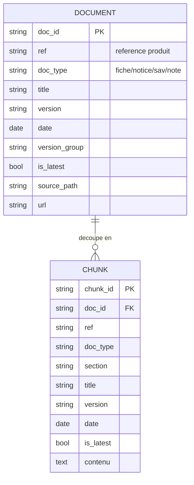
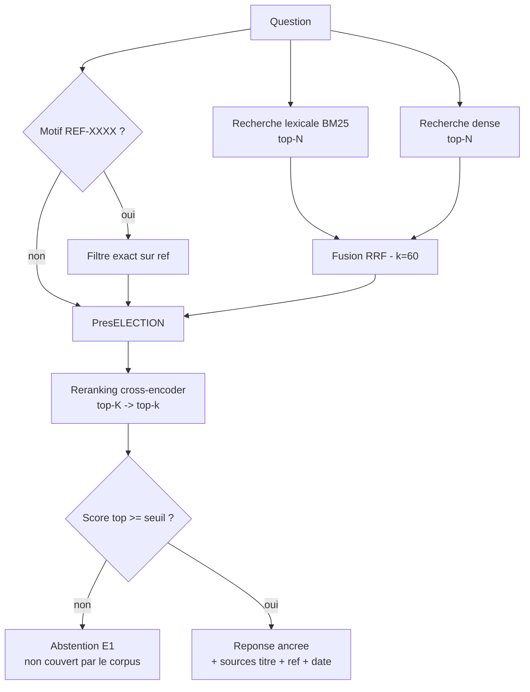

# Chantier 1 — RAG avancé : flux documentaire et chunking

> Dossier de conception. Répond aux cinq questions guides du brief et produit les
> schémas associés. Exigences couvertes : E1 (citations + abstention), E2
> (référence exacte + langage naturel), E6 (gain mesuré). S'appuie sur
> `docs/analyse_donnees.md` (structure réelle du corpus).
>
> Statut des décisions : PROPOSÉ (recommandation de l'expert, à valider par le
> pilote). Les points ouverts sont listés en fin de document.

---

## Q1. Normaliser un corpus hétérogène et traiter les versions multiples

### 1.1 Le problème

Le corpus mélange trois formats (PDF pour fiches et notices, HTML pour SAV,
Markdown pour notes) et contient plusieurs versions datées d'un même document.
Une recherche fiable exige une représentation unique et des métadonnées propres,
et une gestion explicite des versions pour ne jamais les confondre.

### 1.2 Schéma Document canonique (cible commune)

Chaque source est convertie vers un même enregistrement :

```
+--------------+-----------------------------------------------------------------+
| Champ        | Description                                                     |
+--------------+-----------------------------------------------------------------+
| doc_id       | identifiant unique = {doc_type}_{ref|slug}_v{version}            |
| ref          | reference produit (REF-8842) si applicable, sinon null          |
| doc_type     | fiche_technique | notice | procedure_sav | note_interne         |
| title        | titre du document                                               |
| version      | 1.0 / 2.1 / ...                                                 |
| date         | AAAA-MM-JJ                                                      |
| version_group| cle de regroupement des versions d'un meme document logique     |
| is_latest    | vrai si version la plus recente du groupe                       |
| lang         | fr                                                             |
| source_path  | chemin d'origine (tracabilite)                                  |
| url          | lien interne cliquable (citation E1)                            |
| text         | contenu normalise (texte propre, structure par sections)        |
| sections[]   | liste de sections (titre + texte) pour le chunking              |
+--------------+-----------------------------------------------------------------+
```

### 1.3 Extraction spécifique par format

```
+-----------+-----------------------------------------------------------------------+
| Format    | Traitement                                                            |
+-----------+-----------------------------------------------------------------------+
| PDF       | Extraction texte (PyMuPDF / pdfplumber) en respectant l'ordre de       |
| (fiches,  | lecture. Tables eventuelles : extraction dediee (pdfplumber) puis      |
|  notices) | linearisation en "cle : valeur" ou tableau Markdown, pour preserver    |
|           | le sens a l'embedding. Le bloc d'entete (titre, ref, version, date)    |
|           | est parse en metadonnees ET conserve dans le texte.                   |
| HTML      | Parsing (BeautifulSoup). Metadonnees lues dans <title> et les balises  |
| (sav)     | <meta version/date/type>. Titres h1/h2 conserves comme sections.      |
| Markdown  | Frontmatter YAML -> metadonnees (titre, date, auteur, type, version).  |
| (notes)   | Corps conserve avec ses titres.                                       |
+-----------+-----------------------------------------------------------------------+
Normalisation commune : Unicode NFC, espaces normalises, sections preservees,
la reference et le titre restent presents dans le texte (utile au lexical).
```

### 1.4 Traitement des versions (dédoublonnage)

Regroupement par `version_group` :
- fiches et notices : cle = (doc_type, ref).
- procédures SAV : cle = (doc_type, slug, instance), la version portee par le suffixe.
- notes : une seule version, pas de regroupement.

Dans chaque groupe, `is_latest` = version la plus élevée (puis date la plus récente).

Politique de restitution retenue (PROPOSÉ) : **indexer toutes les versions**,
chacune portant `version`, `date` et `is_latest`. Au moment de la recherche, on
privilégie et on cite la version la plus récente ; une version ancienne n'est
renvoyée que si la question la demande explicitement.

```
Pourquoi ce choix :
- on n'ecrase jamais l'historique (utile pour "qu'est-ce qui a change ?") ;
- on ne confond jamais les versions : chaque chunk est date et versionne ;
- la reponse par defaut est la plus recente, ce qui evite le piege du brief.
Alternative ecartee : n'indexer que la derniere version (plus simple mais perte
d'historique et impossibilite de repondre sur une version anterieure).
```

### 1.5 Flux d'ingestion



---

## Q2. Granularité de chunk et métadonnées

### 2.1 Granularité (adaptative, pilotée par la structure)

Les documents sont courts et structurés : un découpage à taille fixe casserait
une fiche ou fusionnerait des sections sans rapport. On découpe selon la
structure, pas selon un nombre de caractères arbitraire.

```
+----------------+------------------+---------------------------+---------------+
| Type           | Taille typique   | Strategie                 | Chunks / doc  |
+----------------+------------------+---------------------------+---------------+
| fiche_technique| ~1 page, dense   | 1 chunk = document entier | 1             |
| notice         | 4 sections       | 1 chunk par section       | ~4            |
| procedure_sav  | court, sections  | 1 chunk par section       | 1 a 3         |
| note_interne   | tres court       | 1 chunk = document entier | 1             |
+----------------+------------------+---------------------------+---------------+
Regle globale : respecter les frontieres section et document ; cible 200 a 400
tokens ; chevauchement ~15% uniquement si une section depasse la cible ; ne
jamais couper une phrase ni fusionner deux documents.
```

Justification : une question cible souvent une section précise (par exemple
« que vérifier 48 h après la mise en service ? » vise la section Mise en service
d'une notice). Le chunk par section maximise la précision du passage cité (E1)
sans diluer le signal.

### 2.2 Métadonnées portées par chaque chunk

```
+-------------+----------------------------------+-------------------------------+
| Champ       | Exemple                          | Role                          |
+-------------+----------------------------------+-------------------------------+
| chunk_id    | fiche_REF-8842_v2.1#0            | identite du passage           |
| doc_id      | fiche_REF-8842_v2.1              | rattachement au document      |
| ref         | REF-8842                         | filtre exact (E2), lien SQL,  |
|             |                                  | regroupement des versions     |
| doc_type    | fiche_technique                  | filtrage collection, RBAC (E4)|
| title       | Disjoncteur tetrapolaire 40 A    | citation (E1)                 |
| version     | 2.1                              | gestion des versions (E2)     |
| date        | 2024-05-25                       | citation (E1), tri recence    |
| is_latest   | true                             | privilegier la derniere       |
| section     | Mise en service                  | precision de la citation      |
| source_path | corpus/fiches/REF-8842-v2.1.pdf  | tracabilite                   |
| url         | (lien interne)                   | citation cliquable (E1)       |
+-------------+----------------------------------+-------------------------------+
```

### 2.3 Pourquoi la métadonnée `ref` est décisive

```
1. Recherche exacte (E2) : "REF-8842" devient un filtre sur un champ structure,
   independant de la similarite semantique qui, elle, echoue sur les codes.
2. Regroupement des versions : ref est la cle qui relie v1.0 et v2.1.
3. Lien fiche <-> notice d'un meme produit (meme ref, doc_type different).
4. Pont vers la base SQL : ref = produits.ref, cle commune corpus / donnees.
Sans ref en metadonnee structuree, "REF-8842" n'est qu'un token rare noye dans
l'embedding et perdu pour le filtrage.
```

### 2.4 Modèle de données (Document / Chunk)



Chaque document normalisé est découpé en un ou plusieurs chunks ; le chunk hérite
des métadonnées de citation (title, ref, version, date) pour rendre E1 mécanique,
et `ref` plus `version` restent des champs filtrables de premier ordre (E2).

---

## Q3. Pourquoi le dense seul rate « REF-8842 », et l'apport de l'hybride + rerank

### 3.1 Pourquoi le dense seul échoue sur une référence exacte

Un embedding projette le texte dans un espace sémantique. « REF-8842 » est un
code alphanumérique sans sémantique : le modèle le découpe en sous-mots et
produit un vecteur dominé par le contexte (« disjoncteur », « fiche »), pas par
le code lui-même. Conséquence : « REF-8842 » et « REF-8843 » s'encodent presque
identiquement, et le dense ne sait pas distinguer la bonne référence. Il excelle
au contraire sur le sens (« quel disjoncteur pour du triphasé ? »).

### 3.2 Ce que rattrape le lexical (BM25)

BM25 fait de la correspondance exacte de termes pondérée par la fréquence
inverse (IDF). Un token rare comme « REF-8842 » a une IDF très élevée : le
document qui le contient remonte en tête, de façon déterministe. Le lexical
gère donc les codes, références et termes hors vocabulaire. Sa faiblesse
symétrique : il rate les paraphrases (la fiche dit « circuits de force
triphasés », la question dit « triphasé »).

### 3.3 Combiner les deux : hybride par RRF

Les deux approches sont complémentaires. On les fusionne par **RRF (Reciprocal
Rank Fusion)** : chaque document reçoit un score `somme de 1/(k + rang)` sur les
listes lexicale et dense (k = 60 par convention). RRF est fondé sur les rangs,
donc insensible aux échelles de score différentes des deux moteurs, robuste et
sans calibrage. On ajoute un **court-circuit exact** : si la question contient un
motif `REF-XXXX`, on applique d'abord un filtre exact sur la métadonnée `ref`,
ce qui garantit la réponse aux questions `reference_exacte` (E2).

### 3.4 Ce qu'ajoute le reranking

L'hybride produit une présélection (par exemple top 20 à 50). Un **cross-encoder**
(reranker) encode conjointement la question et chaque passage, et note la
pertinence réelle bien plus finement qu'une similarité cosinus de bi-encodeur.
Il réordonne la présélection, remonte le meilleur passage, et fournit un **score
de pertinence calibré** réutilisé pour le seuil d'abstention (E1). Coût : de la
latence, maîtrisée en ne rerankant que la présélection.

### 3.5 Flux de recherche



### 3.6 Benchmark des briques (recommandations)

```
+-------------+-------------------------------+----------------------------+-----------------------+
| Composant   | Recommandation                | Alternatives               | Pourquoi              |
+-------------+-------------------------------+----------------------------+-----------------------+
| Embeddings  | BAAI/bge-m3 (multilingue)     | multilingual-e5-large,     | FR natif, dense de    |
|             |                               | Solon-embeddings (FR)      | qualite, local        |
| Lexical     | bm25s (ou rank-bm25)          | index sparse d'un store    | tokens exacts, IDF,   |
|             |                               |                            | transparent           |
| Fusion      | RRF (k=60)                    | somme ponderee normalisee  | robuste, sans reglage |
| Reranker    | BAAI/bge-reranker-v2-m3       | jina-reranker-v2, Cohere   | cross-encoder multi-  |
|             |                               | rerank (API)               | lingue, local         |
| Store       | Chroma (dense) + bm25         | Qdrant (hybride natif),    | simple ; baseline     |
|             | applicatif                    | FAISS                      | dense isolable (E6)   |
+-------------+-------------------------------+----------------------------+-----------------------+
Parti pris : garder le lexical applicatif separe du dense (plutot que le sparse
integre d'un store) pour rendre le baseline "dense seul" trivial a isoler et la
mesure E6 pleinement reproductible.
```

---

## Q4. Garantir E1 : citations systématiques et abstention

### 4.1 Citations systématiques (par construction)

La réponse est bâtie uniquement à partir des chunks retrouvés, qui portent tous
`title`, `ref`, `date`, `version`. La citation est donc mécanique. Le contrat de
sortie du tool l'impose :

```
answer_question(question) -> {
  answer : texte ancre uniquement sur le contexte,
  sources: [ {title, ref, version, date, url}, ... ]  # non vide si answer
}
Regle dure : pas de sources -> pas de reponse. La citation n'est pas optionnelle.
```

### 4.2 Abstention quand la pertinence est trop basse

Double garde, pour ne jamais inventer :

```
Garde 1 (recuperation) : si le score de reranking du meilleur passage < seuil tau,
  -> abstention "non couvert par le corpus" (aucune generation).
Garde 2 (generation) : le LLM recoit une consigne stricte "reponds uniquement a
  partir du contexte ; si le contexte ne suffit pas, renvoie NON_COUVERT".
  -> si NON_COUVERT, on renvoie l'abstention.
```

Calibrage du seuil tau : on l'établit empiriquement pour que les questions
`hors_corpus` tombent sous tau et les `couverte` au-dessus. Ce calibrage relie
directement E1 aux données de mesure E6 (voir Q5). On documente la sensibilité de
tau (jeu de test petit).

---

## Q5. Mesurer le gain (E6)

### 5.1 Sous-ensembles de `questions_rag.jsonl`

```
+--------------------+----+-------------------------+-------------------------------+
| Type d'eval        | N  | Label disponible        | Usage pour E6                 |
+--------------------+----+-------------------------+-------------------------------+
| reference_exacte   | 8  | attendu_reference (dur) | Recall@k, MRR (gain principal)|
| couverte           | 14 | attendu_type (faible)   | Recall@k si gold doc annote ; |
|                    |    |                         | sinon type@k (proxy)          |
| hors_corpus        | 8  | aucun                   | taux d'abstention (E1) +      |
|                    |    |                         | calibrage du seuil tau        |
+--------------------+----+-------------------------+-------------------------------+
```

Recommandation : annoter le document attendu (gold `doc_id`) pour les 14 questions
`couverte`, afin d'obtenir un Recall@k rigoureux plutôt qu'un simple `type@k`.

### 5.2 Métriques

```
- Recall@k (k = 1, 3, 5) : la cible est-elle dans les k premiers ? (E2, E6)
- MRR : rang reciproque du premier resultat correct (qualite du classement).
- Taux d'abstention sur hors_corpus : doit approcher 100% (E1).
Option : nDCG@k si plusieurs documents pertinents par question.
```

### 5.3 Protocole avant / après (reproductible)

```
Baseline : recherche DENSE SEULE (embedding + cosinus, top-k). C'est la
           "recherche dense initiale" nommee par le brief.
Avance   : hybride (BM25 + dense, RRF) + reranking cross-encoder.
Constantes : meme corpus indexe, meme k, meme modele d'embedding, seed fixe.
Sortie   : tableau comparatif dans eval/results/ + synthese dans docs/mesure_e6.md.
```

### 5.4 Tableau de résultats (gabarit à remplir)

```
+------------------------+----------------+-------------------------+--------+
| Metrique               | Baseline dense | Avance hybride + rerank | Gain   |
+------------------------+----------------+-------------------------+--------+
| Recall@1               |       .        |            .            |   .    |
| Recall@3               |       .        |            .            |   .    |
| Recall@5               |       .        |            .            |   .    |
| MRR                    |       .        |            .            |   .    |
| Abstention hors_corpus |       .        |            .            |   .    |
+------------------------+----------------+-------------------------+--------+
```

---

## Décisions proposées (à valider par le pilote)

```
D1  Schema Document canonique unique, extraction specifique par format.
D2  Versions : indexer toutes, marquer is_latest, citer/privilegier la plus
    recente ; ancienne accessible sur demande explicite.
D3  Chunking structure-aware et adaptatif (fiche = 1 chunk ; notice/sav = par
    section ; note = 1 chunk).
D4  Metadonnees riches par chunk ; ref comme champ filtrable de premier ordre.
D5  Hybride BM25 + dense, fusion RRF (k=60), court-circuit exact sur motif REF.
D6  Reranking cross-encoder sur la preselection.
D7  E1 : contrat {answer, sources[]} ; double garde (seuil tau + grounding LLM).
D8  E6 : baseline dense seul vs avance ; Recall@k + MRR sur reference_exacte et
    couverte annote ; abstention sur hors_corpus.
```

## Arbitrages (verrouillés le 2026-08-26)

```
P1  Versions -> INDEXER TOUTES + is_latest, citer/privilegier la plus recente,
    ancienne accessible sur demande explicite. Motif Sorabel : les documents
    vivent (notices, procedures SAV) ; on ne masque pas les versions, on les
    maitrise et on les date a la citation (E1/E2).
P2  Stack -> LOCAL open-source : embeddings BAAI/bge-m3, reranker
    BAAI/bge-reranker-v2-m3 (multilingue FR, sans cout par appel, reproductible).
P3  Store -> CHROMA (dense) + bm25 applicatif (baseline dense seul isolable pour E6).
P4  Eval E6 -> ANNOTER les gold doc des 14 questions "couverte" (Recall@k et MRR
    fiables, pas seulement sur reference_exacte).
```

## Auto-critique (risques et parades)

```
- Latence du cross-encoder : rerank limite a la preselection (top 20-50) + cache.
- Calibrage de tau sur peu d'exemples (8 hors_corpus) : documenter la sensibilite,
  eviter le sur-ajustement, verifier la marge avec les "couverte".
- Labels faibles des "couverte" : annoter les gold doc pour un Recall fiable.
- Quasi-doublons de versions : boost is_latest + dedup par version_group dans la
  liste finale, pour ne pas renvoyer deux fois le meme contenu.
- Tables PDF : aujourd'hui listes cle:valeur ; si de vraies grilles apparaissent,
  les lineariser pour preserver le sens a l'embedding.
```
