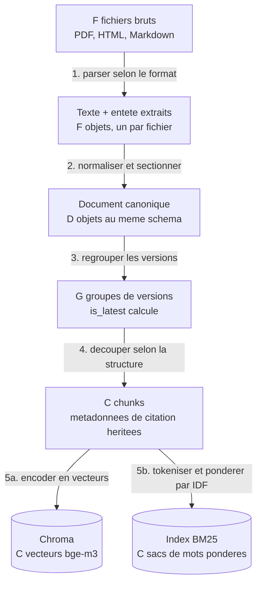
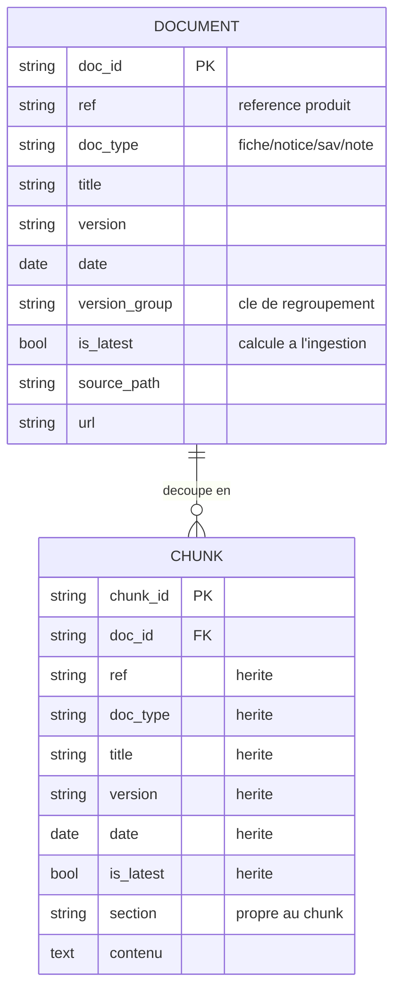
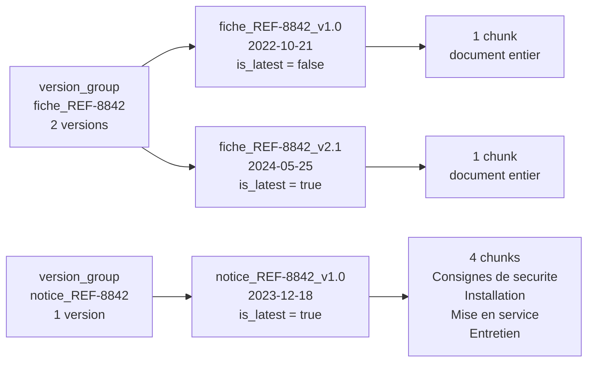
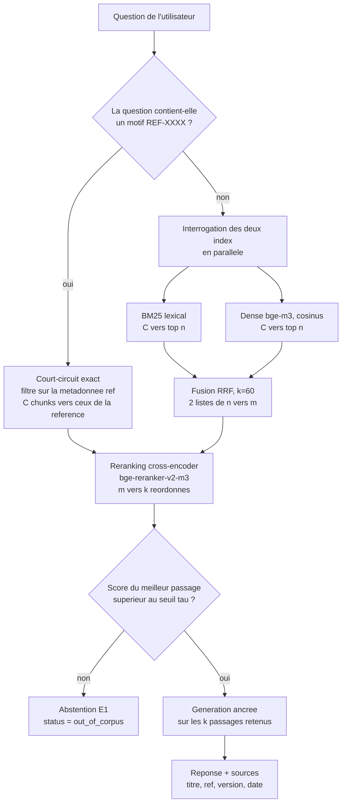

# Chantier 1 — RAG avancé : flux documentaire et chunking

> Dossier de conception. Répond aux cinq questions guides du brief et produit les
> schémas associés. Exigences couvertes : E1 (citations + abstention), E2
> (référence exacte + langage naturel), E6 (gain mesuré). S'appuie sur
> `docs/analyse_donnees.md` (structure réelle du corpus).
>
> Statut des décisions : PROPOSÉ (recommandation de l'expert, à valider par le
> pilote). Les points ouverts sont listés en fin de document.

---

## Q1. Normaliser un corpus hétérogène et traiter les versions multiples

### 1.1 Le problème

Le corpus mélange trois formats (PDF pour fiches et notices, HTML pour SAV,
Markdown pour notes) et contient plusieurs versions datées d'un même document.
Une recherche fiable exige une représentation unique et des métadonnées propres,
et une gestion explicite des versions pour ne jamais les confondre.

### 1.2 Schéma Document canonique (cible commune)

Chaque source est convertie vers un même enregistrement :

| Champ | Description |
| --- | --- |
| `doc_id` | identifiant unique, `{doc_type}_{ref ou slug}_v{version}` |
| `ref` | reference produit si applicable, sinon nul |
| `doc_type` | `fiche_technique`, `notice`, `procedure_sav` ou `note_interne` |
| `title` | titre du document |
| `version` | numero de version, par exemple 1.0 ou 2.1 |
| `date` | AAAA-MM-JJ |
| `version_group` | cle de regroupement des versions d'un meme document logique |
| `is_latest` | vrai si version la plus recente du groupe |
| `lang` | langue du document |
| `source_path` | chemin d'origine, pour la tracabilite |
| `url` | lien interne cliquable, pour la citation (E1) |
| `text` | contenu normalise, texte propre structure par sections |
| `sections[]` | liste de sections (titre + texte), entree du chunking |

### 1.3 Extraction spécifique par format

| Format | Traitement |
| --- | --- |
| PDF (fiches, notices) | Extraction texte (PyMuPDF / pdfplumber) en respectant l'ordre de lecture. Tables eventuelles : extraction dediee (pdfplumber) puis linearisation en « cle : valeur » ou tableau Markdown, pour preserver le sens a l'embedding. Le bloc d'entete (titre, ref, version, date) est parse en metadonnees ET conserve dans le texte. |
| HTML (sav) | Parsing (BeautifulSoup). Metadonnees lues dans `<title>` et les balises `<meta name="version">`, `<meta name="date">`, `<meta name="type">`, dont la valeur est portee par l'attribut `content`. Titres h1/h2 conserves comme sections. |
| Markdown (notes) | Frontmatter YAML vers metadonnees (titre, date, auteur, type, version). Corps conserve avec ses titres. |

Normalisation commune : Unicode NFC, espaces normalisés, sections préservées,
la référence et le titre restent présents dans le texte (utile au lexical).

### 1.4 Traitement des versions (dédoublonnage)

Regroupement par `version_group` :
- fiches et notices : cle = (doc_type, ref).
- procédures SAV : cle = (doc_type, slug, instance), la version portee par le suffixe.
- notes : une seule version, pas de regroupement.

Dans chaque groupe, `is_latest` = version la plus élevée (puis date la plus récente).

Politique de restitution retenue (PROPOSÉ) : **indexer toutes les versions**,
chacune portant `version`, `date` et `is_latest`. Au moment de la recherche, on
privilégie et on cite la version la plus récente ; une version ancienne n'est
renvoyée que si la question la demande explicitement.

```
Pourquoi ce choix :
- on n'ecrase jamais l'historique (utile pour "qu'est-ce qui a change ?") ;
- on ne confond jamais les versions : chaque chunk est date et versionne ;
- la reponse par defaut est la plus recente, ce qui evite le piege du brief.
Alternative ecartee : n'indexer que la derniere version (plus simple mais perte
d'historique et impossibilite de repondre sur une version anterieure).
```

### 1.5 Flux d'ingestion

L'ingestion tourne **hors ligne**, une fois, avant toute question. Elle transforme
`F` fichiers hétérogènes en `C` chunks indexés deux fois. À la requête, le moteur
ne lit plus jamais les fichiers d'origine : il lit les index.

Le schéma suit **les artefacts**, pas les actions : chaque étape affiche ce
qu'elle reçoit et ce qu'elle produit. Les cardinalités sont notées `F`, `D`, `G`
et `C` : elles dépendent du corpus, pas du pipeline. Les valeurs relevées sur le
jeu fourni figurent dans `../analyse_donnees.md`, bloc généré.



Ce que fait chaque étape :

| # | Entree | Operation | Sortie |
| --- | --- | --- | --- |
| 1 | 1 fichier PDF/HTML/MD | parseur dedie au format | texte + entete brut |
| 2 | texte + entete brut | Unicode NFC, espaces, decoupe en sections | 1 Document canonique |
| 3 | les `D` Documents | cle = (doc_type, ref), tri par version puis date | `G` groupes, `is_latest` posé |
| 4 | 1 Document et sa structure | règle propre au `doc_type` | 1 à n chunks |
| 5a | les `C` chunks | bge-m3 | `C` vecteurs |
| 5b | les `C` chunks | tokenisation + pondération IDF | `C` entrées BM25 |

**Étape 1, parser.** Trois formats, trois extracteurs. Le PDF donne un flux de
texte qu'il faut lire dans l'ordre de lecture. Le HTML porte ses métadonnées dans
`<title>` et les balises `<meta>`. Le Markdown les porte dans son frontmatter
YAML. Le piège : perdre l'en-tête, où vivent le titre, la référence, la version
et la date. Sans lui, la citation E1 devient impossible.

**Étape 2, normaliser.** Tout converge vers un **objet unique**, quel que soit le
format d'origine. C'est ce qui permet à la suite du pipeline d'ignorer d'où vient
le document. La normalisation Unicode NFC évite qu'un « é » composé et un « é »
précomposé soient traités comme deux caractères différents par BM25.

**Étape 3, regrouper les versions.** Les 400 documents ne sont pas 400 sujets :
`REF-8842` a une fiche en v1.0 et en v2.1. On les rattache au même
`version_group`, on trie, et la plus récente reçoit `is_latest = true`. C'est ici
que se règle le défaut nommé par le brief, « confond les versions d'une même
notice ». On n'écrase rien : les deux versions restent indexées, la récente est
privilégiée à la citation.

**Étape 4, découper.** Le découpage suit la structure du document, pas un nombre
de caractères. Une fiche tient sur une page dense : la couper séparerait le
calibre de la norme. Une notice a quatre sections indépendantes : les fusionner
diluerait la réponse. Détail en 2.1.

**Hypothèse d'échelle.** Ce pipeline est dimensionné pour un corpus de l'ordre de
10³ chunks. C'est la condition sous laquelle l'arbitrage P3, un index BM25
applicatif tenu en mémoire à côté du store vectoriel, reste défendable. Au-delà
de 10⁵, il faudrait reconsidérer P3 au profit d'un index lexical persistant.
L'ordre de grandeur est donc une **hypothèse de conception**, à la différence du
décompte exact, qui est un relevé.

**Étape 5, indexer deux fois.** Le même chunk part dans deux index qui ne savent
pas faire la même chose. Le vecteur capte le sens, l'index lexical capte les
termes exacts. Les garder **séparés** est un choix assumé (P3) : il rend la
branche « dense seule » isolable pour la mesure E6, sans réindexer.

## Q2. Granularité de chunk et métadonnées

### 2.1 Granularité (adaptative, pilotée par la structure)

Les documents sont courts et structurés : un découpage à taille fixe casserait
une fiche ou fusionnerait des sections sans rapport. On découpe selon la
structure, pas selon un nombre de caractères arbitraire.

| Type | Taille typique | Strategie | Chunks / doc |
| --- | --- | --- | --- |
| fiche_technique | ~1 page, dense | 1 chunk = document entier | 1 |
| notice | 4 sections | 1 chunk par section | ~4 |
| procedure_sav | court, sections | 1 chunk par section | 1 a 3 |
| note_interne | tres court | 1 chunk = document entier | 1 |

Regle globale : respecter les frontieres section et document ; cible 200 a 400
tokens ; chevauchement ~15% uniquement si une section depasse la cible ; ne
jamais couper une phrase ni fusionner deux documents.

Justification : une question cible souvent une section précise (par exemple
« que vérifier 48 h après la mise en service ? » vise la section Mise en service
d'une notice). Le chunk par section maximise la précision du passage cité (E1)
sans diluer le signal.

### 2.2 Métadonnées portées par chaque chunk

Un champ ne se justifie pas parce qu'il est disponible, mais parce que quelque
chose casse sans lui. Le tableau est donc classé **par usage**, avec la
conséquence de son absence.

| Usage | Champ | Exemple (fiche REF-8842 v2.1) | Sans ce champ |
| --- | --- | --- | --- |
| Citation (E1) | `title` | Disjoncteur tetrapolaire triphase 40 A courbe C | la source n'est pas nommable |
| Citation (E1) | `ref` | REF-8842 | on cite un texte sans dire de quel produit |
| Citation (E1) | `version` | 2.1 | on cite sans dire laquelle |
| Citation (E1) | `date` | 2024-05-25 | on cite sans dire de quand |
| Citation (E1) | `url` | lien interne | l'utilisateur ne peut pas verifier |
| Filtrage exact (E2) | `ref` | REF-8842 | « REF-8842 » redevient un token noye, cf. 2.3 |
| Filtrage exact (E2) | `doc_type` | fiche_technique | impossible de preferer une fiche a une note |
| Gouvernance (E4/E5) | `doc_type` | fiche_technique | la collection interdite au support ne peut pas etre filtree |
| Versions | `is_latest` | true | on cite une v1.0 perimee |
| Versions | `version_group` | fiche_REF-8842 | les versions ne se dedoublonnent pas |
| Precision | `section` | fiche = document entier | on cite un document entier pour une phrase |
| Tracabilite | `chunk_id` | fiche_REF-8842_v2.1#0 | pas de rejeu possible |
| Tracabilite | `doc_id` | fiche_REF-8842_v2.1 | on ne remonte pas au document |
| Tracabilite | `source_path` | corpus/fiches/REF-8842-v2.1.pdf | pas d'audit de l'index |

Trois remarques sur la mécanique.

**Les métadonnées sont copiées, pas référencées.** Le chunk porte `title`, `ref`,
`version` et `date` en dur, alors qu'il pourrait les lire sur son document
parent. C'est délibéré : au moment de citer, le moteur n'a en main que les chunks
retournés par la recherche. Une jointure supplémentaire serait un point de panne
entre « j'ai trouvé le passage » et « je sais d'où il vient ». La citation E1
devient ainsi **mécanique** et non conditionnelle.

**Certains champs servent deux fois.** `ref` cite et filtre. `doc_type` cite et
gouverne. C'est normal : ce sont les axes selon lesquels le corpus se lit.

**`is_latest` est un champ calculé, pas lu.** Il n'existe dans aucun fichier
source. Il est produit à l'étape 3 de l'ingestion et doit être recalculé à chaque
réindexation, sinon deux versions se déclarent toutes deux les plus récentes.

### 2.3 Pourquoi la métadonnée `ref` est décisive

```
1. Recherche exacte (E2) : "REF-8842" devient un filtre sur un champ structure,
   independant de la similarite semantique qui, elle, echoue sur les codes.
2. Regroupement des versions : ref est la cle qui relie v1.0 et v2.1.
3. Lien fiche <-> notice d'un meme produit (meme ref, doc_type different).
4. Pont vers la base SQL : ref = produits.ref, cle commune corpus / donnees.
Sans ref en metadonnee structuree, "REF-8842" n'est qu'un token rare noye dans
l'embedding et perdu pour le filtrage.
```

### 2.4 Modèle de données (Document / Chunk)

Deux entités seulement. Le `DOCUMENT` est ce qui existe dans le corpus, le
`CHUNK` est ce qui est indexé et cité.



Le modèle appliqué à un cas réel du corpus, la référence `REF-8842` :



Trois documents, six chunks, une seule référence produit. Ce que le schéma rend
visible :

**La référence n'est pas une clé.** `REF-8842` apparaît sur les trois documents
et les six chunks. Ce n'est pas un identifiant, c'est un **axe de regroupement**.
L'identifiant est `doc_id`, qui inclut le type et la version.

**Le versionnage est par type de document.** La fiche a deux versions, la notice
une seule. Les regrouper toutes sous « REF-8842 » ferait croire que la notice
v1.0 est une version périmée de la fiche v2.1. D'où la clé composite
`(doc_type, ref)`.

**La granularité varie dans un même produit.** Une question sur le calibre vise
la fiche entière, une question sur le serrage des bornes vise une seule section
de la notice. Un découpage uniforme servirait mal l'une des deux.

Volumes sur l'ensemble du corpus :

La règle de découpage, elle, ne dépend pas du corpus :

| Type de document | Chunks produits | Pourquoi |
| --- | --- | --- |
| `fiche_technique` | le document entier | une page dense, la couper séparerait le calibre de la norme |
| `notice` | un par section | les sections sont indépendantes, une question en vise une seule |
| `procedure_sav` | un par section | idem |
| `note_interne` | le document entier | trop court pour être découpé |

Les décomptes obtenus en appliquant cette règle au corpus fourni sont un
**relevé**, pas une propriété du pipeline. Ils figurent dans
`../analyse_donnees.md`, bloc généré, et sont produits par
`docs/releve_donnees.py`.

Une réserve à lever au lot 1 : le nombre de sections par notice est aujourd'hui
déduit d'un comptage de titres numérotés dans le texte extrait, pas d'un parseur
PDF complet. Tant que l'ingestion n'a pas tourné, le décompte de chunks est une
**projection**, pas une mesure.

## Q3. Pourquoi le dense seul rate « REF-8842 », et l'apport de l'hybride + rerank

### 3.1 Pourquoi le dense seul échoue sur une référence exacte

Un embedding projette le texte dans un espace sémantique. « REF-8842 » est un
code alphanumérique sans sémantique : le modèle le découpe en sous-mots et
produit un vecteur dominé par le contexte (« disjoncteur », « fiche »), pas par
le code lui-même. Conséquence : « REF-8842 » et « REF-8843 » s'encodent presque
identiquement, et le dense ne sait pas distinguer la bonne référence. Il excelle
au contraire sur le sens (« quel disjoncteur pour du triphasé ? »).

### 3.2 Ce que rattrape le lexical (BM25)

BM25 fait de la correspondance exacte de termes pondérée par la fréquence
inverse (IDF). Un token rare comme « REF-8842 » a une IDF très élevée : le
document qui le contient remonte en tête, de façon déterministe. Le lexical
gère donc les codes, références et termes hors vocabulaire. Sa faiblesse
symétrique : il rate les paraphrases (la fiche dit « circuits de force
triphasés », la question dit « triphasé »).

### 3.3 Combiner les deux : hybride par RRF

Les deux approches sont complémentaires. On les fusionne par **RRF (Reciprocal
Rank Fusion)** : chaque document reçoit un score `somme de 1/(k + rang)` sur les
listes lexicale et dense (k = 60 par convention). RRF est fondé sur les rangs,
donc insensible aux échelles de score différentes des deux moteurs, robuste et
sans calibrage. On ajoute un **court-circuit exact** : si la question contient un
motif `REF-XXXX`, on applique d'abord un filtre exact sur la métadonnée `ref`,
ce qui garantit la réponse aux questions `reference_exacte` (E2).

### 3.4 Ce qu'ajoute le reranking

L'hybride produit une présélection (par exemple top 20 à 50). Un **cross-encoder**
(reranker) encode conjointement la question et chaque passage, et note la
pertinence réelle bien plus finement qu'une similarité cosinus de bi-encodeur.
Il réordonne la présélection, remonte le meilleur passage, et fournit un **score
de pertinence calibré** réutilisé pour le seuil d'abstention (E1). Coût : de la
latence, maîtrisée en ne rerankant que la présélection.

### 3.5 Flux de recherche

La recherche est un **entonnoir**. Chaque étage réduit le nombre de candidats et
augmente le coût unitaire de l'examen. C'est cet ordre qui rend le pipeline
tenable : le modèle le plus coûteux ne voit que ce que les modèles bon marché ont
présélectionné.



L'entonnoir, étage par étage :

| Étage | Entrée | Sortie | Coût unitaire | Ce qu'il apporte |
| --- | --- | --- | --- | --- |
| Court-circuit `ref` | `C` chunks | les chunks de la référence | négligeable | garantit E2 |
| BM25 | `C` | `n` | très faible | termes exacts |
| Dense | `C` | `n` | faible, vecteurs précalculés | sens, paraphrases |
| Fusion RRF | `2n` | `m` | nul | réconcilie les deux |
| Reranking | `m` | `k` | **élevé** | ordre juste + score calibré |
| Seuil tau | `k` | `k` ou 0 | nul | abstention (E1) |

**Ce qui est de la conception, ici, c'est la décroissance**, pas les nombres :
`C` >> `n` > `m` > `k`. Chaque étage doit réduire assez pour que le suivant, plus
coûteux, reste tenable. Les valeurs de départ proposées sont `n` = 50, `m` = 20,
`k` = 5 ; elles ne sont **pas mesurées** et se calibrent au lot 3 sur
`eval/questions_rag.jsonl`.

**Le court-circuit exact.** Si la question porte un motif `REF-XXXX`, on ne fait
pas de recherche : on filtre sur une métadonnée. C'est un `WHERE ref = ...`, pas
une similarité. Le résultat est déterministe et ne peut pas se tromper de
référence. C'est la réponse directe au test d'acceptance « REF-8842 remonte en
tête ». Les deux moteurs restent disponibles ensuite pour ordonner les 6 chunks
du produit selon le reste de la question.

**Les deux moteurs en parallèle.** Ils ne cherchent pas la même chose. BM25
compare des mots et récompense les termes rares ; il trouve « REF-8842 » et rate
« triphasé » quand la fiche dit « circuits de force triphasés ». Le dense compare
des sens ; il fait l'inverse. Les lancer en parallèle coûte peu, car les vecteurs
sont déjà calculés à l'ingestion.

**La fusion RRF.** Le problème : les deux moteurs produisent des scores
incomparables, un score BM25 de 12,4 et un cosinus de 0,81 ne se somment pas. RRF
ignore les scores et ne regarde que les **rangs** : chaque chunk marque
`1 / (60 + rang)` dans chaque liste, et on additionne. Un chunk 3e partout bat un
chunk 1er ici et 40e ailleurs. Aucun calibrage à régler, c'est ce qui en fait un
choix robuste (D5).

**Le reranking.** Les deux premiers moteurs encodent la question et les documents
**séparément** : ils ne peuvent que comparer deux vecteurs figés. Le
cross-encoder lit la question et le passage **ensemble**, et note leur pertinence
réelle. Beaucoup plus juste, beaucoup plus cher : d'où sa place en fin
d'entonnoir, sur `m` candidats et non sur la totalite du corpus. Il produit un score
calibré, réutilisé à l'étage suivant.

**Le seuil tau.** C'est le score du reranker sur le meilleur passage. En dessous,
on n'appelle pas le générateur du tout : on renvoie `out_of_corpus`. C'est la
première des deux gardes d'E1 (la seconde étant la consigne d'ancrage donnée au
LLM, cf. 4.2). Le calibrage de tau se fait sur les 8 questions `hors_corpus` et
les 14 `couverte` : il faut une marge nette entre les deux populations.

### 3.6 Benchmark des briques (recommandations)

| Composant | Recommandation | Alternatives | Pourquoi |
| --- | --- | --- | --- |
| Embeddings | BAAI/bge-m3 (multilingue) | multilingual-e5-large, Solon-embeddings (FR) | FR natif, dense de qualite, local |
| Lexical | bm25s (ou rank-bm25) | index sparse d'un store | tokens exacts, IDF, transparent |
| Fusion | RRF (k=60) | somme ponderee normalisee | robuste, sans reglage |
| Reranker | BAAI/bge-reranker-v2-m3 | jina-reranker-v2, Cohere rerank (API) | cross-encoder multi-lingue, local |
| Store | Chroma (dense) + bm25 applicatif | Qdrant (hybride natif), FAISS | simple ; baseline dense isolable (E6) |

Parti pris : garder le lexical applicatif separe du dense (plutot que le sparse
integre d'un store) pour rendre le baseline "dense seul" trivial a isoler et la
mesure E6 pleinement reproductible.

---

## Q4. Garantir E1 : citations systématiques et abstention

### 4.1 Citations systématiques (par construction)

La réponse est bâtie uniquement à partir des chunks retrouvés, qui portent tous
`title`, `ref`, `date`, `version`. La citation est donc mécanique. Le contrat de
sortie du tool l'impose :

```
answer_question(question) -> {
  answer : texte ancre uniquement sur le contexte,
  sources: [ {title, ref, version, date, url}, ... ]  # non vide si answer
}
Regle dure : pas de sources -> pas de reponse. La citation n'est pas optionnelle.
```

### 4.2 Abstention quand la pertinence est trop basse

Double garde, pour ne jamais inventer :

```
Garde 1 (recuperation) : si le score de reranking du meilleur passage < seuil tau,
  -> abstention "non couvert par le corpus" (aucune generation).
Garde 2 (generation) : le LLM recoit une consigne stricte "reponds uniquement a
  partir du contexte ; si le contexte ne suffit pas, renvoie NON_COUVERT".
  -> si NON_COUVERT, on renvoie l'abstention.
```

Calibrage du seuil tau : on l'établit empiriquement pour que les questions
`hors_corpus` tombent sous tau et les `couverte` au-dessus. Ce calibrage relie
directement E1 aux données de mesure E6 (voir Q5). On documente la sensibilité de
tau (jeu de test petit).

---

## Q5. Mesurer le gain (E6)

### 5.1 Sous-ensembles de `questions_rag.jsonl`

| Type d'eval | N | Label disponible | Usage pour E6 |
| --- | ---: | --- | --- |
| reference_exacte | 8 | attendu_reference (dur) | Recall@k, MRR (gain principal) |
| couverte | 14 | attendu_type (faible) | Recall@k si gold doc annote ; sinon type@k (proxy) |
| hors_corpus | 8 | aucun | taux d'abstention (E1) + calibrage du seuil tau |

Recommandation : annoter le document attendu (gold `doc_id`) pour les 14 questions
`couverte`, afin d'obtenir un Recall@k rigoureux plutôt qu'un simple `type@k`.

### 5.2 Métriques

```
- Recall@k (k = 1, 3, 5) : la cible est-elle dans les k premiers ? (E2, E6)
- MRR : rang reciproque du premier resultat correct (qualite du classement).
- Taux d'abstention sur hors_corpus : doit approcher 100% (E1).
Option : nDCG@k si plusieurs documents pertinents par question.
```

### 5.3 Protocole avant / après (reproductible)

```
Baseline : recherche DENSE SEULE (embedding + cosinus, top-k). C'est la
           "recherche dense initiale" nommee par le brief.
Avance   : hybride (BM25 + dense, RRF) + reranking cross-encoder.
Constantes : meme corpus indexe, meme k, meme modele d'embedding, seed fixe.
Sortie   : tableau comparatif dans eval/results/ + synthese dans docs/mesure_e6.md.
```

### 5.4 Tableau de résultats (gabarit à remplir)

| Metrique | Baseline dense | Avance hybride + rerank | Gain |
| --- | ---: | ---: | ---: |
| Recall@1 | . | . | . |
| Recall@3 | . | . | . |
| Recall@5 | . | . | . |
| MRR | . | . | . |
| Abstention hors_corpus | . | . | . |

---

## Décisions proposées (à valider par le pilote)

```
D1  Schema Document canonique unique, extraction specifique par format.
D2  Versions : indexer toutes, marquer is_latest, citer/privilegier la plus
    recente ; ancienne accessible sur demande explicite.
D3  Chunking structure-aware et adaptatif (fiche = 1 chunk ; notice/sav = par
    section ; note = 1 chunk).
D4  Metadonnees riches par chunk ; ref comme champ filtrable de premier ordre.
D5  Hybride BM25 + dense, fusion RRF (k=60), court-circuit exact sur motif REF.
D6  Reranking cross-encoder sur la preselection.
D7  E1 : contrat {answer, sources[]} ; double garde (seuil tau + grounding LLM).
D8  E6 : baseline dense seul vs avance ; Recall@k + MRR sur reference_exacte et
    couverte annote ; abstention sur hors_corpus.
```

## Arbitrages (verrouillés le 2026-08-26)

```
P1  Versions -> INDEXER TOUTES + is_latest, citer/privilegier la plus recente,
    ancienne accessible sur demande explicite. Motif Sorabel : les documents
    vivent (notices, procedures SAV) ; on ne masque pas les versions, on les
    maitrise et on les date a la citation (E1/E2).
P2  Stack -> LOCAL open-source : embeddings BAAI/bge-m3, reranker
    BAAI/bge-reranker-v2-m3 (multilingue FR, sans cout par appel, reproductible).
P3  Store -> CHROMA (dense) + bm25 applicatif (baseline dense seul isolable pour E6).
P4  Eval E6 -> ANNOTER les gold doc des 14 questions "couverte" (Recall@k et MRR
    fiables, pas seulement sur reference_exacte).
```

## Auto-critique (risques et parades)

```
- Latence du cross-encoder : rerank limite a la preselection (top 20-50) + cache.
- Calibrage de tau sur peu d'exemples (8 hors_corpus) : documenter la sensibilite,
  eviter le sur-ajustement, verifier la marge avec les "couverte".
- Labels faibles des "couverte" : annoter les gold doc pour un Recall fiable.
- Quasi-doublons de versions : boost is_latest + dedup par version_group dans la
  liste finale, pour ne pas renvoyer deux fois le meme contenu.
- Tables PDF : aujourd'hui listes cle:valeur ; si de vraies grilles apparaissent,
  les lineariser pour preserver le sens a l'embedding.
```
