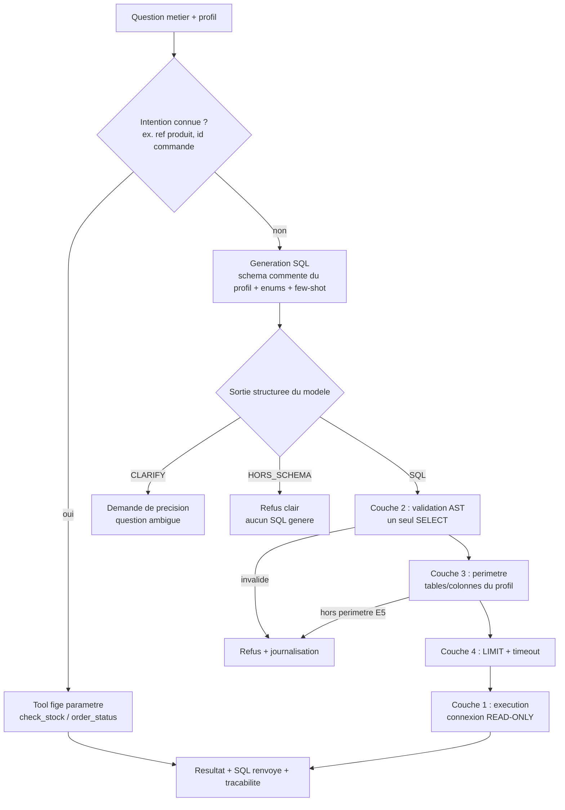
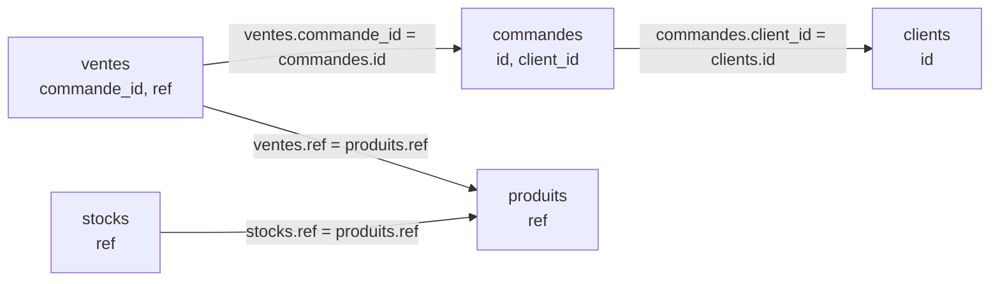
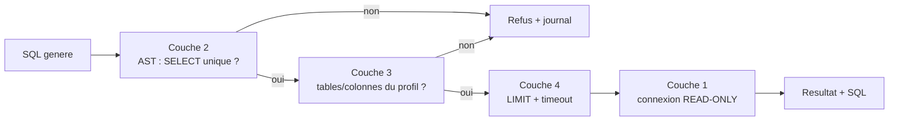
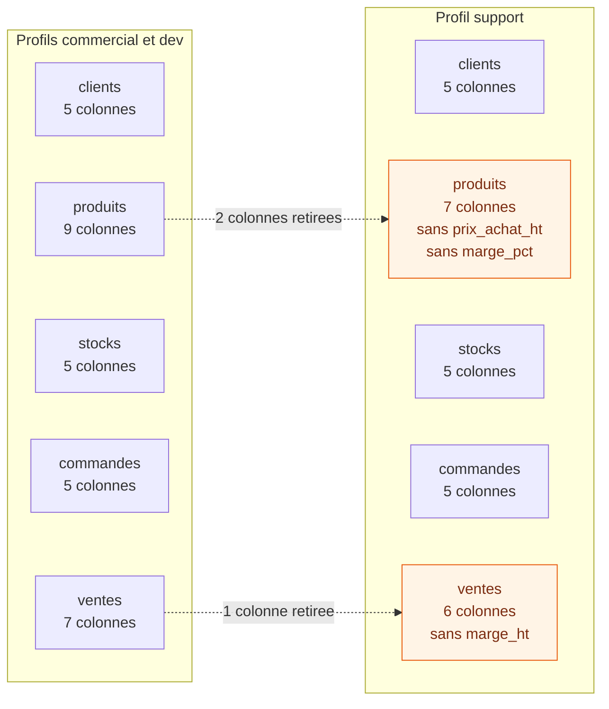

# Chantier 2 — Catalogue de tools et chemin Text-to-SQL

> Dossier de conception. Répond aux cinq questions guides du brief et produit les
> schémas associés. Exigences couvertes : E2 (langage naturel), E3 (lecture seule
> + transparence), E4 (catalogue de tools bornés par profil), E5 (colonnes
> sensibles jamais pour le support). S'appuie sur `docs/analyse_donnees.md`
> (schéma SQL réel) et sur les valeurs réelles extraites de `data/sorabel.db`.
>
> Statut des décisions : PROPOSÉ (à valider par le pilote), sauf mention.

---

## Vue d'ensemble du chemin



---

## Q1. De la question métier à une requête juste : que donner au modèle

Pour que la génération soit fiable, on fournit au modèle un contexte précis et
borné au profil. Quatre ingrédients :

### 1.1 Schéma commenté (limité au profil)

DDL des tables autorisées, avec type, sémantique et sensibilité. Exemple :

```sql
-- Table produits : catalogue. 120 lignes.
CREATE TABLE produits (
  ref            TEXT PRIMARY KEY,   -- reference produit, ex. 'REF-8842'
  nom            TEXT,               -- libelle commercial
  categorie      TEXT,               -- cf. enumerations
  fabricant      TEXT,               -- cf. enumerations
  unite          TEXT,               -- 'piece' | 'conditionnement'
  prix_vente_ht  REAL,               -- prix public HT (visible tous profils)
  prix_achat_ht  REAL,               -- SENSIBLE : interdit au profil support (E5)
  marge_pct      REAL,               -- SENSIBLE : interdit au profil support (E5)
  actif          INTEGER             -- 1 = actif
);
-- Dialecte : SQLite. Dates au format texte 'AAAA-MM-JJ'.
```

Principe clé : le schéma présenté au modèle ne contient **que** les tables et
colonnes autorisées pour le profil. Le support ne voit même pas exister
`prix_achat_ht`, `marge_pct`, `marge_ht` (première ligne de défense pour E5).

### 1.2 Énumérations et valeurs types

**Règle.** Toute colonne textuelle de faible cardinalité voit ses valeurs
distinctes injectées dans le prompt. Sans elles, le modèle invente un littéral
plausible mais faux, du type `statut = 'livrée'` là où la base stocke `'livree'`.
La requête est alors **syntaxiquement valide, franchit toutes les gardes, et
renvoie zéro ligne sans erreur** : c'est le pire mode de défaillance du système,
car aucune des six couches de sécurité ne le détecte.

**Corollaire, appris à nos dépens.** Ces valeurs ne se recopient pas dans un
document. Le 2026-08-31, six littéraux recopiés ici avaient perdu leurs accents,
et la même énumération recopiée à trois endroits avait divergé. Les valeurs sont
donc **extraites par introspection** au démarrage du serveur, et le relevé de
référence est produit par `docs/releve_donnees.py`, section « Énumérations » de
`../analyse_donnees.md`. Aucune valeur littérale n'est écrite à la main dans ce
chantier.

**Ce qu'il faut relever, indépendamment du jeu de données :**

| Élément | Pourquoi le modèle en a besoin |
| --- | --- |
| valeurs distinctes des colonnes de faible cardinalité | employer le bon littéral, accents et casse compris |
| plage couverte par les colonnes de date | résoudre un mois relatif comme « avril » |
| format de stockage des dates | choisir `LIKE` plutôt qu'une fonction de date absente du dialecte |

**Seuil.** Une colonne est traitée comme une énumération en deçà d'une quinzaine
de valeurs distinctes. Au-delà, la lister encombrerait le prompt sans l'aider.

### 1.3 Les jointures canoniques

C'est la principale source d'erreur d'un modèle qui génère du SQL : relier deux
tables par la mauvaise clé. Les quatre seuls chemins possibles dans ce schéma,
avec leur prédicat exact :



Deux lectures utiles. Pour remonter d'une vente jusqu'au client, il faut
**deux** jointures, `ventes` puis `commandes` puis `clients` : il n'existe pas
de lien direct. Et `ref` est la clé qui relie le monde SQL au corpus
documentaire, où elle est aussi la métadonnée de filtrage exact (E2).

### 1.4 Exemples de requêtes (few-shot, dialecte SQLite)

Quelques paires question -> SQL représentatives ancrent les patterns (comptage,
filtre par mois, jointure, agrégat, top-N) :

```
Q: combien de commandes en avril ?
SQL: SELECT COUNT(*) FROM commandes WHERE date_commande LIKE '2026-04%';

Q: les 5 produits les plus vendus en quantite ?
SQL: SELECT v.ref, SUM(v.quantite) AS q FROM ventes v
     GROUP BY v.ref ORDER BY q DESC LIMIT 5;

Q: quelles references sont sous leur seuil de reappro a Lyon ?
SQL: SELECT ref, quantite, seuil_reappro FROM stocks
     WHERE entrepot = 'LYON' AND quantite < seuil_reappro;
```

### 1.5 Consignes système

```
- Dialecte SQLite uniquement. Une seule instruction SELECT.
- Utiliser exclusivement les tables et colonnes du schema fourni.
- Interdiction de SELECT * : lister les colonnes explicitement.
- Toujours borner par LIMIT (ajoute par le serveur si absent).
- Si la question ne peut PAS etre repondue avec ce schema -> renvoyer HORS_SCHEMA.
- Si un critere est ambigu (ex. "meilleur") -> renvoyer CLARIFY avec les options.
```

---

## Q2. Garantir la lecture seule (E3) : défense en profondeur

Une seule barrière ne suffit pas : chaque couche couvre un mode de défaillance
différent. La question du brief (« une seule barrière suffit-elle ? ») appelle
un non argumenté.

| Couche | Barriere                                               | Ce qu'elle bloque                                                                             | Exigence |
| -----: | ------------------------------------------------------ | --------------------------------------------------------------------------------------------- | -------- |
|      1 | Connexion READ-ONLY (SQLite mode=ro / query_only)      | TOUTE ecriture, meme si les couches hautes sont contournees                                   | E3       |
|      2 | Validation AST (sqlglot)                               | non-SELECT (INSERT/UPDATE/DELETE/DROP/ALTER/PRAGMA/ATTACH), instructions multiples (; empile) | E3       |
|      3 | Perimetre tables/colonnes (extraction AST + whitelist) | acces hors matrice du profil (prix_achat_ht, marge_pct, ...)                                  | E4/E5    |
|      4 | LIMIT par defaut + timeout                             | requetes lourdes, produit cartesien, blocage de la base                                       | E3       |
|      5 | Transparence : SQL renvoye                             | (pas une barriere, une exigence)                                                              | E3       |
|      6 | Journalisation                                         | trace tout appel, autorise/refuse                                                             | E5       |

Ordre de raisonnement :



Point important sur la « liste de mots interdits » : c'est un filtre rapide
complémentaire, mais **insuffisant seul** (contournable par commentaires, casse,
alias). L'autorité, c'est l'analyse AST, qui raisonne sur la structure réelle de
la requête. La connexion en lecture seule reste le garde-fou ultime : même une
requête d'écriture qui passerait toutes les couches logicielles échouerait au
niveau du moteur.

L'incident du brief (base verrouillée un vendredi soir) est adressé par la
couche 4 (LIMIT + timeout) et la couche 1 (aucune écriture possible).

---

## Q3. Restreindre tables et colonnes par profil (E5)

### 3.1 Matrice d'accès SQL (préfigure le chantier 3)

| Profil     | clients | produits                                        | stocks | commandes | ventes                          |
| ---------- | ------- | ----------------------------------------------- | ------ | --------- | ------------------------------- |
| commercial | oui     | toutes colonnes (dont prix_achat_ht, marge_pct) | oui    | oui       | toutes colonnes (dont marge_ht) |
| support    | oui     | SAUF prix_achat_ht, marge_pct                   | oui    | oui       | SAUF marge_ht                   |
| dev        | oui     | toutes colonnes                                 | oui    | oui       | toutes colonnes                 |

Colonnes sensibles (jamais pour support) : produits.prix_achat_ht,
produits.marge_pct, ventes.marge_ht.

Note : le profil commercial a bien accès aux marges (l'éval SQL-11, marge de mai,
est de profil commercial et doit passer). Seul le support en est privé.

Ce que chaque profil reçoit **dans son prompt**, et non ce qui est filtré après
coup. Le support ne voit pas exister les colonnes sensibles :



Trois colonnes sur 31 disparaissent, dans deux tables sur cinq. Le reste est
identique pour les trois profils : la restriction porte sur les colonnes,
jamais sur les tables. Le support garde `prix_vente_ht`, qui est public.

### 3.2 Application en deux temps

```
Avant generation : le schema montre au modele uniquement les colonnes autorisees
                   -> le modele ne peut pas referencer ce qu'il ne voit pas.
Apres generation : extraction des tables/colonnes depuis l'AST, verification
                   d'inclusion dans la whitelist du profil. Toute reference
                   interdite -> REFUS CLAIR + journalisation (jamais un filtrage
                   silencieux qui masquerait le probleme).
```

### 3.3 Traitement de `SELECT *`

`SELECT *` sur `produits` ou `ventes` ferait fuiter les colonnes sensibles.
Décision : **interdire `SELECT *`** (le modèle liste les colonnes ; la couche AST
rejette toute étoile). Plus sûr et plus lisible qu'une expansion automatique,
surtout sur des jointures.

---

## Q4. Tools SQL figés vs SQL généré

Certains besoins récurrents et bien définis gagnent à être des requêtes
paramétrées écrites à la main plutôt que du SQL généré.

| Tool fige (parametre)    | Besoin couvert                     | Ref eval |
| ------------------------ | ---------------------------------- | -------- |
| `check_stock(ref)` | stock par entrepot d'une reference | SQL-02 |
| `order_status(order_id)` | statut d'une commande | SQL-08 |

Comparaison des deux approches :

| Critere        | Tools figes (parametres)                    | SQL genere (ask_database)             |
| -------------- | ------------------------------------------- | ------------------------------------- |
| Exactitude     | garantie (requete ecrite, testee)           | variable (depend du modele)           |
| Securite       | maximale (pas d'injection ni de generation) | forte MAIS via la pile de gardes (Q2) |
| Couverture     | limitee aux cas prevus                      | ouverte, ad hoc, analytique           |
| Cout / latence | faible (pas d'appel LLM)                    | superieur (appel LLM)                 |
| Maintenance    | code a ecrire par cas                       | generique                             |

Principe retenu : un **routage**. Si la question correspond à une intention connue
(entité identifiable : une `ref`, un id de commande), on emploie le tool figé
(voie rapide, sûre, déterministe). Sinon, repli sur `ask_database` (Text-to-SQL
générique, fortement gardé). Les figés sont la « route pavée » des demandes
fréquentes ; le SQL généré est la souplesse pour l'ad hoc.

Note : les tests d'acceptation du brief passent explicitement par `ask_database`
(ex. « combien de commandes en avril ? », « supprime les commandes de test »).
Les tools figés sont des entrées de catalogue complémentaires, pas un
remplacement.

---

## Q5. Question ambiguë ou hors schéma

Le modèle renvoie une sortie **structurée** parmi trois cas, jamais du SQL deviné :

| Cas         | Exemple (eval)                                                         | Comportement                                                                  |
| ----------- | ---------------------------------------------------------------------- | ----------------------------------------------------------------------------- |
| SQL         | "combien de commandes en avril ?"                                      | requete + resultat + SQL                                                      |
| CLARIFY     | "quel est le meilleur client ?" (SQL-23), "ca se vend bien ?" (SQL-24) | demande de precision : par chiffre d'affaires ? nombre de commandes ? marge ? |
| HORS_SCHEMA | "meteo a Lille demain ?" (SQL-21), "qui est le PDG ?" (SQL-22)         | refus clair, aucun SQL genere                                                 |

Distinction essentielle :
- **Hors schéma** : la donnée n'existe pas dans la base. On refuse proprement
  (« cette question ne relève pas des données disponibles »), sans inventer de
  table ni de colonne. Garde-fou : si un SQL est malgré tout produit et référence
  un objet inexistant, la validation AST le rejette.
- **Ambiguë** : la question est répondable une fois le critère précisé. On
  demande une précision en énumérant les interprétations plausibles, plutôt que
  de deviner (« meilleur » n'a pas de définition unique).

### 5.3 Entité valide mais introuvable (résultat vide)

Distinguer deux situations, car elles ne se disent pas de la même façon :

```
- Requete de liste ou d'agregat qui ne ramene rien = resultat legitime :
  status=ok, rows=[]. Ce n'est PAS une erreur (ex. "commandes livrees en juin"
  pourrait etre zero).
- Recherche d'ENTITE par identifiant precis qui ne trouve rien = status=not_found,
  message "identifiant valide, aucune donnee". Concerne order_status, check_stock,
  et ask_database quand l'intention est un identifiant unique.
Dans les deux cas : SQL genere renvoye (transparence E3) et appel journalise.
```

Exemple : SQL-08 « statut de la commande CMD-2026-0042 ». Cet identifiant est
absent de la table (trou de numérotation entre CMD-2026-0041 et CMD-2026-0044).
La requête est valide mais ne ramène aucune ligne : sortie `not_found`, pas une
fausse réponse vide.

### 5.4 Désambiguïsation d'entité (un libellé, plusieurs références)

**Un libellé n'est pas une clé.** Une référence est un identifiant, un nom
commercial n'en est pas un : rien n'empêche deux produits distincts de porter le
même libellé, et c'est vrai de tout catalogue rédigé en langage naturel. Le
risque est donc permanent, qu'il se matérialise ou non sur un jeu donné. Il faut
séparer deux natures d'ambiguïté :

```
- Ambiguite de CRITERE (la metrique est indefinie : "meilleur client",
  "ca se vend bien") -> CLARIFY (cf. 5.2).
- Ambiguite d'ENTITE (un libelle correspond a plusieurs ref) -> reponse
  MULTILIGNE listant toutes les references correspondantes avec l'attribut
  demande. Plus utile et plus transparent qu'un aller-retour ; montre la
  duplication reelle des donnees. status=ok.
```

*Occurrence sur le jeu fourni, qui prouve que le risque n'est pas théorique mais
ne fonde pas la règle : 43 libellés sur 120 désignent plusieurs références (cf.
`../analyse_donnees.md`, section « Anomalies du jeu »).*

Exemple : SQL-10 « prix de vente HT du disjoncteur tétrapolaire 40 A » correspond
à 4 produits (REF-8842, REF-1711, REF-8721, REF-1601). Réponse : les 4 références
avec leur prix, pas une valeur unique arbitraire. Pour SQL-18 (même situation sur
« projecteur LED 100 W », profil support), le refus `FORBIDDEN_COLUMN` prime par
l'ordre des gardes (Q2), la multiplicité est sans objet.

---

## Catalogue de tools (vue consolidée, à finaliser au chantier 3)

```
Famille SQL
  ask_database(question)                Text-to-SQL generique, pile de gardes (Q2)
  get_schema()                          tables et colonnes autorisees, aucune donnee
  check_stock(ref)                      stock par entrepot (fige)
  order_status(order_id)                statut d'une commande (fige)

Famille RAG (chantier 1)
  answer_question(question)             RAG complet + sources citees (E1)
  search_docs(query)                    recherche hybride, renvoie des passages
  get_document(doc_id)                  recupere un document complet
  list_sources(filtre)                  inventaire du corpus
```

**Aucun tool ne prend le profil en paramètre.** Il est résolu par le serveur à
partir de l'identité de l'appelant, jamais transmis par le client. La
spécification MCP est explicite : ce qu'un client déclare sur lui-même « n'est
pas vérifié par le protocole » et « ne doit pas servir à des décisions de
sécurité ». Un profil passé en argument serait déclaratif, et n'importe quel
appelant pourrait se déclarer `dev`. Le mécanisme de résolution fait l'objet de
la décision D28, au chantier 3.

Le profil ainsi résolu conditionne l'accès (E4) et le périmètre des colonnes
(E5). La matrice complète tool x collection x table x colonne est l'objet du
chantier 3.

---

## Couverture du jeu d'éval SQL

Le jeu compte cinq types de questions. Ce que le dossier leur oppose est une
**construction**, pas une réponse question par question : elle reste valable si
le jeu change de questions.

| Type d'éval | Ce que la conception oppose | Décision | Où |
| --- | --- | --- | --- |
| `metier` | génération sur schéma borné au profil, enrichi des énumérations réelles et de few-shot au dialecte | D9 | 1.1 à 1.5 |
| `ecriture` | pile de gardes, AST autoritaire, connexion en lecture seule en garde-fou ultime | D10, D11 | Q2 |
| `table_interdite` | périmètre du profil appliqué avant génération, par masquage du schéma, et après, par extraction AST | D12, D13 | Q3 |
| `hors_schema` | sortie structurée à trois cas, aucun SQL produit quand la donnée n'existe pas | D15 | 5.1, 5.2 |
| `ambigue` | ambiguïté de critère vers `clarify`, ambiguïté d'entité vers réponse multiligne | D27 | 5.2, 5.4 |
| résultat vide | agrégat ou liste sans ligne vers `ok`, entité par identifiant précis introuvable vers `not_found` | D26 | 5.3 |

Le détail par question, les requêtes de référence et les valeurs attendues sont
l'affaire de `eval/attendus_sql.jsonl`, pas du dossier de conception (D30). Trois
questions font exception et restent ici, parce qu'elles ont **produit** une
décision au lieu de la vérifier : SQL-08 a fait naître `not_found` (5.3), SQL-10 a
fait naître la réponse multiligne (5.4), et SQL-18 a établi que le refus de
colonne sensible précède la désambiguïsation d'entité.

---

## Décisions proposées

```
D9   Prompt de generation = schema commente (borne au profil) + enumerations
     reelles + few-shot SQLite + consignes strictes.
D10  Lecture seule = defense en profondeur (connexion RO + AST + perimetre +
     LIMIT/timeout + transparence + journal). Pas de barriere unique.
D11  AST (sqlglot) autoritaire ; blocklist de mots = filtre secondaire.
D12  Perimetre par profil applique avant (schema montre) ET apres (validation AST).
D13  Interdiction de SELECT * (liste explicite des colonnes).
D14  Routage : tools figes (check_stock, order_status, les deux seuls que le brief
     nomme) pour les besoins recurrents ; ask_database pour l'ad hoc.
D15  Sortie structuree {SQL | CLARIFY | HORS_SCHEMA} ; jamais de SQL devine.
D16  LIMIT par defaut = 200 (valeur a confirmer) ; timeout d'execution.
D26  Resultat vide : liste/agregat sans ligne = status=ok, rows=[] ; entite par
     identifiant precis introuvable = status=not_found. SQL toujours renvoye.
D27  Desambiguisation : ambiguite de critere -> CLARIFY ; ambiguite d'entite
     (un libelle -> plusieurs ref) -> reponse multiligne (status=ok).
D30  Le tableau de correspondance des 24 questions SQL quitte le dossier de
     conception : sa colonne "mecanisme" est de la tracabilite au niveau de la
     CLASSE et non de l'item, sa colonne "comportement attendu" est un corrige
     de test. Remplacement : une table par TYPE d'eval, qui prouve la couverture
     sans donner de reponse et reste vraie si le jeu d'eval change. Le detail
     par question va dans eval/attendus_sql.jsonl, sidecar joint par id ;
     questions_sql.jsonl n'est pas modifie. sql_reference vaut null pour les
     hors_schema, ce qui encode la garantie "aucun SQL hallucine". Restent en
     conception les trois cas qui ont PRODUIT une decision : SQL-08 pour D26,
     SQL-10 pour D27, SQL-18 pour la precedence des gardes.
```

## Arbitrage (verrouillé le 2026-08-26)

```
P5  LLM de generation Text-to-SQL -> LOCAL, modele oriente code (ex.
    Qwen2.5-Coder Instruct). Motif Sorabel : passerelle interne gouvernee,
    confidentialite au coeur du projet ; coherence avec la stack RAG locale ;
    reproductible, sans cout par appel. La generation ne voit que le schema et
    la question (pas les lignes), le local leve tout doute (y compris si l'on
    ajoute une reformulation des resultats). Repli : mesurer le taux de SQL juste
    sur SQL-01..12 ; si insuffisant, monter en gamme (modele local plus grand)
    avant d'envisager une API. Les gardes (AST, RO, perimetre) sont
    independantes du modele.
```

## Auto-critique (risques et parades)

```
- Mois ambigu sans annee : "avril" -> mapper sur 2026-04 (seule occurrence dans
  la plage). Documenter la convention ; si plusieurs annees, demander l'annee.
- SELECT * interdit : friction possible pour l'utilisateur ; compense par de bons
  few-shot qui listent les colonnes.
- Jointures generees fausses (mauvaise cle) : few-shot montrant les jointures
  canoniques (ventes->commandes->clients, ventes/stocks->produits).
- Colonne sensible via alias ou sous-requete : l'extraction AST resout les
  colonnes reelles, pas les alias de surface.
- LIMIT injecte fausse un COUNT/agregat : n'injecter LIMIT que sur les requetes
  qui renvoient des lignes de detail, pas sur un agregat scalaire.
- Qualite du SQL dependante du modele (P5) : mesurer le taux de reussite sur
  SQL-01 a 12 ; sinon renforcer few-shot ou changer de modele.
```
