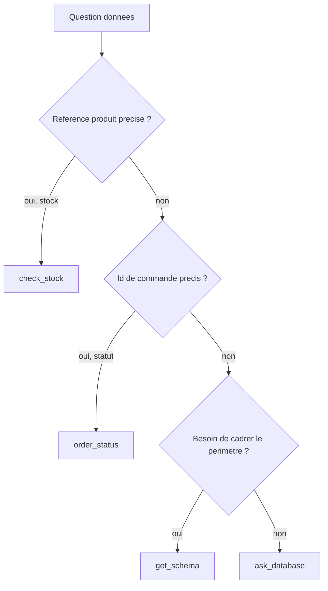
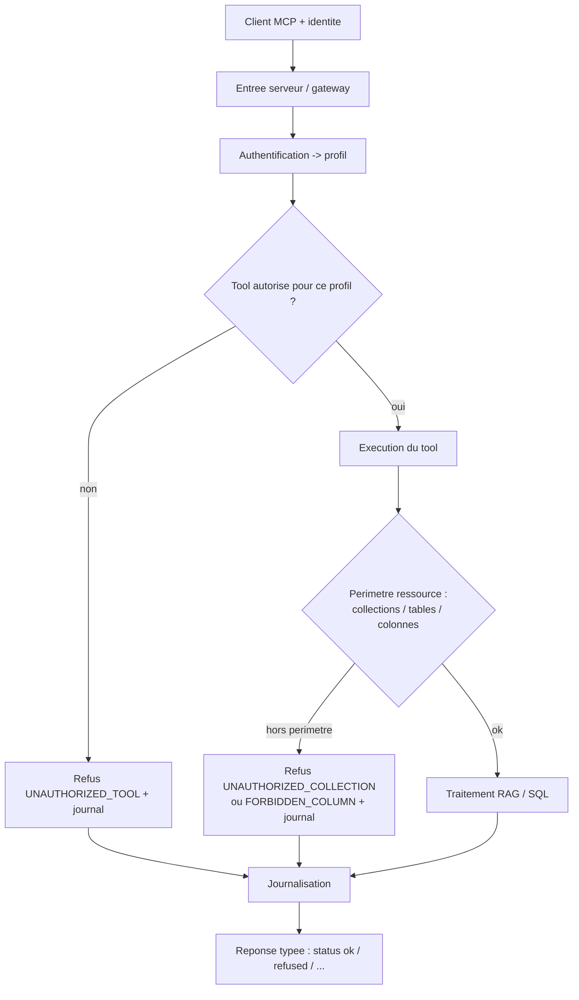

# Chantier 3 — Exposition MCP et matrice d'accès

> Dossier de conception. Répond aux cinq questions guides du brief et produit les
> schémas associés. Exigences couvertes : E4 (un serveur, chaque client borné à
> ses tools/collections/tables), E5 (tout appel journalisé, colonnes sensibles
> jamais pour le support), et le cadre de refus/erreurs qui protège E1 et E3.
> Consolide les chantiers 1 (collections RAG, sensibilité des notes) et 2
> (matrice SQL, pile de gardes).
>
> Statut des décisions : PROPOSÉ (à valider par le pilote), sauf mention.

---

## 0. Nomenclature du catalogue (figée ici)

Réconciliation des noms du brief et du chantier 2 :

```
+----------------------+------------------------+-------------------------------+
| Nom retenu           | Ancien nom (chantier 2)| Famille                        |
+----------------------+------------------------+-------------------------------+
| answer_question      | answer_question        | RAG (haut niveau)              |
| search_docs          | search_docs            | RAG (brique)                   |
| get_document         | get_document           | RAG (brique)                   |
| list_sources         | (nouveau)              | RAG (brique / decouverte)      |
| ask_database         | ask_database           | SQL (generatif)                |
| get_schema           | (nouveau)              | SQL (aide)                     |
| check_stock          | get_stock              | SQL (fige)                     |
| order_status         | get_order_status       | SQL (fige)                     |
+----------------------+------------------------+-------------------------------+
Note : get_product (chantier 2) est absorbe par ask_database + get_schema ; on
le reintroduira comme fige seulement si un besoin recurrent le justifie.
```

---

## Q1. Quels tools exposer : haut niveau vs briques, et pour qui

### 1.1 Le tool de haut niveau et ses briques

```
answer_question   RAG complet : recherche hybride -> reranking -> generation
                  ancree -> reponse + sources citees (E1). Une seule entree,
                  reponse prete a afficher.

search_docs       Brique : recherche hybride seule, renvoie des passages classes
                  (sans generation).
get_document      Brique : recupere un document complet (par doc_id ou ref+version).
list_sources      Brique : liste les sources disponibles (references, types,
                  versions) pour explorer/decouvrir le corpus.
```

### 1.2 À quels clients

```
+------------------+-----------------------------------------------------------+
| Client           | Usage                                                     |
+------------------+-----------------------------------------------------------+
| Bot Slack support| answer_question : veut une reponse SAV prete, avec sources|
| Poste commercial | answer_question : idem, cote commercial                   |
| IDE developpeurs | briques (search_docs, get_document, list_sources) : veut  |
|                  | chercher SANS generer, composer sa propre logique         |
+------------------+-----------------------------------------------------------+
```

Raison : le haut niveau sert les clients qui veulent une réponse clé en main ;
les briques servent les clients qui pilotent le pipeline (l'IDE qui « cherche
sans générer », ou construit son propre raisonnement). C'est aussi la
séparation testée par le brief (search_docs puis get_document = les briques
fonctionnent séparément).

---

## Q2. Décrire les tools données pour que le client (et son LLM) choisisse le bon

La description MCP de chaque tool doit dire QUAND l'employer, l'entité attendue,
et ce qu'il renvoie ou non. C'est ce qui guide le LLM appelant.

```
+--------------+------------------------------------------------------------------+
| Tool         | Description orientee "quand l'utiliser"                          |
+--------------+------------------------------------------------------------------+
| ask_database | "Repond a une question metier analytique ou ad hoc en generant   |
|              | du SQL lecture seule (filtre, agregat, jointure). A utiliser      |
|              | quand aucun tool fige ne couvre le besoin."                       |
| get_schema   | "Retourne les tables et colonnes AUTORISEES pour ce client. Ne    |
|              | renvoie aucune donnee. A appeler pour cadrer une question avant   |
|              | ask_database."                                                    |
| check_stock  | "Retourne le stock par entrepot d'UNE reference precise (ex.      |
|              | REF-8842). A utiliser des qu'on dispose de la reference exacte."  |
| order_status | "Retourne le statut d'UNE commande identifiee (ex. CMD-2026-0042)."|
+--------------+------------------------------------------------------------------+
```

Arbre de décision suggéré (donné au client dans le mini guide d'accès) :



Principes : figés = narrow et déterministes (l'entité est dans la signature),
`ask_database` = fourre-tout analytique, `get_schema` = découverte qui améliore
la génération. Des descriptions étroites poussent le LLM vers le figé pour les
lookups exacts et le repli vers `ask_database` pour le reste.

---

## Q3. Matrice d'accès : contenu et point d'application

### 3.1 Où l'appliquer : aux DEUX niveaux (défense en profondeur)

```
+---------------------+-----------------------------------------------------------+
| Niveau              | Responsabilite                                            |
+---------------------+-----------------------------------------------------------+
| Entree serveur      | Authentifier le client -> resoudre le profil. Verifier    |
| (gateway)           | l'autorisation au niveau TOOL (ce profil peut-il appeler  |
|                     | ce tool ?). Refus uniforme avant toute logique metier.    |
|                     | Journalisation centrale.                                  |
| Dans chaque tool    | Appliquer le perimetre RESSOURCE que seul le tool connait |
|                     | : collections autorisees (RAG), tables/colonnes (SQL, cf. |
|                     | pile de gardes chantier 2). Ex. quelles colonnes le SQL   |
|                     | genere touche reellement.                                 |
+---------------------+-----------------------------------------------------------+
```

Pourquoi les deux : la gateway offre un point de contrôle uniforme et empêche
même l'appel d'un tool interdit (E4) ; mais elle ne peut pas savoir quelles
colonnes un SQL généré va toucher, ni quelle collection un document provient.
Ce contrôle fin appartient au tool. Une seule source de vérité (config
déclarative) alimente les deux.



### 3.2 Matrice client x tool

```
+------------------+---------+------------+----------+
| Tool             | support | commercial | dev/IDE  |
+------------------+---------+------------+----------+
| answer_question  |   oui   |    oui     |   oui    |
| search_docs      |    -    |     -      |   oui    |  (brique)
| get_document     |    -    |     -      |   oui    |  (brique)
| list_sources     |    -    |     -      |   oui    |  (brique)
| ask_database     |  oui*   |    oui     |   oui    |  (* colonnes sensibles bloquees)
| get_schema       |  oui*   |    oui     |   oui    |  (* schema filtre au profil)
| check_stock      |   oui   |    oui     |   oui    |
| order_status     |   oui   |    oui     |   oui    |
+------------------+---------+------------+----------+
Le refus au niveau tool (E4) est demontre par les briques RAG, reservees a
dev/IDE : un support qui appelle search_docs est refuse.
```

### 3.3 Matrice client x collection (RAG)

```
+------------+---------+------------+----------+
| Collection | support | commercial | dev/IDE  |
+------------+---------+------------+----------+
| fiches     |   oui   |    oui     |   oui    |
| notices    |   oui   |    oui     |   oui    |
| sav        |   oui   |    oui     |   oui    |
| notes      |    -    |    oui     |   oui    |  (sensibles : politique-tarifaire,
+------------+---------+------------+----------+   reunion-achat ; jamais support)
```

### 3.4 Matrice client x table / colonnes (SQL) — rappel chantier 2

```
+-----------+---------+---------------------------------+-----------------------+
| Table     | support | colonnes bloquees (support)     | commercial / dev      |
+-----------+---------+---------------------------------+-----------------------+
| clients   |  oui    | -                               | toutes                |
| produits  |  oui    | prix_achat_ht, marge_pct        | toutes                |
| stocks    |  oui    | -                               | toutes                |
| commandes |  oui    | -                               | toutes                |
| ventes    |  oui    | marge_ht                        | toutes                |
+-----------+---------+---------------------------------+-----------------------+
```

### 3.5 Source de vérité : configuration déclarative

Une seule config gouverne gateway et tools. Exemple :

```yaml
profils:
  support:
    tools: [answer_question, ask_database, get_schema, check_stock, order_status]
    collections: [fiches, notices, sav]
    sql:
      tables: [clients, produits, stocks, commandes, ventes]
      colonnes_interdites: [produits.prix_achat_ht, produits.marge_pct, ventes.marge_ht]
  commercial:
    tools: [answer_question, ask_database, get_schema, check_stock, order_status]
    collections: [fiches, notices, sav, notes]
    sql: { tables: [clients, produits, stocks, commandes, ventes], colonnes_interdites: [] }
  dev:
    tools: [answer_question, search_docs, get_document, list_sources,
            ask_database, get_schema, check_stock, order_status]
    collections: [fiches, notices, sav, notes]
    sql: { tables: "*", colonnes_interdites: [] }
```

---

## Q4. Réponse d'un appel refusé et journalisation (E5)

### 4.1 Contrat de refus (typé, jamais confondable avec une réponse)

```json
{
  "status": "refused",
  "code": "UNAUTHORIZED_TOOL",
  "message": "Le profil support n'est pas autorise a appeler search_docs.",
  "detail": { "profil": "support", "tool": "search_docs" }
}
```

Codes normalisés :

```
+--------------------------+-----------------------------------------------+
| Code                     | Cas                                           |
+--------------------------+-----------------------------------------------+
| UNAUTHORIZED_TOOL        | tool non autorise pour le profil (E4)         |
| UNAUTHORIZED_COLLECTION  | collection RAG interdite (ex. notes/support)  |
| FORBIDDEN_COLUMN         | colonne sensible demandee (ex. marge/support) |
| READ_ONLY_VIOLATION      | SQL en ecriture (E3)                          |
| OUT_OF_SCHEMA            | question hors schema SQL                       |
| OUT_OF_CORPUS           | question non couverte par le corpus (E1)       |
| AMBIGUOUS               | critere ambigu, precision requise              |
+--------------------------+-----------------------------------------------+
```

### 4.2 Journalisation : tout appel, autorisé ou refusé (E5)

Un enregistrement structuré par appel (JSONL, dans `governance/logs/`) :

```json
{
  "request_id": "req-...",
  "timestamp": "2026-08-27T09:00:00Z",
  "client_id": "slack-support-bot",
  "profil": "support",
  "tool": "ask_database",
  "params_resume": { "question": "quelle est la marge sur la REF-8842 ?" },
  "decision": "refused",
  "code": "FORBIDDEN_COLUMN",
  "sql_genere": "SELECT marge_pct FROM produits WHERE ref='REF-8842'",
  "ressources_touchees": { "tables": ["produits"], "colonnes": ["marge_pct"] },
  "latency_ms": 42,
  "result_resume": null
}
```

Règles de journalisation :

```
- Tracer les appels AUTORISES ET REFUSES (le brief : "tous les appels y figurent").
- Ne jamais journaliser les VALEURS sensibles (pas de lignes de prix d'achat) :
  on logge des metadonnees (colonnes touchees, nb de lignes), pas le contenu.
- Toujours consigner le SQL genere (transparence E3) et le code de decision.
- Un identifiant de requete pour correler appel, refus et resultat.
```

---

## Q5. Comment le client gère proprement les erreurs, sans les faire passer pour des réponses

Principe : la sortie de chaque tool est **typée par `status`**. Le client ne
traite comme réponse QUE `status == "ok"` ; tout le reste est un signal de
contrôle à restituer honnêtement.

```
+------------------+-------------------------------+-------------------------------+
| status           | Cas                           | Ce que le client fait         |
+------------------+-------------------------------+-------------------------------+
| ok               | reponse valide                | afficher answer/rows + sources|
| out_of_corpus    | RAG ne couvre pas (E1)        | dire "non trouve dans la doc",|
|                  |                               | ne rien inventer              |
| out_of_schema    | SQL hors donnees (E3)         | dire "hors des donnees dispo" |
| not_found        | entite par identifiant precis | dire "identifiant valide mais |
|                  | introuvable (SQL valide)      | aucune donnee", pas une       |
|                  |                               | fausse reponse vide           |
| clarify          | question ambigue (critere)    | demander la precision (options)|
| refused          | non autorise / colonne / RO   | message d'acces refuse, pas   |
|                  |                               | de nouvelle tentative aveugle |
| error            | panne technique               | erreur technique, reessayer   |
+------------------+-------------------------------+-------------------------------+
```

Recommandation MCP : renvoyer les refus de politique et les cas "pas de
résultat" (hors corpus/schéma) comme un résultat de tool normal portant un
`status` non-`ok` et un `code` lisible par machine (le LLM client peut réagir :
s'excuser, demander une précision, escalader). Réserver l'erreur protocolaire MCP
aux pannes techniques. Cette convention est documentée dans le **mini guide
d'accès** (livrable), pour que les intégrateurs branchent leur client
correctement.

Point clé : ne jamais transformer un `message` de refus ou d'abstention en texte
de réponse. C'est la garantie que l'abstention E1 et les refus E3/E4/E5 ne
deviennent pas de fausses réponses.

---

## Correspondance avec les tests d'acceptation MCP

```
+-----------------------------------------------+-------------------------------+
| Test d'acceptation                            | Mecanisme                     |
+-----------------------------------------------+-------------------------------+
| profil autorise -> acces borne aux tools /    | matrice + double application  |
| collections / tables prevus                   | (gateway + tool)              |
| appel non autorise -> refus clair + journal   | contrat de refus + JSONL      |
| search_docs puis get_document (sans generer)  | briques RAG (dev/IDE)         |
| session de demo -> journal = tous les appels  | journalisation autorises +    |
| (autorises + refuses)                         | refuses                       |
+-----------------------------------------------+-------------------------------+
```

---

## Décisions proposées

```
D17  Catalogue de 8 tools, nomenclature figee (section 0).
D18  Haut niveau (answer_question) pour support/commercial ; briques
     (search_docs/get_document/list_sources) reservees a dev/IDE.
D19  Descriptions de tools orientees "quand l'utiliser" + arbre de decision
     dans le mini guide d'acces.
D20  Matrice appliquee aux DEUX niveaux : gateway (tool) + tool (ressources).
D21  Source de verite unique : config declarative par profil (tools /
     collections / sql tables+colonnes).
D22  Collection notes interdite au support ; accessible commercial/dev.
D23  Contrat de refus type {status, code, message, detail} ; codes normalises.
D24  Journalisation JSONL de tout appel (autorise + refuse), sans valeurs
     sensibles, avec SQL genere et ressources touchees.
D25  Sortie typee par status ; le client ne rend "reponse" que status=ok.
```

## Arbitrages (verrouillés le 2026-08-27)

```
P6  Briques RAG -> RESERVEES a dev/IDE. Motif Sorabel : le brief pose l'usage
    des briques pour l'IDE ; support et commercial veulent une reponse ancree,
    pas des passages bruts. Exposition minimale, deny-by-default, demonstration
    E4 nette.
P7  Collection notes -> COMMERCIAL + DEV, jamais support ; pas de 4e profil.
    Le brief ne definit que 3 clients (support, dev, commercial). La cible a
    proteger est le bot support customer-facing. Le commercial voit deja les
    marges cote SQL : la politique tarifaire lui est coherente. Le deny-by-
    default permet d'ajouter plus tard un profil achat/direction sans refonte.
```

## Point ouvert (implémentation)

```
P8  Mecanisme d'identite du client MCP (jeton, en-tete, id de session) : a
    definir en phase de developpement. L'autorisation ne vaut que si l'identite
    est fiable.
```

## Auto-critique (risques et parades)

```
- Config vs code : garder la matrice 100% declarative, testee, pour eviter la
  derive entre gateway et tools (une seule source).
- Fuite par message d'erreur : les messages de refus ne doivent pas divulguer de
  donnee sensible (dire "colonne interdite", pas la valeur).
- Sur-permissivite par defaut : politique "deny by default" (tout ce qui n'est
  pas explicitement autorise est refuse).
- Briques trop restreintes : si le commercial a besoin de list_sources, ouvrir au
  cas par cas (P6).
- Identite falsifiable : l'autorisation ne vaut que si l'identite du client est
  fiable (P8) ; a cadrer a l'implementation.
```
