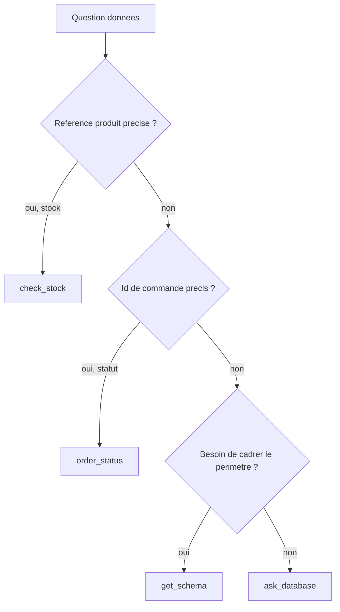
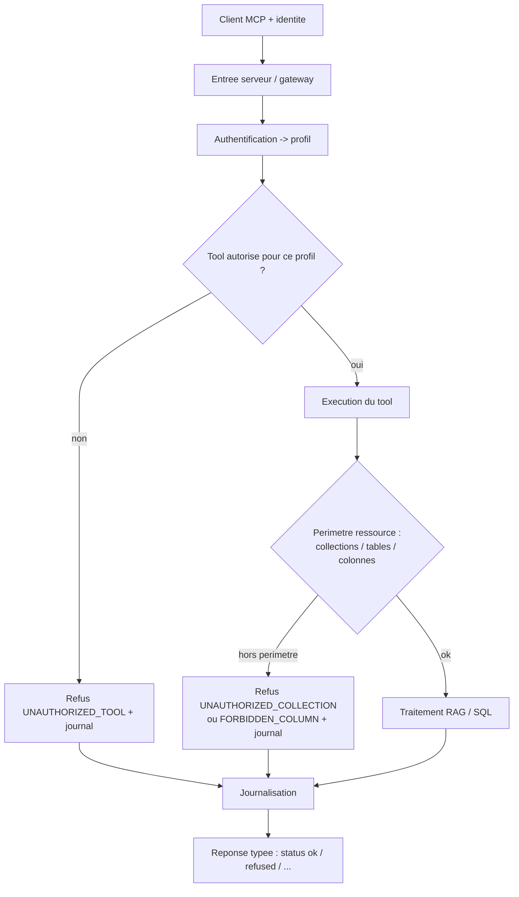

# Chantier 3 : Exposition MCP et matrice d'accès

> Dossier de conception. Répond aux cinq questions guides du brief et produit les
> schémas associés. Exigences couvertes : E4 (un serveur, chaque client borné à
> ses tools/collections/tables), E5 (tout appel journalisé, colonnes sensibles
> jamais pour le support), et le cadre de refus/erreurs qui protège E1 et E3.
> Consolide les chantiers 1 (collections RAG, sensibilité des notes) et 2
> (matrice SQL, pile de gardes).
>
> Statut des décisions : VALIDÉ. P6, P7 et P8 verrouillés, P8 par D28.

---

## 0. Nomenclature du catalogue (figée ici)

Réconciliation des noms du brief et du chantier 2 :

| Nom retenu      | Ancien nom (chantier 2) | Famille                   |
| --------------- | ----------------------- | ------------------------- |
| answer_question | answer_question         | RAG (haut niveau)         |
| search_docs     | search_docs             | RAG (brique)              |
| get_document    | get_document            | RAG (brique)              |
| list_sources    | (nouveau)               | RAG (brique / decouverte) |
| ask_database    | ask_database            | SQL (generatif)           |
| get_schema      | (nouveau)               | SQL (aide)                |
| check_stock     | get_stock               | SQL (fige)                |
| order_status    | get_order_status        | SQL (fige)                |

Note : get_product (chantier 2) est absorbe par ask_database + get_schema ; on
le reintroduira comme fige seulement si un besoin recurrent le justifie.

---

## Q1. Quels tools exposer : haut niveau vs briques, et pour qui

### 1.1 Le tool de haut niveau et ses briques

```
answer_question   RAG complet : recherche hybride -> reranking -> generation
                  ancree -> reponse + sources citees (E1). Une seule entree,
                  reponse prete a afficher.

search_docs       Brique : recherche hybride seule, renvoie des passages classes
                  (sans generation).
get_document      Brique : recupere un document complet (par doc_id ou ref+version).
list_sources      Brique : liste les sources disponibles (references, types,
                  versions) pour explorer/decouvrir le corpus.
```

### 1.2 À quels clients

| Client            | Usage                                                                                                      |
| ----------------- | ---------------------------------------------------------------------------------------------------------- |
| Bot Slack support | answer_question : veut une reponse SAV prete, avec sources                                                 |
| Poste commercial  | answer_question : idem, cote commercial                                                                    |
| IDE developpeurs  | briques (search_docs, get_document, list_sources) : veut chercher SANS generer, composer sa propre logique |

Raison : le haut niveau sert les clients qui veulent une réponse clé en main ;
les briques servent les clients qui pilotent le pipeline (l'IDE qui « cherche
sans générer », ou construit son propre raisonnement). C'est aussi la
séparation testée par le brief (search_docs puis get_document = les briques
fonctionnent séparément).

---

## Q2. Décrire les tools données pour que le client (et son LLM) choisisse le bon

La description MCP de chaque tool doit dire QUAND l'employer, l'entité attendue,
et ce qu'il renvoie ou non. C'est ce qui guide le LLM appelant.

| Tool         | Description orientee "quand l'utiliser"                                                                                                                                 |
| ------------ | ----------------------------------------------------------------------------------------------------------------------------------------------------------------------- |
| ask_database | "Repond a une question metier analytique ou ad hoc en generant du SQL lecture seule (filtre, agregat, jointure). A utiliser quand aucun tool fige ne couvre le besoin." |
| get_schema   | "Retourne les tables et colonnes AUTORISEES pour ce client. Ne renvoie aucune donnee. A appeler pour cadrer une question avant ask_database."                           |
| check_stock  | "Retourne le stock par entrepot d'UNE reference precise (ex. REF-8842). A utiliser des qu'on dispose de la reference exacte."                                           |
| order_status | "Retourne le statut d'UNE commande identifiee (ex. CMD-2026-0042)."                                                                                                     |

Arbre de décision suggéré (donné au client dans le mini guide d'accès) :



Principes : figés = narrow et déterministes (l'entité est dans la signature),
`ask_database` = fourre-tout analytique, `get_schema` = découverte qui améliore
la génération. Des descriptions étroites poussent le LLM vers le figé pour les
lookups exacts et le repli vers `ask_database` pour le reste.

---

## Q3. Matrice d'accès : contenu et point d'application

### 3.1 Où l'appliquer : aux DEUX niveaux (défense en profondeur)

| Niveau | Responsabilite |
| --- | --- |
| Entree serveur (gateway) | Authentifier le client, resoudre le profil, verifier l'autorisation au niveau TOOL : ce profil peut-il appeler ce tool ? Refus uniforme avant toute logique metier. Journalisation centrale. |
| Dans chaque tool | Appliquer le perimetre RESSOURCE que seul le tool connait : collections autorisees (RAG), tables et colonnes (SQL, cf. pile de gardes du chantier 2). Lui seul sait quelles colonnes le SQL genere touche reellement. |

Pourquoi les deux : la gateway offre un point de contrôle uniforme et empêche
même l'appel d'un tool interdit (E4) ; mais elle ne peut pas savoir quelles
colonnes un SQL généré va toucher, ni quelle collection un document provient.
Ce contrôle fin appartient au tool. Une seule source de vérité (config
déclarative) alimente les deux.



### 3.2 Matrice client x tool

> **Les trois tableaux qui suivent sont des VUES.** La source de vérité est
> `governance/matrice.yaml` (D21). En cas de divergence, c'est le fichier YAML
> qui fait foi. Une vue toujours à jour, régénérée depuis lui, est dans
> `governance/matrice_lisible.md`.

| Tool            | support | commercial | dev/IDE | Note                                  |
| --------------- | :-----: | :--------: | :-----: | ------------------------------------- |
| answer_question |   oui   |    oui     |   oui   |                                       |
| search_docs     |    -    |     -      |   oui   | brique RAG                            |
| get_document    |    -    |     -      |   oui   | brique RAG                            |
| list_sources    |    -    |     -      |   oui   | brique RAG                            |
| ask_database    |   oui   |    oui     |   oui   | support : colonnes sensibles bloquees |
| get_schema      |   oui   |    oui     |   oui   | support : schema filtre au profil     |
| check_stock     |   oui   |    oui     |   oui   |                                       |
| order_status    |   oui   |    oui     |   oui   |                                       |

Le refus au niveau tool (E4) est démontré par les briques RAG, réservées à
dev/IDE : un support qui appelle `search_docs` est refusé.

### 3.3 Matrice client x collection (RAG)

Une **collection** est un axe de gouvernance ; un `doc_type` est une propriété du
document, portée par chaque chunk (chantier 1, section 2.2). Les deux se
correspondent un pour un, et c'est ce champ qui rend la matrice applicable au
moment de la recherche :

| Collection (matrice) | `doc_type` (métadonnée du chunk) | Dossier du corpus |
| --- | --- | --- |
| `fiches` | `fiche_technique` | `data/corpus/fiches/` |
| `notices` | `notice` | `data/corpus/notices/` |
| `sav` | `procedure_sav` | `data/corpus/sav/` |
| `notes` | `note_interne` | `data/corpus/notes/` |

Le filtrage s'applique donc sur `doc_type`, pas sur un chemin de fichier : un
document déplacé reste gouverné.


| Collection | support | commercial | dev/IDE | Note                                                                   |
| ---------- | :-----: | :--------: | :-----: | ---------------------------------------------------------------------- |
| fiches     |   oui   |    oui     |   oui   |                                                                        |
| notices    |   oui   |    oui     |   oui   |                                                                        |
| sav        |   oui   |    oui     |   oui   |                                                                        |
| notes      |    -    |    oui     |   oui   | sensibles : politique-tarifaire, reunion-achat. Jamais pour le support |

### 3.4 Matrice client x table / colonnes (SQL) : rappel chantier 2

| Table     | support | colonnes bloquees (support) | commercial / dev |
| --------- | ------- | --------------------------- | ---------------- |
| clients   | oui     | -                           | toutes           |
| produits  | oui     | prix_achat_ht, marge_pct    | toutes           |
| stocks    | oui     | -                           | toutes           |
| commandes | oui     | -                           | toutes           |
| ventes    | oui     | marge_ht                    | toutes           |

### 3.5 Source de vérité : configuration déclarative

Une seule configuration gouverne la gateway et les tools. Elle **existe** :
c'est `governance/matrice.yaml`, chargé au démarrage.

Ce document ne la recopie pas. Un exemple illustratif figurait ici jusqu'au
2026-09-01, et il avait déjà dérivé du fichier réel : il donnait `tables: "*"`
au profil `dev` là où la matrice énumère les cinq tables, et imbriquait les
droits SQL sous une clé `sql:` que le fichier n'a pas. C'est précisément le
défaut que D21 existe pour empêcher.

| Fichier | Rôle |
| --- | --- |
| `governance/matrice.yaml` | La source. Catalogue fermé, collections, colonnes sensibles, trois profils, invariants |
| `governance/verifier_matrice.py` | Contrôle la cohérence, puis régénère la vue. Échoue si un invariant tombe |
| `governance/matrice_lisible.md` | Vue générée, à titre informatif. Ne pas éditer à la main |

Les invariants ne sont pas des commentaires : le script refuse une matrice qui
donne une brique RAG au support, qui oublie une colonne sensible, qui cite un
tool hors catalogue ou une colonne absente de la base.

---

## Q4. Réponse d'un appel refusé et journalisation (E5)

### 4.1 Contrat de refus (typé, jamais confondable avec une réponse)

```json
{
  "status": "refused",
  "code": "UNAUTHORIZED_TOOL",
  "message": "Le profil support n'est pas autorise a appeler search_docs.",
  "detail": { "profil": "support", "tool": "search_docs" }
}
```

Codes normalisés :

| Code | Cas | Accompagne |
| --- | --- | --- |
| `UNAUTHORIZED_TOOL` | tool non autorise pour le profil (E4) | `refused` |
| `UNAUTHORIZED_COLLECTION` | collection RAG interdite au profil | `refused` |
| `FORBIDDEN_COLUMN` | colonne sensible demandee (E5) | `refused` |
| `READ_ONLY_VIOLATION` | SQL en ecriture (E3) | `refused` |
| `OUT_OF_SCHEMA` | question hors du schema SQL | `out_of_schema` |
| `OUT_OF_CORPUS` | question non couverte par le corpus (E1) | `out_of_corpus` |
| `NOT_FOUND` | entite par identifiant precis introuvable (D26) | `not_found` |
| `AMBIGUOUS` | critere ambigu, precision requise (D27) | `clarify` |
| `INTERNAL_ERROR` | panne technique du serveur, aucune conclusion metier a en tirer | `error` |

Les quatre premiers accompagnent `status = refused`. Les cinq suivants
accompagnent un statut non-`ok` qui n'est pas un refus : le code permet au client
de reagir sans avoir a interpreter le message.

### 4.2 Journalisation : tout appel, autorisé ou refusé (E5)

Un enregistrement structuré par appel (JSONL, dans `governance/logs/`) :

```json
{
  "request_id": "req-...",
  "timestamp": "2026-08-27T09:00:00Z",
  "client_id": "slack-support-bot",
  "profil": "support",
  "tool": "ask_database",
  "params_resume": { "question": "quelle est la marge sur la REF-8842 ?" },
  "decision": "refused",
  "code": "FORBIDDEN_COLUMN",
  "sql_genere": "SELECT marge_pct FROM produits WHERE ref='REF-8842'",
  "ressources_touchees": { "tables": ["produits"], "colonnes": ["marge_pct"] },
  "latency_ms": 42,
  "result_resume": null
}
```

Règles de journalisation :

```
- Tracer les appels AUTORISES ET REFUSES (le brief : "tous les appels y figurent").
- Ne jamais journaliser les VALEURS sensibles (pas de lignes de prix d'achat) :
  on logge des metadonnees (colonnes touchees, nb de lignes), pas le contenu.
- Toujours consigner le SQL genere (transparence E3) et le code de decision.
- Un identifiant de requete pour correler appel, refus et resultat.
```

---

## Q5. Comment le client gère proprement les erreurs, sans les faire passer pour des réponses

Principe : la sortie de chaque tool est **typée par `status`**. Le client ne
traite comme réponse QUE `status == "ok"` ; tout le reste est un signal de
contrôle à restituer honnêtement.

| status        | Cas                                                    | Ce que le client fait                                                     |
| ------------- | ------------------------------------------------------ | ------------------------------------------------------------------------- |
| ok            | reponse valide                                         | afficher answer/rows + sources                                            |
| out_of_corpus | RAG ne couvre pas (E1)                                 | dire "non trouve dans la doc", ne rien inventer                           |
| out_of_schema | SQL hors donnees (E3)                                  | dire "hors des donnees dispo"                                             |
| not_found     | entite par identifiant precis introuvable (SQL valide) | dire "identifiant valide mais aucune donnee", pas une fausse reponse vide |
| clarify       | question ambigue (critere)                             | demander la precision (options)                                           |
| refused       | non autorise / colonne / RO                            | message d'acces refuse, pas de nouvelle tentative aveugle                 |
| error         | panne technique                                        | erreur technique, reessayer                                               |

Recommandation MCP : renvoyer les refus de politique et les cas "pas de
résultat" (hors corpus/schéma) comme un résultat de tool normal portant un
`status` non-`ok` et un `code` lisible par machine (le LLM client peut réagir :
s'excuser, demander une précision, escalader). Réserver l'erreur protocolaire MCP
aux pannes techniques. Cette convention est documentée dans le **mini guide
d'accès** (livrable), pour que les intégrateurs branchent leur client
correctement.

Point clé : ne jamais transformer un `message` de refus ou d'abstention en texte
de réponse. C'est la garantie que l'abstention E1 et les refus E3/E4/E5 ne
deviennent pas de fausses réponses.

---

## Correspondance avec les tests d'acceptation MCP

| Test d'acceptation | Mecanisme |
| --- | --- |
| profil autorise -> acces borne aux tools, collections et tables prevus | matrice + double application (gateway + tool) |
| appel non autorise -> refus clair + journal | contrat de refus + JSONL |
| search_docs puis get_document, sans generer | briques RAG reservees dev/IDE |
| session de demo -> le journal contient tous les appels, autorises et refuses | journalisation des deux issues |

---

## Décisions proposées

```
D17  Catalogue de 8 tools, nomenclature figee (section 0).
D18  Haut niveau (answer_question) pour support/commercial ; briques
     (search_docs/get_document/list_sources) reservees a dev/IDE.
D19  Descriptions de tools orientees "quand l'utiliser" + arbre de decision
     dans le mini guide d'acces.
D20  Matrice appliquee aux DEUX niveaux : gateway (tool) + tool (ressources).
D21  Source de verite unique : config declarative par profil (tools /
     collections / sql tables+colonnes).
D22  Collection notes interdite au support ; accessible commercial/dev.
D23  Contrat de refus type {status, code, message, detail} ; codes normalises.
D24  Journalisation JSONL de tout appel (autorise + refuse), sans valeurs
     sensibles, avec SQL genere et ressources touchees.
D25  Sortie typee par status ; le client ne rend "reponse" que status=ok.
D28  Identite du client MCP resolue par le TRANSPORT, jamais par un argument de
     tool. Une seule fonction resoudre_profil(contexte) -> Profil, appelee a
     l'entree de la gateway avant tout dispatch ; tout l'aval ignore le
     transport. Normatif : stdio, profil fixe au lancement par SORABEL_PROFIL,
     valide contre les cles de la matrice au demarrage, refus de demarrer si
     absent ou inconnu, immuable pour la vie du processus. Extension documentee :
     HTTP + Authorization Bearer, table jeton -> profil hors depot, 401 sinon.
     Le nom de client declare et le client_id du journal sont DECLARATIFS :
     journalisation uniquement, jamais autorisation. Detail et limites en Q6.
D29  Domicile des releves, selon qui les lit. (a) La conception ne garde que la
     regle, plus des illustrations etiquetees comme telles. (b) Trace generee et
     versionnee par docs/releve_donnees.py : bloc dans analyse_donnees.md,
     indispensable car data/ est exclu du depot. (c) Ce que le CODE consomme
     (schema, enumerations, predicats de jointure) est obtenu par introspection
     au demarrage, jamais recopie : les quatre chemins de jointure sont d'ailleurs
     declares comme cles etrangeres dans la base, donc introspectables. Le releve
     ne decrit que structure et agregats, jamais de lignes, et ne porte aucune
     notion d'autorisation : les colonnes sensibles restent dans la seule matrice
     (D21), et le schema montre au modele vaut introspection INTER matrice[profil].
D42  Classification EXHAUSTIVE des colonnes (2026-09-02). Les trois listes
     colonnes_sensibles, colonnes_restreintes et colonnes_publiques doivent
     couvrir exactement le schema de la base. Une colonne non classee fait
     ECHOUER le controle au lieu de devenir visible. Motif : colonnes_interdites
     seule est une LISTE NOIRE dans un fichier qui proclame deny-by-default, donc
     une colonne ajoutee a la base etait exposee au support en silence.
     colonnes_restreintes accueille ce qui depasse le litteral d'E5, aujourd'hui
     clients.email, sur un profil dont le client est public (D34).
D44  Les invariants se controlent contre des ANCRES ECRITES EN DUR dans
     verifier_matrice.py, hors du YAML. Motif : le controle E5 verifiait
     colonnes_sensibles contre colonnes_interdites, deux listes du meme fichier ;
     en retirer une colonne des deux laissait 19 controles sur 19 au vert. Un
     invariant qui se verifie contre la donnee qu'il controle s'annule avec elle.
```

## Arbitrages (verrouillés le 2026-08-27)

```
P6  Briques RAG -> RESERVEES a dev/IDE. Motif Sorabel : le brief pose l'usage
    des briques pour l'IDE ; support et commercial veulent une reponse ancree,
    pas des passages bruts. Exposition minimale, deny-by-default, demonstration
    E4 nette.
P7  Collection notes -> COMMERCIAL + DEV, jamais support ; pas de 4e profil.
    Le brief ne definit que 3 clients (support, dev, commercial). La cible a
    proteger est le bot support customer-facing. Le commercial voit deja les
    marges cote SQL : la politique tarifaire lui est coherente. Le deny-by-
    default permet d'ajouter plus tard un profil achat/direction sans refonte.
```

## Q6. D'où vient l'identité du client ? (P8, verrouillé le 2026-08-31)

Toute la matrice repose sur une question qu'elle ne pose pas : **comment le
serveur sait-il à qui il parle ?** Sans réponse, E4 est un vœu.

### 6.1 Ce que le protocole MCP fournit, et ce qu'il ne fournit pas

MCP définit deux transports. En **stdio**, le client lance le serveur comme
sous-processus et dialogue par les flux standards ; la spécification d'
autorisation exclut explicitement ce transport et renvoie à l'environnement du
processus. En **HTTP streamable**, le serveur est un service et la spécification
le traite en *Resource Server* OAuth 2.1 : en-tête `Authorization: Bearer`,
métadonnées de ressource protégée, validation de l'audience du jeton, `401` avec
`WWW-Authenticate`, jeton interdit en paramètre d'URL.

Deux points sont décisifs et souvent mal compris :

- ce qu'un client **déclare** sur lui-même n'est pas vérifié par le protocole,
  et ne doit pas servir à décider. Cela vaut pour le nom du client transmis à la
  connexion comme pour un en-tête quelconque ;
- MCP ne définit **aucune** notion de rôle, de profil ni de RBAC. L'autorisation
  applicative est entièrement à la charge du serveur, ce qui est cohérent avec
  nos décisions D20 et D21.

### 6.2 Sources d'information, et leur valeur

| Source | Transport | Fiabilité | Autorise ? |
| --- | --- | --- | --- |
| paramètre de tool | les deux | rempli par le LLM appelant | **jamais** |
| nom du client déclaré à la connexion | les deux | auto-déclaré, non vérifié | non, journal seulement |
| identifiant de session | HTTP | corrèle des requêtes, ne prouve rien | non, seul |
| variables d'environnement du processus | stdio | fixées par celui qui lance | oui, si le lanceur est l'ancre de confiance |
| en-tête `Authorization` | HTTP | vaut ce que vaut la validation du jeton | oui |

### 6.3 Le piège que nous avions dans le dossier

Le catalogue du chantier 2 faisait figurer `profil` comme **paramètre** de chaque
tool. Un paramètre est rempli par le client : le bot support n'avait qu'à
demander `profil = "commercial"` pour lire les marges. E4 devenait décorative.
Corrigé le 2026-08-31 ; les chantiers 4 et 5 étaient déjà justes et font foi.

### 6.4 Décision

Une seule fonction du serveur connaît le transport :
`resoudre_profil(contexte) -> Profil`, appelée à l'entrée de la gateway avant
tout dispatch. Tout l'aval reçoit un profil et ignore d'où il vient, ce qui rend
le changement de transport indolore.

**Implémentation normative, stdio.** Le profil est fixé au lancement par la
variable d'environnement `SORABEL_PROFIL`, validée au démarrage contre les clés
de la matrice. Absente ou inconnue, le serveur **refuse de démarrer** : le
deny-by-default s'applique au lancement, pas au premier appel. Le profil est
ensuite immuable pour la vie du processus.

**Extension documentée, non requise, HTTP.** `Authorization: Bearer` et une table
jeton vers profil chargée hors du dépôt, `401` sinon. Un seul processus sert
alors les trois profils.

### 6.5 Ce que cette solution ne protège pas

À dire en soutenance, pas à sous-entendre.

- Elle authentifie un **contexte de lancement**, pas une personne. Qui peut
  éditer la configuration du client peut s'attribuer n'importe quel profil.
- Aucun secret côté serveur en variante stdio : l'ancre de confiance est le
  compte système et les droits sur le fichier de configuration.
- Ni expiration, ni révocation, ni rotation. Retirer un accès se fait en
  modifiant la configuration du poste client.
- **Imputabilité au profil, pas à l'individu.** Le journal répond à « quel
  profil a demandé cette marge », jamais à « qui ». E5 est satisfaite au sens du
  brief, tout appel est journalisé, mais ce n'est pas une piste d'audit
  nominative. Le `client_id` du journal est déclaratif, donc falsifiable.

### 6.6 Ce qu'il faudrait en production

Transport HTTP, serveur en *Resource Server* OAuth 2.1 : jetons émis par
l'annuaire de l'entreprise, **audience liée au serveur** pour qu'un jeton volé
ailleurs ne soit pas rejouable ici, validation à chaque requête, jetons courts
avec rotation et révocation. Le profil se dérive alors d'une revendication du
jeton validé, jamais d'une table statique, et le sujet nominatif entre au journal
pour rendre l'imputabilité réelle.

## Auto-critique (risques et parades)

```
- Config vs code : garder la matrice 100% declarative, testee, pour eviter la
  derive entre gateway et tools (une seule source).
- Fuite par message d'erreur : les messages de refus ne doivent pas divulguer de
  donnee sensible (dire "colonne interdite", pas la valeur).
- Sur-permissivite par defaut : politique "deny by default" (tout ce qui n'est
  pas explicitement autorise est refuse).
- Briques trop restreintes : si le commercial a besoin de list_sources, ouvrir au
  cas par cas (P6).
- Identite falsifiable : traite en Q6. L'autorisation vaut ce que vaut le
  contexte de lancement, ce qui est assume et documente, pas ignore.
```
