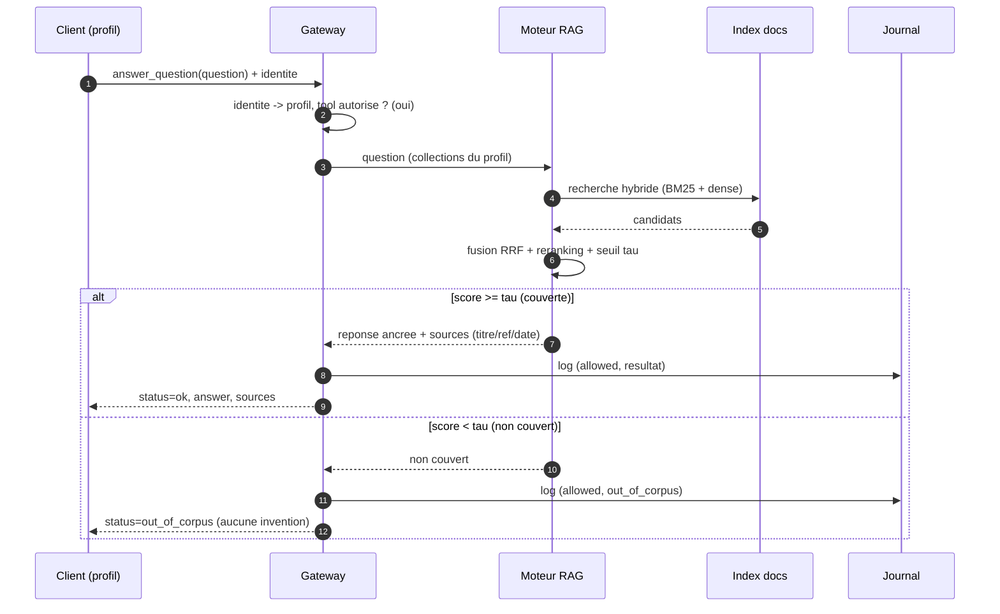
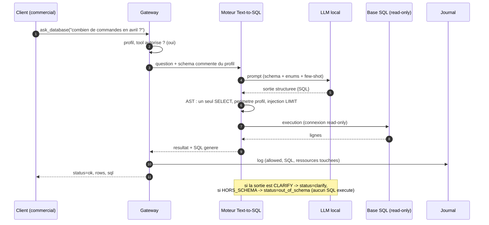
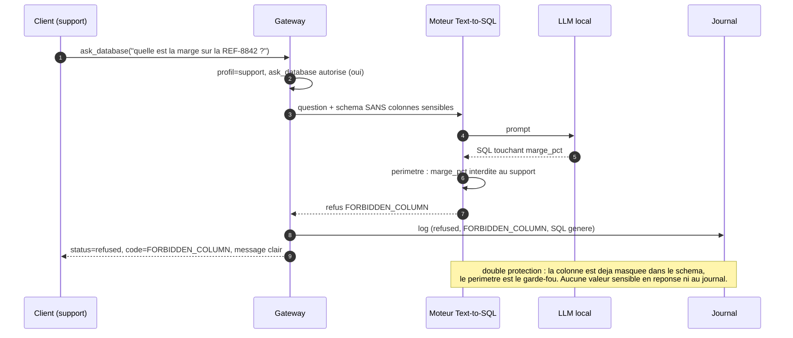
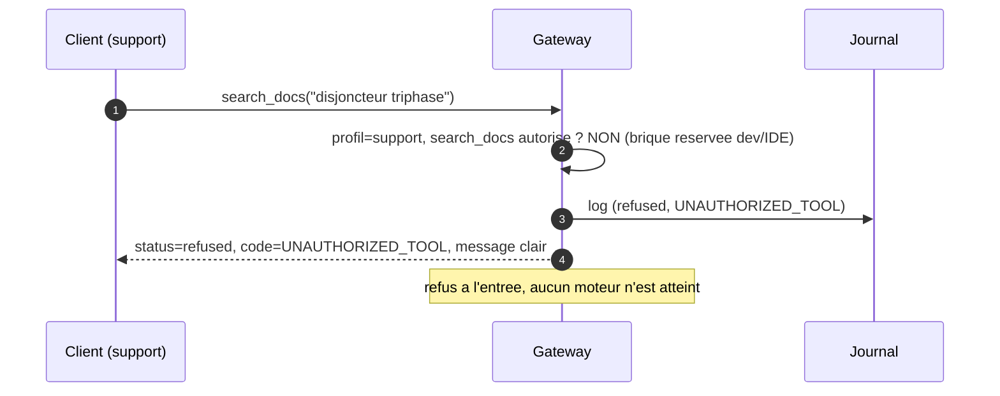
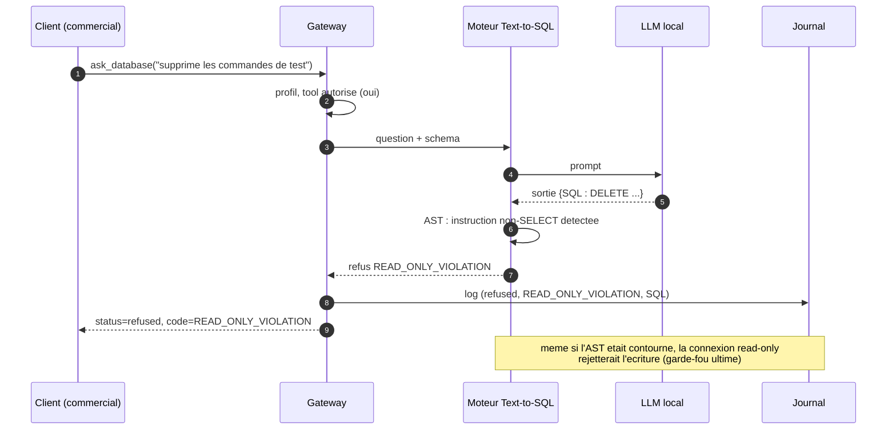

# Diagrammes de séquence — interactions de la Gateway

> Vue comportementale complétant `00_architecture.md` (vue structurelle). Chaque
> séquence illustre un comportement clé et ses points de contrôle. Participants
> communs : Client (porteur d'un profil), Gateway (interface MCP + autorisation),
> les moteurs RAG et Text-to-SQL, l'Index, le LLM de génération, la base SQL, le
> Journal.

---

## 1. Question documentaire (answer_question) : réponse ou abstention (E1, E2)

---

## 2. Question métier Text-to-SQL autorisée (ask_database) : gardes lecture seule (E3)

---

## 3. Colonne sensible pour le support (E5) : refus par le périmètre

---

## 4. Appel non autorisé au niveau tool (E4)

---

## 5. Tentative d'écriture : lecture seule (E3)

---

## Lecture transversale

| Sequence | Ce qu'elle demontre                                              | Exigence |
| -------: | ---------------------------------------------------------------- | -------- |
|        1 | reponse + sources, ou abstention propre                          | E1, E2   |
|        2 | SQL genere execute en lecture seule + SQL renvoye (transparence) | E3       |
|        3 | colonne sensible refusee au support                              | E5       |
|        4 | tool interdit refuse a l'entree                                  | E4       |
|        5 | ecriture refusee (AST + connexion RO)                            | E3       |

Dans tous les cas, l'appel (autorise ou refuse) est journalise (E5), et la
sortie est typee par status : une abstention ou un refus n'est jamais rendu
comme une reponse.
