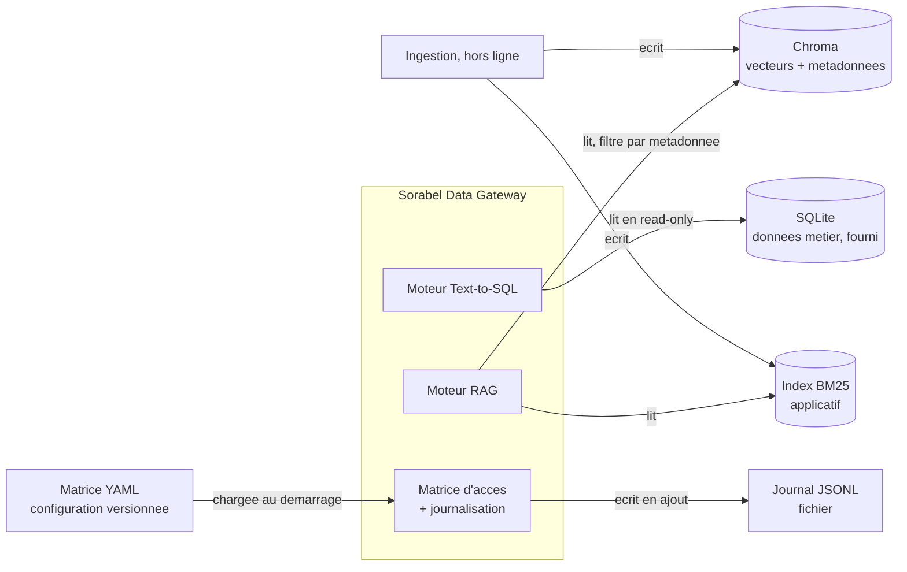

# Chantier 6 : Choix des bases de données

> Ce document tranche **quel type de stockage** convient à chacun des besoins de
> la Gateway, et pourquoi. Il ne décrit ni le schéma des données (chantier 2 et
> `../analyse_donnees.md`), ni le pipeline qui les alimente (chantier 1).
>
> Il corrige au passage un motif erroné : l'arbitrage P3 justifiait le store
> vectoriel par sa « simplicité », alors que le critère décisif est ailleurs.

---

## 1. Il n'y a pas une base, il y a trois besoins

La question « quelle base de données pour Sorabel » n'a pas de réponse unique,
parce que la Gateway écrit et lit trois choses de natures différentes.

| Besoin | Contenu | Volume | Accès |
| --- | --- | --- | --- |
| Données métier | produits, stocks, commandes, ventes, clients | ~10³ lignes | lecture seule, requêtes ad hoc |
| Index documentaire | chunks, vecteurs, postings lexicaux | ~10³ chunks | lecture à la requête, écriture à l'ingestion |
| Journal des appels | un enregistrement par appel, autorisé ou refusé | croît sans borne | écriture seule, lecture différée |

Les confondre conduirait à un mauvais choix : ce qui convient à l'un disqualifie
souvent l'autre.

Un quatrième élément n'est pas une base et ne doit pas le devenir : **la matrice
d'accès**. C'est une configuration déclarative (D21), lue au démarrage, versionnée
avec le code. La mettre en base créerait une seconde source de vérité pour les
droits, ce que le chantier 3 interdit.

## 2. Ce qui décide, et ce qui ne décide rien

À cette échelle, **la performance ne départage aucun candidat**. Tout moteur
sérieux répond en quelques millisecondes sur 10³ enregistrements. Écarter une
option pour sa lenteur serait ici un faux argument.

Les critères qui tranchent réellement :

| Critère | D'où il vient |
| --- | --- |
| Filtrage par métadonnée **avant** la recherche vectorielle | E2 (référence exacte), E4 (collections du profil), politique de versions |
| Baseline dense isolable sans réindexer | E6, le gain doit être attribuable et non fabriqué par l'outil |
| Langage de requête déclaratif et analysable | E3, la requête est renvoyée et validée par AST |
| Connexion en lecture seule au niveau du pilote | E3, garde-fou ultime de la pile de gardes |
| Embarqué, sans service à administrer | contrainte de projet : poste local, six jours |
| Source de vérité unique pour les droits | D21 |

## 3. Données métier : relationnel, et SQLite

### 3.1 Le type ne se discute pas

Les données **sont** relationnelles : quatre clés étrangères déclarées, et aucune
question métier ne se répond sans jointure. Aller d'une vente à un client demande
deux sauts, il n'existe pas de lien direct.

| Famille écartée | Motif |
| --- | --- |
| Documentaire | obligerait à dupliquer les données ou à réimplémenter les jointures |
| Clé-valeur | aucun langage de requête, or E3 exige une requête renvoyée et vérifiable |
| Graphe | pertinent si les relations étaient l'objet d'étude, elles sont ici un moyen |
| Colonne | conçu pour l'analytique à grande échelle, hors sujet à 10³ lignes |

Le relationnel n'est pas un choix par défaut : c'est le seul type qui donne un
**langage de requête analysable par AST**, ce dont dépend toute la pile de gardes
d'E3.

### 3.2 SQLite ou PostgreSQL

Le brief fournit un fichier SQLite. Rien n'interdirait de migrer, et l'argument
en faveur de PostgreSQL est sérieux : ses rôles natifs permettraient d'appliquer
E5 **par la base elle-même**, avec un droit accordé colonne par colonne. Ce serait
une couche de défense supplémentaire, réelle, indépendante de notre code.

Je l'écarte pour trois raisons, dans l'ordre de force :

1. **Deux sources de vérité pour les droits.** La matrice serait à la fois dans
   la configuration et dans les privilèges de la base. Elles divergeraient, et le
   chantier 3 a explicitement retenu l'inverse (D21). Un contrôle dupliqué n'est
   pas un contrôle renforcé, c'est un contrôle incertain.
2. **SQLite offre exactement le garde-fou attendu.** Une connexion ouverte en
   mode lecture seule au niveau du pilote, complétée par le réglage `query_only`,
   refuse toute écriture avant même que le moteur analyse la requête. C'est la
   couche 1 de la pile du chantier 2.
3. **Le fichier est fourni.** Migrer imposerait un service à installer, à
   démarrer et à sauvegarder, pour un gain que le point 1 annule.

Ce que ce choix coûte, à dire plutôt qu'à taire : pas de gestion d'utilisateurs,
pas de concurrence en écriture, pas de vue matérialisée. Aucun de ces manques ne
concerne un accès en lecture seule à 10³ lignes.

### 3.3 Décision

**SQLite, ouvert en lecture seule.** La ligne correspondante de `MEMOIRE_PROJET.md` passe
de PROPOSÉ à VALIDÉ.

## 4. Index documentaire : Chroma, et pourquoi le motif écrit était faux

### 4.1 Le critère décisif

Une recherche documentaire gouvernée n'est pas une recherche de plus proches
voisins. Elle doit **filtrer avant de chercher** :

- par `ref`, pour le court-circuit exact qui garantit E2 ;
- par `doc_type`, pour n'interroger que les collections ouvertes au profil (E4) ;
- par `is_latest`, pour privilégier la version courante (D2).

Un moteur incapable de filtrer sur une métadonnée oblige à récupérer large puis à
trier après coup, ce qui casse la garantie : un chunk interdit au profil aurait
déjà été lu.

### 4.2 Comparaison

| Option | Filtrage par métadonnée | Mode | Verdict |
| --- | --- | --- | --- |
| Chroma | oui, clause `where` appliquée avant la similarité | embarqué | **retenu** |
| FAISS | non, à implémenter soi-même | bibliothèque | écarté |
| Qdrant | oui, hybride natif | service | écarté |
| sqlite-vec | oui, exprimé en SQL | extension SQLite | non retenu |
| pgvector | oui | service | écarté avec PostgreSQL |

**FAISS** est écarté parce que c'est une bibliothèque de recherche par
similarité, pas une base : le filtrage par métadonnée y est à la charge de
l'appelant. E2 et E4 seraient entièrement à recoder, et deviendraient du code
maison non testé sur le chemin critique de la gouvernance.

**Qdrant** sait tout faire, y compris l'hybride en natif. C'est précisément ce
qui le disqualifie ici : E6 exige une baseline dense **isolable**, et un moteur
qui fusionne lexical et dense en interne rend la séparation moins nette. S'ajoute
un service à administrer.

**sqlite-vec** est l'option qui unifierait la technologie de stockage : les
vecteurs vivraient dans un fichier SQLite, filtrables en SQL. Je ne le retiens
pas, mais par prudence et non par rejet : la base métier étant ouverte en lecture
seule, il faudrait de toute façon un second fichier, et l'écosystème est plus
jeune que celui de Chroma. À reconsidérer si la stack devait se réduire.

### 4.3 L'index lexical reste à part

Le BM25 n'est pas dans le store vectoriel, alors que plusieurs moteurs proposent
un index épars intégré. Ce choix est délibéré, et c'est ce qui rend E6 mesurable :
la branche « dense seule » s'obtient en n'interrogeant qu'un seul des deux index,
sans rien réindexer ni reconfigurer.

### 4.4 Décision, et correction du motif

**Chroma pour le dense, index BM25 applicatif pour le lexical.** L'arbitrage P3
est confirmé, mais son motif est réécrit : le critère n'est pas la simplicité,
c'est le **filtrage par métadonnée avant la recherche**, sans lequel E2 et E4 ne
tiennent pas.

## 5. Journal des appels : un fichier, pas une base

Le journal est en écriture seule pendant l'exploitation, et relu après coup. Ses
contraintes sont donc inverses de celles d'un index.

| Option | Pour | Contre |
| --- | --- | --- |
| JSONL en ajout | une ligne complète par appel, résiste à un arrêt brutal, lisible à l'œil, aucune dépendance | pas de requête, il faut un script pour filtrer |
| SQLite | requêtable, agrégats immédiats | verrous en écriture, schéma à maintenir, illisible sans outil |

Le test d'acceptation du brief demande que « quand on ouvre le journal, tous les
appels y figurent ». Il suppose une lecture directe, pas une requête. Et lors
d'une démonstration, montrer un fichier où chaque ligne est un appel lisible vaut
mieux qu'ouvrir un client de base de données.

**Décision : JSONL en ajout, un objet par ligne.** Si la démonstration doit
filtrer, par exemple pour ne montrer que les refus, un script de lecture de
quelques lignes suffit. Ce n'est pas un motif pour introduire une base.

## 6. Vue d'ensemble



Quatre supports, quatre natures : une base relationnelle qu'on ne fait que lire,
deux index reconstructibles à volonté, un fichier d'ajout, et une configuration
versionnée. Aucun n'est de trop, et aucun ne duplique un autre.

## 7. Décisions

```
D31  Donnees metier : RELATIONNEL, SQLite, ouvert en lecture seule au niveau du
     pilote. Le type est impose par la nature des donnees (jointures) et par E3
     (requete renvoyee et analysable par AST). PostgreSQL ecarte malgre l'atout
     de ses roles natifs : il creerait une seconde source de verite pour les
     droits, contre D21. Statut de la ligne MEMOIRE_PROJET.md : PROPOSE -> VALIDE.
D32  Index documentaire : CHROMA pour le dense, index BM25 applicatif separe
     pour le lexical. Critere decisif = filtrage par metadonnee AVANT la
     recherche, sans lequel E2 et E4 ne tiennent pas. FAISS ecarte car il ne
     filtre pas. Qdrant ecarte car son hybride natif brouille la baseline E6 et
     demande un service. sqlite-vec non retenu, a reconsiderer si la stack doit
     se reduire. Ceci CORRIGE le motif de P3, qui invoquait la simplicite.
D33  Journal : FICHIER JSONL en ajout, un objet par ligne, pas de base. Ecriture
     seule, une ligne complete par appel donc resistante a un arret brutal,
     lisible sans outil pendant la demonstration. Filtrer se fait par script.
```

## 8. Auto-critique

```
- Ce chantier rouvre un arbitrage VALIDE (P3). Il n'en change pas la conclusion,
  seulement le motif ecrit, qui etait faux. Le risque etait de tout rouvrir ;
  il est borne a cela.
- L'argument PostgreSQL est reel et je ne l'ai pas caricature. Si le projet
  devait un jour servir plusieurs equipes en ecriture, il redeviendrait le bon
  choix, et D21 devrait alors etre repense, pas contourne.
- sqlite-vec n'a pas ete teste. Le retenir aurait ete un pari, pas un choix.
- Les volumes qui fondent "la performance ne decide rien" sont ceux du jeu
  fourni. Si le corpus changeait d'ordre de grandeur, D32 serait a reexaminer,
  au meme titre que l'hypothese d'echelle posee au chantier 1.
- Les licences et les versions des candidats n'ont pas ete verifiees. A faire
  au lot 0, au moment de figer les dependances.
```

---

## D45 : Chroma EMBARQUÉ, sans service ni conteneur

> Ajouté le 2026-09-02, après essai sur le poste de développement.

Le dépôt amont propose Chroma comme **service**, via `docker compose` sur le port
8002, et `.env.example` déclare un `CHROMA_URL`. Cette voie est fermée ici :
Docker Desktop ne démarre pas, la virtualisation étant **désactivée dans le
firmware** du poste (`VirtualizationFirmwareEnabled = False`). Cela se réactive
au redémarrage, dans le BIOS, et peut être verrouillé par une DSI.

**Décision : `chromadb.PersistentClient`, en processus, sur un chemin sous
`SORABEL_DATA_DIR` (D35).** Le contrat d'intégration dit que « l'implémentation
interne est libre », et la suite d'acceptance ne touche jamais Chroma : elle
parle au serveur MCP en stdio et rien d'autre.

**Ce qui a été vérifié**, et non supposé, sur `chromadb` 0.5.23 avec des vecteurs
choisis pour que le chunk interdit soit le plus proche de la requête :

| Requête | Résultat | Ce que cela prouve |
| --- | --- | --- |
| sans filtre | `notice A`, `note interne tarifaire` | la note interdite est bien la 2e plus proche |
| `where doc_type in [notice]` | `notice A`, `notice B` | elle disparaît, **et** la profondeur est remplie de candidats autorisés |
| `where doc_type + is_latest` | `notice A` seule | le filtre combiné fonctionne |
| réouverture du client | 4 chunks relus | la persistance survit au processus |

C'est la propriété exacte qui a fait retenir Chroma et écarter FAISS : le filtre
par métadonnée s'applique **avant** la recherche. Si le filtrage avait lieu après,
la note aurait été lue, la profondeur `n` aurait été consommée par des candidats
hors périmètre, et aucun refus n'aurait été journalisé.

**Ce que ce choix fait gagner**, au-delà du contournement : une unité de moins à
déployer. Le dimensionnement du chantier 7 comptait un service Chroma ; il n'y en
a plus. L'index devient un fichier sous le chemin unique de D35, donc versionnable
en artefact, reproductible et sauvegardable comme le reste.

**Ce que ce choix coûte**, et il faut le dire : un index en processus ne se
partage pas entre plusieurs instances de serveur. Avec D39, deux processus
serveurs, un par profil, ils liront **le même répertoire** en lecture seule après
l'ingestion. C'est tenable parce que l'ingestion est hors ligne et faite une
fois. Si un jour l'ingestion devenait continue, il faudrait revenir au service.

**À faire au lot 1** : désactiver la télémétrie de Chroma
(`ANONYMIZED_TELEMETRY=False`). Elle émet des événements réseau à chaque appel,
ce qui n'a pas sa place dans une gateway gouvernée, et elle bruite déjà la sortie.
