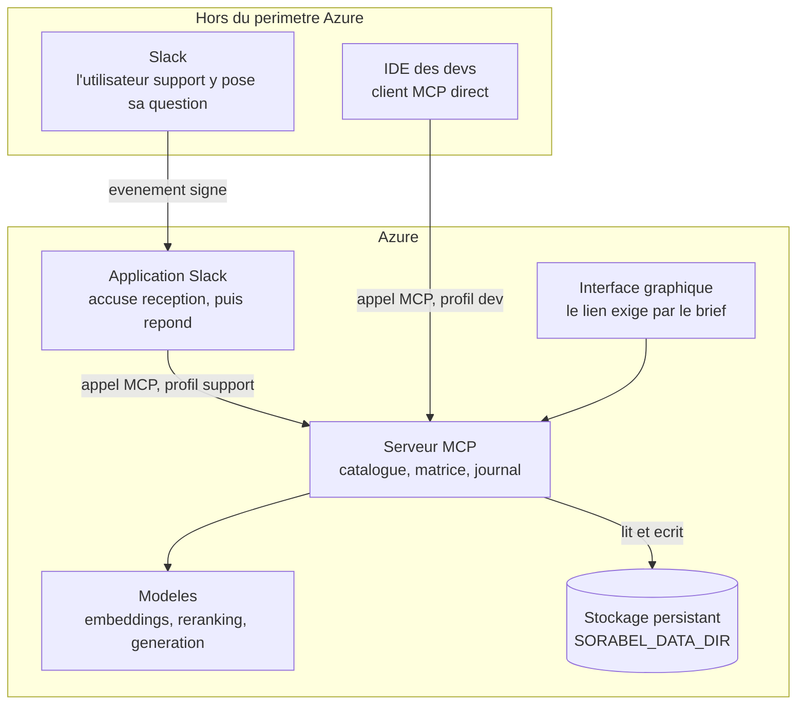

# Chantier 7 — Cible de déploiement Azure

> Ce chantier pose **où et comment la Gateway s'exécute une fois livrée**, révise
> les décisions que l'hébergement remet en cause, et dit ce qui reste local
> pendant le développement.
>
> Cadrage honnête : le brief exige « un lien d'une interface graphique du produit
> fonctionnel ». Il impose donc un **déploiement**, pas Azure. Azure est le moyen
> retenu par le pilote, et ce choix devra être assumé en soutenance.
>
> Toutes les affirmations sur les services Azure ont été vérifiées contre la
> documentation officielle le 2026-09-01. Les sources sont en fin de document.

---

## 1. Les unités déployables, et celle que le dossier oubliait

Jusqu'ici, le dossier raisonnait sur un seul exécutable. Le déploiement en révèle
quatre.

| Unité | Rôle | État dans le dossier avant ce chantier |
| --- | --- | --- |
| Serveur MCP | expose les 8 tools, applique la matrice, journalise | conçu en détail |
| Interface graphique | le lien exigé par le brief | mentionnée, jamais conçue |
| **Application Slack** | le client du profil support | **une étiquette dans les schémas, rien de plus** |
| Modèles | embeddings, reranking, génération SQL | choisis, jamais dimensionnés |

Les deux dernières lignes sont des trous, pas des détails. La suite les traite.

## 2. Slack n'est pas un client MCP, c'est une application à concevoir

### 2.1 Ce que le dossier en disait

Neuf occurrences du mot « Slack » dans tout le dépôt, toutes décoratives : une
boîte dans un schéma, une ligne dans la matrice, un `client_id` d'exemple. Nulle
part le fait que le bot est **lui-même un programme**, qu'il faut héberger, et
qui est le véritable appelant de la Gateway.

L'utilisateur du support ne parle pas à la Gateway. Il parle à Slack, qui parle
au bot, qui appelle la Gateway.

### 2.2 Trois contraintes que Slack impose et que la conception ignorait

**Le délai de trois secondes.** Slack attend un accusé de réception quasi
immédiat sur un événement ou une commande. Or notre chaîne, recherche hybride
puis reranking puis génération ancrée, dépasse largement ce budget. Le bot doit
donc **accuser réception tout de suite et répondre ensuite**, en publiant un
second message. Ce n'est pas un détail d'implémentation : cela change le contrat
d'interaction, et il faut le dire à l'utilisateur qui attend.

**Un point d'entrée public.** Slack pousse les événements vers une URL. Le bot
expose donc un service HTTP joignable depuis l'extérieur, ce qui en fait une
unité déployée à part entière, avec sa propre surface d'exposition.

**Une signature à vérifier.** Slack signe ses requêtes. Le bot doit valider cette
signature, sans quoi n'importe qui peut lui faire croire qu'un message vient de
Slack.

### 2.3 Ce que Slack apporte, et que D28 déclarait manquer

La décision D28 énonce une limite franche : le mécanisme d'identité
« authentifie un contexte de lancement, pas une personne », et l'imputabilité
porte « sur le profil, pas sur l'individu ».

Slack change cela **partiellement**. Une requête Slack signée transporte
l'identité de l'utilisateur qui a posé la question. Le bot sait donc qui demande.

Mais la Gateway, elle, ne le sait pas : elle voit un appel du bot, avec le profil
`support`. Trois lectures possibles, et une seule est correcte :

| Usage de l'identité Slack | Verdict |
| --- | --- |
| Décider des droits | **Non.** Ce serait une identité transmise par un client, ce que D28 interdit |
| Choisir le profil | **Non.** Même motif : le profil vient du contexte de lancement |
| Enrichir le journal | **Oui**, à condition de la marquer comme attestée par le bot et non vérifiée par la Gateway |

L'imputabilité gagne donc un cran sans que l'autorisation change : le journal
peut porter « qui », tout en continuant à décider sur « quel profil ».

### 2.4 Ce qui reste ouvert

L'espace de travail Slack et l'application Slack ne sont pas créés. Le nom du
canal, le mode d'invocation (commande, mention, message direct) et le format de
restitution des sources dans un message Slack ne sont pas tranchés. Ils relèvent
du développement, pas de la conception.

## 3. Où vivent les fichiers : la décision de persistance

C'est la seule décision réellement **nouvelle** que le déploiement impose, et le
piège est net.

| Plateforme | Comportement du système de fichiers |
| --- | --- |
| Container Apps | stockage de conteneur **éphémère** : les données disparaissent à l'arrêt ou au redémarrage. La persistance exige un volume Azure Files monté explicitement |
| App Service | ce qui est écrit sous `/home` persiste aux redémarrages et est partagé entre instances. Ailleurs, non |

Deux artefacts sont concernés : le fichier de base métier, et l'index
documentaire. Si rien n'est décidé, l'index se reconstruit à chaque démarrage,
ou pire, disparaît en pleine démonstration sans message d'erreur.

**Décision.** Le chemin de tous les artefacts persistants est donné par une
variable d'environnement unique, `SORABEL_DATA_DIR`, avec une valeur locale par
défaut. En déploiement, elle pointe vers `/home` sur App Service, ou vers un
volume Azure Files monté sur Container Apps. Le code n'écrit **jamais** ailleurs.

Ce choix a une vertu au-delà d'Azure : il rend le stockage explicite en local
aussi, donc testable.

## 4. Dimensionnement de la pile face à Azure

La question posée est juste : les modèles retenus tiennent-ils sur Azure ?

### 4.1 Les trois modèles n'ont pas le même profil de charge

| Modèle | Rôle | Charge par question | Tient sur processeur ? |
| --- | --- | --- | --- |
| `bge-m3` | embeddings | 1 encodage de la question ; le corpus est encodé une fois à l'ingestion | **oui**, à cette échelle |
| `bge-reranker-v2-m3` | reranking | scorer les `m` candidats présélectionnés, soit une vingtaine de paires | **oui**, avec une latence de l'ordre de la seconde |
| coder instruct (P5) | génération SQL | produire une requête, quelques dizaines de jetons | **non**. Un modèle de cette taille sur processeur rend l'appel inutilisable |

C'est la ligne de partage, et elle est nette : **les deux modèles critiques pour
E6 sont précisément ceux qui tiennent sur processeur.** La mesure du gain ne
dépend donc d'aucun accélérateur.

### 4.2 Trois voies pour la génération SQL

| Voie | Ce qu'elle coûte | Ce qu'elle préserve |
| --- | --- | --- |
| GPU serverless sur Container Apps, modèle servi par Ollama | du temps de calcul accéléré, facturé à l'usage, avec mise à l'échelle à zéro entre deux démonstrations | P5 à la lettre, y compris le motif de confidentialité |
| Azure OpenAI pour la seule génération | facturation au jeton, la plus simple à exploiter | rien du motif « local », mais les données restent dans le locataire |
| Modèle coder plus petit, sur processeur | rien de plus | P5 formellement, au prix d'une qualité de SQL à mesurer |

Microsoft documente le déploiement de modèles via Ollama sur GPU serverless
Container Apps, et ces GPU sont disponibles en Europe de l'Ouest. La première
voie n'est donc pas une extrapolation.

**Ce que P5 prévoyait déjà** : « repli mesuré sur SQL-01 à 12 avant API ». Le
protocole est écrit, il suffit de l'appliquer. La troisième voie se teste en
premier, et l'on ne monte en gamme que si le taux de SQL juste est insuffisant.

### 4.3 Les modèles ouverts retenus existent sur Azure

`bge-m3` et `bge-reranker-v2-m3` figurent nommément au catalogue Azure AI
Foundry, en disponibilité générale. Migrer vers Azure **n'oblige à changer aucun
des modèles** choisis en conception. La plateforme d'hébergement dédiée qui les
sert est en revanche documentée comme étant en préversion, ce qui est à
consigner.

## 5. Révision des cinq décisions rouvertes

| Décision | Verdict | Motif |
| --- | --- | --- |
| **P2**, embeddings et reranker | **inchangée** | Les deux modèles sont au catalogue Azure, et tiennent sur processeur à cette échelle |
| **P5**, LLM de génération local | **inchangée dans son principe**, précisée | Trois voies décrites en 4.2, le repli mesuré prévu par P5 s'applique |
| **D28**, identité | **inchangée** | Voir 5.1 |
| **D31**, base métier | **inchangée**, complétée | Le type ne bouge pas ; l'emplacement du fichier devient explicite (section 3) |
| **D32**, index documentaire | **inchangée**, complétée | Idem. Un service managé reste une alternative, non retenue, voir 5.2 |

### 5.1 Pourquoi Entra ID ne remplace pas D28 aujourd'hui

C'était l'hypothèse la plus séduisante, et c'est celle que la vérification a le
plus abîmée. Trois obstacles documentés :

- la spécification MCP exige les indicateurs de ressource de la RFC 8707, où le
  paramètre porte l'URI canonique du serveur. Entra ID lie l'audience par son
  propre modèle de portées, et **aucune source officielle ne revendique la
  conformité** à cette norme ;
- le support des métadonnées de ressource protégée, exigé par la spécification,
  est **en préversion** du côté Azure ;
- Entra ID **ne gère pas l'enregistrement dynamique de client**, ce qui impose de
  préenregistrer chaque client MCP.

Une authentification Entra ID reste faisable et documentée par Microsoft, mais
c'est un **chantier distinct**, avec ses réserves à écrire. D28 tient, et le
transport stdio reste le mode normatif.

**Correction d'une imprécision.** Les métadonnées de ressource protégée sont
servies par le **serveur MCP** lui-même, qui est le serveur de ressources, non
par le fournisseur d'identité. La préversion signalée côté Azure concerne la
fonction d'authentification intégrée d'App Service, qui les produit à votre
place. Si nous les servons nous-mêmes, cette réserve ne nous lie pas.

### 5.1 bis Et Keycloak ?

La question se pose légitimement : un fournisseur d'identité libre serait-il plus
conforme à la spécification MCP qu'Entra ID ? La documentation de Keycloak répond
elle-même, et la réponse est non.

| Critère exigé par la spécification MCP | Entra ID | Keycloak |
| --- | --- | --- |
| Indicateurs de ressource, RFC 8707 | non revendiqué | **« Keycloak cannot currently recognize the resource parameter »**, support planifié |
| Contournement proposé | portée `{App-ID-URI}/.default` | portée, exactement le même palliatif |
| Métadonnées de serveur d'autorisation, RFC 8414 | oui | oui |
| Enregistrement dynamique de client | non | oui, et support expérimental du format de métadonnées client plus récent |
| Coût d'exploitation | service managé, déjà dans le locataire | service **et base de données** à héberger et administrer |

Sur le point qui fâche, les indicateurs de ressource, **les deux en sont au même
point** et proposent le même contournement par la portée. Keycloak est mieux
placé sur l'enregistrement de client et possède une page dédiée à MCP, mais il
introduit une base de données et un service de plus.

**Verdict : non retenu.** Pas parce que Keycloak serait mauvais, mais parce qu'il
ne résout pas le problème qui motiverait de changer, et qu'il coûte deux
composants supplémentaires pour trois profils.

### 5.1 ter Ce qu'un fournisseur d'identité ne doit surtout pas absorber

Si un fournisseur d'identité entre un jour dans l'architecture, la frontière avec
la matrice déclarative doit être tenue, sans quoi on retombe sur le défaut qui a
fait écarter PostgreSQL au chantier 6.

| Question | Qui répond | Support |
| --- | --- | --- |
| Qui appelle, et est-ce prouvé ? | le fournisseur d'identité | jeton validé |
| À quel profil cet appelant correspond-il ? | une revendication du jeton, ou la configuration de lancement | `SORABEL_PROFIL` aujourd'hui |
| Ce profil a-t-il le droit d'appeler ce tool, cette collection, cette colonne ? | **la matrice, et elle seule** | `governance/matrice.yaml` |

Les deux premières lignes sont de l'**authentification**, la troisième de
l'**autorisation applicative**. Keycloak sait faire la troisième, avec son moteur
de politiques. **Il ne faut pas s'en servir.** Ce serait encoder la matrice une
seconde fois, ce que D21 interdit, et le fichier YAML cesserait d'être la source
de vérité unique.

La règle tient en une phrase : un fournisseur d'identité dit **qui**, la matrice
dit **quoi**. Le fichier YAML ne bouge donc pas, quel que soit le mécanisme
d'identité retenu.

**Consequence pratique.** Le seul gain réel qu'un fournisseur d'identité
apporterait sur `SORABEL_PROFIL` n'est pas la conformité, c'est l'**expiration et
la révocation** : retirer un accès sans éditer la configuration d'un poste.

### 5.2 Pourquoi ne pas passer à un service d'index managé

Azure AI Search ferait la recherche vectorielle, le lexical et le filtrage, et
fournit un classement sémantique intégré, désormais indépendant de la langue.
C'est tentant, et c'est précisément ce qui l'écarte : **c'est l'argument qui a
déjà écarté Qdrant**. Un moteur qui fusionne lexical et dense en interne rend la
baseline « dense seule » moins nette à isoler, or E6 en dépend.

Décision inchangée, mais l'alternative est nommée : si la mesure E6 était
abandonnée, Azure AI Search deviendrait le choix évident.

## 6. Ce qui reste local pendant le développement

**Stratégie retenue : incrémentale.** Azure est une cible, pas une refonte.

| Lot | Où | Pourquoi |
| --- | --- | --- |
| 0 à 4 : bootstrap, ingestion, recherche, mesure E6, Text-to-SQL | **local** | Déboguer la pile de gardes, la matrice et les citations à travers une couche d'hébergement coûte plusieurs fois plus cher. Et E6 se mesure plus sûrement à modèle figé |
| 5 : gouvernance et serveur MCP | **local**, puis premier déploiement | Le serveur doit répondre correctement avant d'être exposé |
| 6 : interface, application Slack | **Azure** | C'est là que le lien exigé par le brief est produit |

Rien dans cette stratégie n'interdit de déployer plus tôt. Elle dit seulement
qu'aucun lot ne dépend d'Azure pour être terminé.

## 7. Architecture cible



Point de lecture : le bot Slack est **entre** l'utilisateur et la Gateway. Il
porte le profil `support`, jamais celui de la personne qui a écrit dans Slack.

## 8. Décisions

```
D34  Slack est une APPLICATION a part entiere, pas un client MCP direct. Elle est
     hebergee, expose un point d'entree public, verifie la signature des requetes
     Slack, et repond en DIFFERE : accuse de reception immediat, puis second
     message avec la reponse et ses sources, la chaine RAG depassant le budget de
     trois secondes impose par Slack. L'identite de l'utilisateur Slack est
     transmise au journal comme ATTESTEE PAR LE BOT et non verifiee par la
     gateway ; elle n'entre JAMAIS dans une decision d'autorisation, ni dans le
     choix du profil (D28). L'imputabilite gagne un cran, l'autorisation ne
     change pas.
D35  Tout artefact persistant s'ecrit sous un chemin unique donne par la variable
     SORABEL_DATA_DIR, valeur locale par defaut. En deploiement : /home sur App
     Service, ou un volume Azure Files monte sur Container Apps. Le code n'ecrit
     nulle part ailleurs. Motif : le stockage de conteneur est ephemere par
     defaut, un index ecrit ailleurs disparait au redemarrage SANS message
     d'erreur. Vertu secondaire : le stockage devient explicite et testable en
     local aussi.
D36  Dimensionnement : les deux modeles critiques pour E6, embeddings et
     reranker, tiennent sur processeur a l'echelle du projet. La mesure du gain
     ne depend donc d'aucun accelerateur. Seule la generation SQL exige un
     accelerateur ou une API. Ordre d'essai, conforme au repli deja prevu par
     P5 : modele coder plus petit sur processeur d'abord, mesure sur SQL-01 a 12,
     puis GPU serverless avec Ollama, puis API managee. Aucun modele de P2 n'est
     remplace : bge-m3 et bge-reranker-v2-m3 sont au catalogue Azure.
D37  Strategie INCREMENTALE. Azure est une cible de deploiement, pas une refonte.
     Les lots 0 a 4 se font et se valident en local ; le deploiement intervient
     au lot 5, l'interface et l'application Slack au lot 6. Motif : deboguer la
     pile de gardes a travers une couche d'hebergement coute plusieurs fois plus
     cher, et E6 se mesure plus surement a modele figé. Aucun lot ne depend
     d'Azure pour etre termine.
```

## 9. Auto-critique

```
- Ce chantier ajoute une unite deployee que personne n'avait comptee, le bot
  Slack. C'est du travail en plus, decouvert tard. Il valait mieux le decouvrir
  maintenant qu'au moment de la demonstration.
- Le format de restitution des sources dans un message Slack n'est pas tranche.
  Or E1 exige des sources citees : un message Slack mal concu peut les rendre
  illisibles. A traiter au lot 6.
- Je n'avance AUCUN chiffre de cout. Le palier gratuit de Container Apps est
  confirme officiellement, mais les tarifs des modeles n'ont pas pu etre lus sur
  les pages officielles, dont le contenu est dynamique. A etablir avec la
  calculatrice Azure et les volumes reels, avant d'ecrire un montant ici.
- La plateforme qui sert les modeles ouverts sur Azure est documentee en
  preversion. Ce n'est pas bloquant pour une demonstration, ce le serait pour une
  mise en production.
- D34 ameliore l'imputabilite mais ne la resout pas : l'identite Slack est
  attestee par un composant que nous ecrivons. Un bot compromis peut mentir au
  journal. Seule une authentification de bout en bout leverait cette reserve.
- La strategie incrementale reporte le risque de deploiement a la fin. C'est son
  defaut : si Azure resiste, on le decouvre tard. Parade : deployer un serveur
  vide des le lot 0, pour eprouver la chaine de deploiement avant qu'elle porte
  quelque chose.
```

## Sources

Vérifiées le 2026-09-01.

- [Spécification MCP, autorisation](https://modelcontextprotocol.io/specification/2025-06-18/basic/authorization)
- [App Service et authentification MCP](https://learn.microsoft.com/en-us/azure/app-service/configure-authentication-mcp)
- [Stockage et volumes, Container Apps](https://learn.microsoft.com/en-us/azure/container-apps/storage-mounts)
- [Système de fichiers App Service](https://learn.microsoft.com/en-us/azure/app-service/operating-system-functionality)
- [GPU serverless, Container Apps](https://learn.microsoft.com/en-us/azure/container-apps/gpu-serverless-overview)
- [Déployer un modèle avec Ollama sur GPU serverless](https://learn.microsoft.com/en-us/azure/container-apps/deploy-openai-gpt-oss-ollama)
- [bge-m3 au catalogue Azure AI Foundry](https://ai.azure.com/catalog/models/baai-bge-m3)
- [Classement sémantique, Azure AI Search](https://learn.microsoft.com/en-us/azure/search/semantic-search-overview)
- [Keycloak et MCP, serveur d'autorisation](https://www.keycloak.org/securing-apps/mcp-authz-server)
- [Spécifications implémentées par Keycloak](https://www.keycloak.org/securing-apps/specifications)
- [Versions de modèles et retraits](https://learn.microsoft.com/en-us/azure/foundry/openai/concepts/model-retirements)
