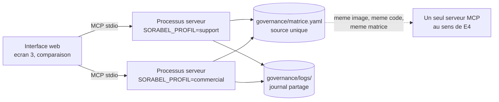

# Chantier 8 : interface de démonstration et preuve de la gouvernance

> Écrit le 2026-09-02, en réponse à la revue de conception. Le dossier avait
> décidé **où** déployer l'interface et jamais **ce qu'elle est**. Le chantier 7
> le reconnaissait lui-même : « mentionnée, jamais conçue ».
>
> Statut des décisions : PROPOSÉ. D38 à D40 attendent l'accord du pilote.

---

## 1. Pourquoi ce chantier existe

Le brief demande « un lien vers une interface graphique du produit fonctionnel ».
C'est le seul livrable qui exige un artefact **déployé**, et c'est celui que
l'évaluateur ouvrira **en premier**, avant le dossier et avant les journaux.

Le piège est là. Une interface qui montre une réponse documentaire et un résultat
SQL montre un chatbot. Elle ne démontre **ni E4 ni E5**, c'est-à-dire ni la
gouvernance, qui est le sujet du projet. Le produit de Sorabel n'est pas la
recherche, ce sont les **droits sur la recherche**.

**D38, ce que l'interface doit prouver.** Chaque écran répond à une exigence
nommée, et l'exigence est écrite sur l'écran.

| Exigence | Ce qui la rend visible | Écran |
| --- | --- | --- |
| E1 | Les sources sous chaque réponse, titre, référence, version, date. Et une question hors corpus qui produit une abstention affichée comme telle | 1 |
| E2 | La même recherche, `REF-8842` puis « quel disjoncteur pour du triphasé ? », qui aboutissent toutes deux | 1 |
| E3 | Le SQL affiché **à côté** du résultat, jamais replié. Et une demande d'écriture qui produit un refus | 2 |
| **E4** | Le **même appel**, joué sous deux profils, deux issues côte à côte | 3 |
| **E5** | Idem sur une colonne sensible, plus le journal visible en direct | 3 et 4 |
| E6 | Le tableau d'ablation, dense puis hybride puis reranking, avec ses intervalles | 5 |

---

## 2. Les cinq écrans

**Écran 1, poser une question documentaire.** Champ de saisie, réponse, et sous
la réponse les sources sous forme de cartes cliquables. Un bandeau permanent
indique le profil actif. Une question non couverte affiche l'abstention en clair,
pas un message d'erreur.

**Écran 2, interroger la base.** Même principe, mais le SQL généré est affiché
en permanence au-dessus du tableau de résultats, jamais derrière un pli. C'est la
couche 5 de la pile de gardes rendue visible : la transparence n'est pas une
option d'affichage.

**Écran 3, la comparaison par profil.** C'est **l'écran principal**, celui qui
justifie l'existence de cette interface. Deux colonnes, `support` à gauche,
`commercial` à droite, une seule question saisie une seule fois, envoyée aux
deux.

```
+-----------------------------------------------------------+
|  "quelle est la marge sur la REF-8842 ?"          [Jouer]  |
+---------------------------+-------------------------------+
|  profil support           |  profil commercial            |
|                           |                               |
|  REFUSE                   |  OK                           |
|  FORBIDDEN_COLUMN         |  SELECT marge_pct FROM ...    |
|  produits.marge_pct       |  47,3 %                       |
|                           |                               |
|  journal : refused        |  journal : allowed            |
+---------------------------+-------------------------------+
```

Les paires à jouer sont déjà écrites, elles viennent de `eval/cas_mcp.jsonl` :
MCP-10 contre MCP-14 pour la colonne sensible, MCP-08 contre MCP-09 pour la
collection `notes`, MCP-01 contre MCP-05 pour le refus de tool. Trois boutons
suffisent, et la démonstration est reproductible à l'identique le jour de la
soutenance.

**Écran 4, le journal en direct.** Les dernières lignes JSONL, filtrables par
profil et par décision. Chaque appel des écrans 1 à 3 y apparaît en temps réel,
autorisé comme refusé. C'est la preuve d'E5 la plus simple à administrer : on
n'explique pas que tout est journalisé, on le montre pendant qu'on parle.

**Écran 5, la mesure E6.** Le tableau d'ablation de `docs/mesure_e6.md`, rempli.
Statique, mais c'est le livrable de la preuve chiffrée.

---

## 3. D39 : comment montrer deux profils, alors que D28 le fige au lancement

La revue a trouvé une contradiction que personne n'avait vue. D28 fixe le profil
par `SORABEL_PROFIL` au lancement, **immuable pour la vie du processus**, et le
guide d'accès en tire la conséquence : « besoin de deux profils, déclarer deux
entrées de serveur distinctes ». Mais le backlog demande un client « montrant
deux profils **sur le même serveur** ». Les deux ne peuvent pas être vrais en
même temps.



**La résolution retenue : deux processus, et c'est la topologie normale de MCP.**
En transport `stdio`, chaque client lance **son propre** processus serveur ; c'est
ainsi que le protocole fonctionne, pas un contournement. « Un même serveur MCP »
au sens d'E4 désigne un même programme, un même catalogue, une même matrice, pas
un même identifiant de processus.

Ce qu'il faut donc montrer à l'écran, et dire à voix haute : les deux colonnes
sont servies par **la même image, le même code et le même fichier de matrice**.
Seule la variable d'environnement de lancement diffère. Le journal, lui, est
**partagé** : c'est ce qui rend la démonstration vérifiable, puisque les deux
décisions opposées se lisent dans le même fichier, à la suite.

L'alternative, HTTP avec un jeton porteur et un seul processus, est documentée au
chantier 7. Elle reste la voie de production. Elle n'est **pas** requise pour la
démonstration, et l'inscrire au lot 5 ajouterait un chantier d'authentification
là où le calendrier n'a plus de marge.

**Limite à énoncer en soutenance, pas à masquer** : ce mécanisme authentifie un
**contexte de lancement**, pas une personne. L'imputabilité va au profil, pas à
l'individu. C'est déjà écrit en D28, et l'interface ne change rien à cette limite.

---

## 4. D40 : ce que l'interface n'est pas

Trois refus, pour que le lot 6 ne dérive pas.

| Refusé | Pourquoi |
| --- | --- |
| Un sélecteur de profil dans l'interface | Il ferait croire que le profil est une préférence d'affichage. Le profil est une propriété du serveur, pas du client. L'écran 3 joue **deux serveurs**, il ne bascule pas un réglage |
| Une authentification d'utilisateur | Hors périmètre, et D28 dit pourquoi. Ajouter une page de connexion suggérerait une garantie que le système ne donne pas |
| Un affichage « joli » des refus | Un refus s'affiche avec son `code` et sa `decision` bruts. C'est la preuve, pas un message d'erreur à adoucir |

---

## 5. Ce que ce chantier laisse ouvert

| Sujet | État |
| --- | --- |
| Framework | Non tranché. Une page servie par le même conteneur que la Gateway suffit. Le choix n'engage aucune autre décision |
| Ordre des lots | L'interface reste au lot 6, mais l'écran 3 est le seul obligatoire. Écrit dans cet ordre, un lot 6 tronqué livre quand même la preuve de gouvernance |
| Coût | Voir l'item A4 du backlog, non chiffré |
