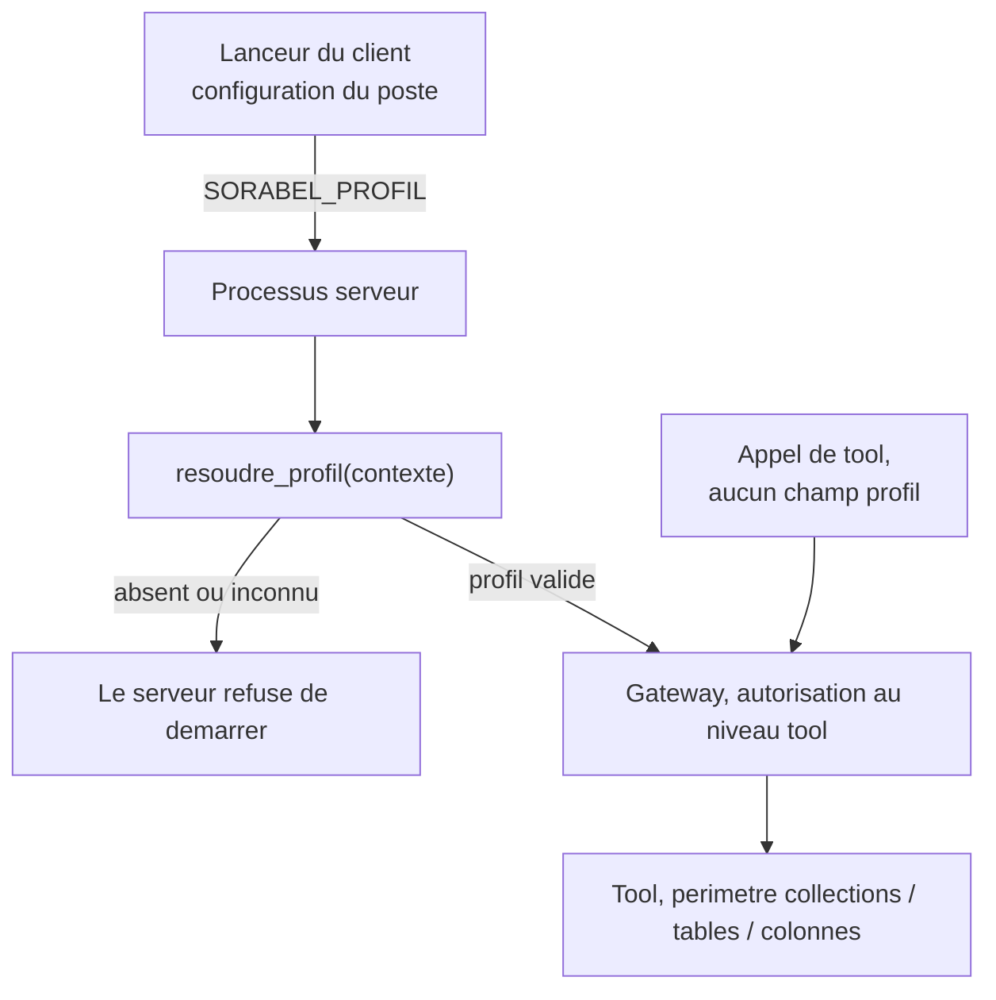
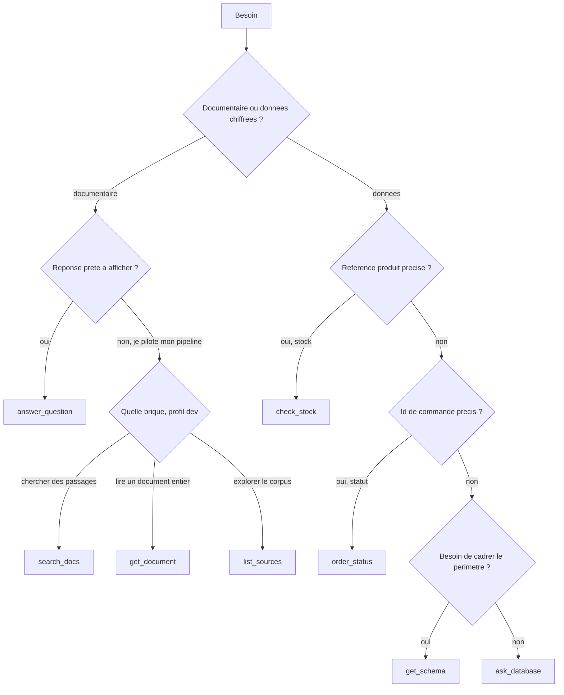

# Mini guide d'accès à la Sorabel Data Gateway

> Livrable du brief : « le serveur MCP exposant le catalogue complet ainsi qu'un mini guide
> d'accès ». Document d'intégration, destiné aux équipes qui branchent un client sur la
> Gateway. Ce n'est pas un dossier de conception : les justifications sont dans
> `docs/conception/` (chantiers 1, 2, 3, catalogue 05). Ce n'est pas non plus une
> documentation d'implémentation du serveur.
>
> Sources : `docs/conception/05_catalogue_tools.md` (contrat des tools),
> `03_matrice_acces.md` (identité D28, matrice, refus, journal), `02_tools_text2sql.md`
> (garanties SQL), `01_flux_chunks.md` (garanties RAG).

---

## 1. À qui s'adresse ce guide

| Équipe | Client MCP | Profil obtenu |
| --- | --- | --- |
| Support SAV | bot Slack | `support` |
| Ventes | poste commercial | `commercial` |
| Développement | IDE des devs | `dev` |

Ce que la Gateway garantit, en trois lignes :

1. Toute réponse documentaire cite ses sources (titre, référence, version, date, lien) ;
   si le corpus ne couvre pas la question, elle le dit au lieu d'inventer (E1).
2. Tout SQL exécuté est en lecture seule, borné aux tables et colonnes de votre profil, et
   la requête générée vous est toujours renvoyée avec le résultat (E3, E5).
3. Un seul serveur sert les trois clients ; chacun est borné à ses tools, collections et
   tables, et tout appel, autorisé ou refusé, est journalisé (E4, E5).

---

## 2. Se connecter

### 2.1 Le profil n'est jamais un paramètre d'appel

Aucune signature de tool ne comporte `profil`, `role` ou `client_id`. C'est la décision
D28 du chantier 3, et c'est le point que les intégrateurs doivent comprendre en premier.

Raison : un paramètre est rempli par le client, donc par le LLM appelant. Si le profil était
un argument, le bot support n'aurait qu'à demander `profil = "commercial"` pour lire les
marges, et le cloisonnement E4 deviendrait décoratif. Le protocole MCP ne vérifie pas ce
qu'un client déclare sur lui-même, et ne définit aucune notion de rôle : l'autorisation est
entièrement à la charge du serveur.

Le profil est donc résolu par le **transport**, à l'entrée de la gateway, avant tout
dispatch, par une fonction unique `resoudre_profil(contexte) -> Profil`. Tout l'aval reçoit
un profil et ignore d'où il vient.



### 2.2 Transport normatif : stdio

Votre client lance le serveur comme sous-processus et dialogue par les flux standards.
Le profil est fixé au lancement par la variable d'environnement `SORABEL_PROFIL`,
validée au démarrage contre les clés de la matrice.

Règles à connaître :

| Règle | Conséquence pour l'intégrateur |
| --- | --- |
| `SORABEL_PROFIL` absente ou inconnue | le serveur **refuse de démarrer** : le deny-by-default s'applique au lancement, pas au premier appel |
| Profil immuable pour la vie du processus | un processus égale un profil, pas de bascule en cours de session |
| Valeurs acceptées | `support`, `commercial`, `dev`, les clés de la matrice |
| Besoin de deux profils | déclarer deux entrées de serveur distinctes, jamais un paramètre |

Configuration client, forme habituelle d'une déclaration de serveur MCP en stdio :

```json
{
  "mcpServers": {
    "sorabel-data-gateway": {
      "command": "<commande de lancement du serveur, non encore figee>",
      "args": [],
      "env": {
        "SORABEL_PROFIL": "support"
      }
    }
  }
}
```

Question ouverte : la commande et les arguments exacts de lancement ne sont fixés dans aucun
document de conception, le serveur n'étant pas encore implémenté. À compléter au moment du
développement, sans changer la mécanique décrite ici.

### 2.3 Extension documentée, non requise : HTTP

Prévue mais pas exigée pour la version livrée. Le serveur devient un service : en-tête
`Authorization: Bearer`, table jeton vers profil chargée hors du dépôt, `401` sinon. Un seul
processus sert alors les trois profils. Le jeton ne passe jamais en paramètre d'URL.

Question ouverte : ni l'URL du service, ni l'emplacement de la table jeton vers profil ne
sont définis. Ils le seront si cette variante est retenue.

### 2.4 Ce qui est déclaratif, donc sans effet sur l'autorisation

Le nom de client annoncé à la connexion et le `client_id` du journal sont **déclaratifs** :
ils servent à la journalisation, jamais à l'autorisation. Les renseigner proprement aide la
lecture du journal ; les falsifier ne donne aucun droit supplémentaire.

---

## 3. Ce à quoi chaque profil a droit

Politique générale : deny-by-default. Tout ce qui n'est pas explicitement autorisé est
refusé. La matrice est appliquée à deux niveaux : à la gateway pour le droit d'appeler un
tool, dans le tool pour le périmètre des ressources réellement touchées.

Les trois tableaux de cette section sont des **vues** de `governance/matrice.yaml`,
qui est la source de vérité chargée par le serveur au démarrage (D21). Si votre
serveur se comporte autrement que ce guide ne l'annonce, c'est le fichier YAML de
votre déploiement qui a raison, pas ce document.

### 3.1 Tools accessibles

| Tool | `support` | `commercial` | `dev` | Précision |
| --- | :---: | :---: | :---: | --- |
| `answer_question` | oui | oui | oui | |
| `search_docs` | non | non | oui | brique RAG, réservée à l'IDE |
| `get_document` | non | non | oui | brique RAG, réservée à l'IDE |
| `list_sources` | non | non | oui | brique RAG, réservée à l'IDE |
| `ask_database` | oui | oui | oui | `support` : colonnes sensibles bloquées |
| `get_schema` | oui | oui | oui | `support` : schéma filtré, sans colonnes sensibles |
| `check_stock` | oui | oui | oui | |
| `order_status` | oui | oui | oui | |

Un appel à un tool absent de votre colonne est refusé avant toute logique métier, avec le
code `UNAUTHORIZED_TOOL`. Ce n'est pas une panne, c'est le comportement attendu.

### 3.2 Collections documentaires

| Collection | `support` | `commercial` | `dev` | Contenu |
| --- | :---: | :---: | :---: | --- |
| `fiches` | oui | oui | oui | fiches techniques produit |
| `notices` | oui | oui | oui | notices d'utilisation |
| `sav` | oui | oui | oui | procédures SAV |
| `notes` | non | oui | oui | notes internes sensibles : politique tarifaire, réunion achat |

Conséquence concrète : le bot support ne verra jamais un passage de note interne remonter
dans une réponse, ni dans une citation. Le filtrage a lieu dans le tool, pas dans le client.

### 3.3 Tables et colonnes SQL

Les cinq tables métier sont accessibles aux trois profils. La restriction porte sur les
colonnes, jamais sur les tables.

| Table | Colonnes retirées au profil `support` | `commercial` et `dev` |
| --- | --- | --- |
| `clients` | aucune | toutes |
| `produits` | `prix_achat_ht`, `marge_pct` | toutes |
| `stocks` | aucune | toutes |
| `commandes` | aucune | toutes |
| `ventes` | `marge_ht` | toutes |

Trois colonnes sur trente et une disparaissent pour le support. Elles ne sont pas filtrées
après coup : elles n'apparaissent pas dans le schéma présenté au modèle de génération, donc
il ne peut pas les référencer. Si une requête les référence malgré tout, elle est refusée
avec `FORBIDDEN_COLUMN`, jamais filtrée en silence. Le support conserve `prix_vente_ht`,
qui est une donnée publique.

Appelez `get_schema` pour obtenir, à l'exécution, la vue exacte dont dispose votre profil.
C'est la source la plus fiable pour cadrer une question avant `ask_database`.

---

## 4. Choisir son tool

### 4.1 Arbre de décision



### 4.2 Une phrase par tool

| Tool | Quand l'employer |
| --- | --- |
| `answer_question` | Quand vous voulez une réponse documentaire prête à afficher, avec ses sources. |
| `search_docs` | Quand vous voulez des passages classés sans génération, pour composer votre propre logique. |
| `get_document` | Quand vous tenez un `doc_id`, ou un couple référence et version, et voulez le document entier. |
| `list_sources` | Quand vous explorez le corpus : quelles références, quels types, quelles versions existent. |
| `ask_database` | Quand la question métier est analytique ou ad hoc et qu'aucun tool figé ne la couvre. |
| `get_schema` | Avant `ask_database`, pour connaître tables et colonnes autorisées ; ne renvoie aucune donnée. |
| `check_stock` | Dès que vous disposez de la référence exacte et voulez le stock par entrepôt. |
| `order_status` | Quand vous tenez un identifiant de commande précis et voulez son statut. |

Principe de routage : les tools figés sont déterministes, sans appel de modèle, donc plus
sûrs et moins coûteux. Préférez-les chaque fois que l'entité est connue. `ask_database` est
la voie ouverte pour tout le reste.

### 4.3 Ce que renvoie chaque famille

| Famille | Charge utile en cas de succès |
| --- | --- |
| RAG haut niveau | `answer`, plus `sources[]` avec `title`, `ref`, `version`, `date`, `url` |
| RAG briques | `hits[]` (passage, score, `doc_id`, `ref`, `version`, `section`), `document`, ou `sources[]` |
| SQL généré | `rows[]` et le `sql` réellement exécuté |
| SQL figé | `stock[]` par entrepôt, ou le statut de la commande |

Deux règles utiles côté client :

- une réponse documentaire sans source n'existe pas. Pas de sources, pas de réponse ;
- par défaut, c'est la version la plus récente d'un document qui est citée. Une version
  antérieure n'est renvoyée que si vous la demandez explicitement.

---

## 5. Lire une réponse

### 5.1 La règle qui prime sur toutes les autres

**Toute sortie est typée par `status`. Seul `status = "ok"` est une réponse. Un statut
non-`ok` ne doit jamais être présenté à l'utilisateur final comme une réponse.**

C'est ce qui empêche l'abstention documentaire (E1) et les refus (E3, E4, E5) de devenir de
fausses réponses. En particulier, le champ `message` d'un refus ou d'une abstention est un
texte de contrôle à l'intention de l'intégrateur ; il ne doit pas être recopié tel quel
comme s'il était le contenu de la réponse.

Convention de transport des erreurs : les refus de politique et les cas « pas de résultat »
arrivent comme un **résultat de tool normal** portant un `status` non-`ok` et un `code`
lisible par machine. L'erreur protocolaire MCP est réservée aux pannes techniques. Votre
client doit donc brancher sur `status`, et non sur la présence d'une exception.

### 5.2 Statuts, codes, et conduite à tenir

| `status` | Code associé | Signification | Ce que fait le client |
| --- | --- | --- | --- |
| `ok` | aucun | réponse valide | afficher `answer` et `sources`, ou `rows` et `sql` |
| `out_of_corpus` | `OUT_OF_CORPUS` | le corpus ne couvre pas la question | dire « non trouvé dans la documentation », ne rien inventer |
| `out_of_schema` | `OUT_OF_SCHEMA` | la question ne relève pas des données disponibles | dire « hors des données disponibles » ; aucun SQL n'a été produit |
| `not_found` | `NOT_FOUND` | identifiant valide, aucune donnée correspondante | dire « identifiant valide, aucune donnée » ; ne pas présenter cela comme une réponse |
| `clarify` | `AMBIGUOUS` | critère ambigu | redemander la précision, en proposant les options renvoyées |
| `refused` | `UNAUTHORIZED_TOOL` | ce profil ne peut pas appeler ce tool | message d'accès refusé, pas de nouvelle tentative aveugle |
| `refused` | `UNAUTHORIZED_COLLECTION` | collection documentaire interdite au profil | idem |
| `refused` | `FORBIDDEN_COLUMN` | colonne sensible demandée | idem, et ne pas reformuler pour contourner |
| `refused` | `READ_ONLY_VIOLATION` | la requête était en écriture | idem, en signalant que seule la lecture est possible |
| `error` | `INTERNAL_ERROR` | panne technique du serveur | erreur technique, nouvelle tentative légitime, aucune conclusion métier à en tirer |

Distinction à ne pas manquer : `rows: []` avec `status = "ok"` est un **résultat légitime**,
car une liste ou un agrégat peut valoir zéro. C'est `not_found` qui signale une entité
recherchée par identifiant précis et introuvable. Les deux se disent différemment à
l'utilisateur.


### 5.3 Exemples

Les valeurs de contenu ci-dessous sont illustratives. Seules les formes font foi.

Réponse documentaire aboutie :

```json
{
  "status": "ok",
  "answer": "Le disjoncteur REF-8842 est tetrapolaire, calibre 40 A, courbe C.",
  "sources": [
    {
      "title": "Disjoncteur tetrapolaire triphase 40 A courbe C",
      "ref": "REF-8842",
      "version": "2.1",
      "date": "2024-05-25",
      "url": "https://intranet.sorabel/docs/fiche_REF-8842_v2.1"
    }
  ]
}
```

Question hors corpus, à restituer comme telle :

```json
{
  "status": "out_of_corpus",
  "code": "OUT_OF_CORPUS",
  "message": "Cette question n'est pas couverte par le corpus documentaire."
}
```

Question métier avec SQL renvoyé :

```json
{
  "status": "ok",
  "sql": "SELECT COUNT(*) AS n FROM commandes WHERE date_commande LIKE '2026-04%'",
  "rows": [ { "n": 27 } ]
}
```

Colonne sensible demandée par le profil `support` :

```json
{
  "status": "refused",
  "code": "FORBIDDEN_COLUMN",
  "message": "Colonne interdite pour ce profil.",
  "detail": { "profil": "support", "colonnes": ["produits.marge_pct"] }
}
```

Tool non autorisé pour le profil :

```json
{
  "status": "refused",
  "code": "UNAUTHORIZED_TOOL",
  "message": "Le profil support n'est pas autorise a appeler search_docs.",
  "detail": { "profil": "support", "tool": "search_docs" }
}
```

Identifiant valide mais introuvable :

```json
{
  "status": "not_found",
  "code": "NOT_FOUND",
  "message": "Identifiant valide, aucune donnee correspondante.",
  "detail": { "order_id": "CMD-2026-0042" }
}
```

Question ambiguë sur le critère :

```json
{
  "status": "clarify",
  "code": "AMBIGUOUS",
  "message": "Critere a preciser.",
  "detail": { "options": ["chiffre d'affaires", "nombre de commandes", "marge"] }
}
```

Question ouverte : le champ `detail` est spécifié par un exemple dans le chantier 3, pas par
un schéma. Sa forme varie selon le code. Ne construisez pas votre logique client dessus,
branchez-la sur `status` et `code`.

### 5.4 Ce qu'un client ne doit pas faire

| Anti-pattern | Pourquoi c'est faux |
| --- | --- |
| Afficher le `message` d'un refus comme s'il s'agissait de la réponse | transforme un refus en fausse réponse, casse E1 et E5 |
| Traiter `rows: []` comme un échec | un agrégat nul est un résultat valide |
| Réessayer un `refused` en reformulant la question | la matrice ne dépend pas de la formulation, et chaque tentative est journalisée |
| Passer un champ `profil` dans les arguments | il est ignoré, le profil vient du transport |
| Attendre une exception pour détecter un refus | les refus arrivent comme un résultat de tool normal |

---

## 6. Ce qui est journalisé

Tout appel est journalisé, autorisé comme refusé, dans un fichier JSONL sous
`governance/logs/`. Un enregistrement par appel.

| Champ | Contenu |
| --- | --- |
| `request_id` | identifiant de requête, corrèle appel, décision et résultat |
| `timestamp` | horodatage de l'appel |
| `client_id` | nom du client, **déclaratif** |
| `profil` | profil résolu par le transport |
| `tool` | tool appelé |
| `params_resume` | résumé des paramètres, dont la question posée |
| `decision` | autorisé ou refusé |
| `code` | code de décision, le cas échéant |
| `sql_genere` | SQL produit, systématiquement consigné, transparence E3 |
| `ressources_touchees` | tables et colonnes, ou collections, réellement touchées |
| `latency_ms` | durée de traitement |
| `result_resume` | métadonnées de résultat, par exemple un nombre de lignes |

Ce qui n'est **pas** journalisé :

- les **valeurs** sensibles. On consigne les colonnes touchées et le nombre de lignes, jamais
  le contenu des lignes. Un refus sur `marge_pct` trace le nom de la colonne, pas la marge ;
- aucune identité nominative, voir la limite énoncée en 7.

Ce que cela implique pour vous : la question posée par l'utilisateur figure au journal via
`params_resume`. Si votre client transmet du texte utilisateur susceptible de contenir des
données personnelles, c'est un point à traiter de votre côté.

---

## 7. Limites connues

Énoncées franchement, parce que la garantie vaut ce que vaut le mécanisme d'identité.

| Limite | Portée réelle |
| --- | --- |
| Authentifie un contexte de lancement, pas une personne | qui peut éditer la configuration du client peut s'attribuer n'importe quel profil |
| Aucun secret côté serveur en stdio | l'ancre de confiance est le compte système et les droits sur le fichier de configuration |
| Ni expiration, ni révocation, ni rotation | retirer un accès se fait en modifiant la configuration du poste client |
| `client_id` déclaratif | falsifiable, donc bon pour lire un journal, jamais pour décider |

**Imputabilité au profil, pas à l'individu.** Le journal répond à « quel profil a demandé
cette marge », jamais à « qui ». E5 est satisfaite au sens du brief, tout appel est
journalisé, mais ce n'est pas une piste d'audit nominative.

Ce qu'il faudrait en production : transport HTTP, serveur en *Resource Server* OAuth 2.1,
jetons émis par l'annuaire de l'entreprise, audience liée au serveur pour qu'un jeton volé
ailleurs ne soit pas rejouable ici, validation à chaque requête, jetons courts avec rotation
et révocation. Le profil se dériverait alors d'une revendication du jeton validé, et le sujet
nominatif entrerait au journal.

---

## 8. Questions ouvertes

Points qu'aucun document de conception ne tranche à ce jour. Ils sont listés ici plutôt que
comblés par une supposition.

| # | Question ouverte | Impact pour l'intégrateur |
| --- | --- | --- |
| 1 | Commande et arguments exacts de lancement du serveur en stdio | la configuration client de la section 2.2 reste à compléter |
| 2 | URL du service et emplacement de la table jeton vers profil, en variante HTTP | bloque l'usage de la variante HTTP |
| 3 | Schéma exact du champ `detail` selon le code | ne pas s'appuyer dessus, brancher sur `status` et `code` |
| 4 | Comment un client renseigne son `client_id` déclaratif | journal moins lisible si le champ reste vide |
| 5 | Valeur par défaut de `k` pour `search_docs`, et valeur du seuil d'abstention | non contractuelles, le seuil est calibré empiriquement (E6) |
| 6 | Ouverture éventuelle de `list_sources` au profil `commercial` | prévue « au cas par cas » par le chantier 3, non tranchée |

Deux questions figuraient ici jusqu'au 2026-09-02 et ont été retirées : elles étaient
déjà tranchées ailleurs, et l'une donnait une consigne fausse.

| Ancienne question | Où elle est en fait tranchée |
| --- | --- |
| Code associé à `status = "error"` | `INTERNAL_ERROR`, chantier 3, section 4.1 |
| Correspondance collection vers `doc_type` | `governance/matrice.yaml`, clé `collections`, et chantier 3, section 3.3 |

La seconde conseillait de « ne pas coder en dur la valeur d'un filtre » et de « la
demander au serveur ». Aucun tool du catalogue n'expose cette correspondance : la
consigne envoyait vers un appel qui n'existe pas. La correspondance est fixe, et
contrôlée contre le corpus réel par `governance/verifier_matrice.py` :

| Collection | `doc_type` |
| --- | --- |
| `fiches` | `fiche_technique` |
| `notices` | `notice` |
| `sav` | `procedure_sav` |
| `notes` | `note_interne` |
